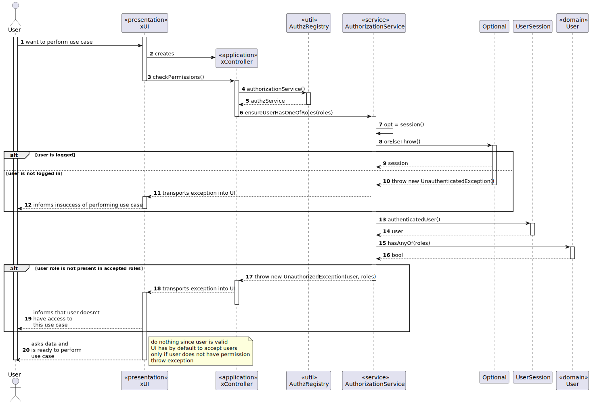
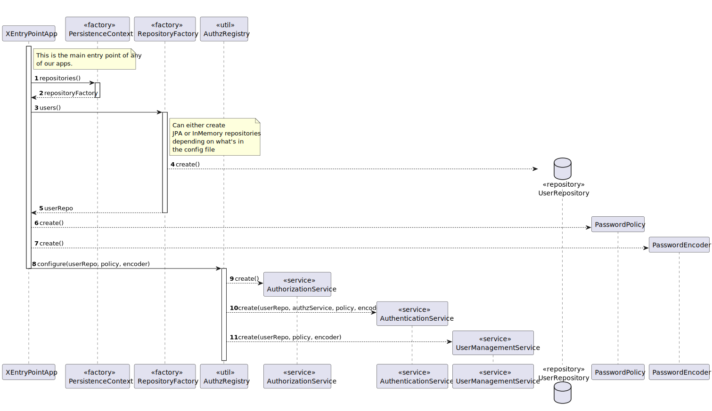
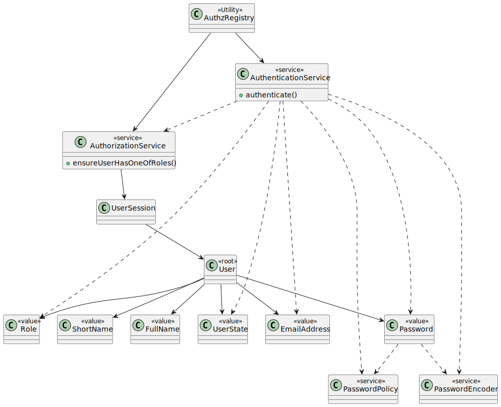

# US G006

## 1. Context

*In this User Story, the Project Manager wants us to incorporate Authentication and Authorization in our System, in order to give access accordingly to the application(s).*

## 2. Requirements

**US G006** - As a **Project Manager**, I want the system to support and apply authentication and authorization for all its users and functionalities.

- G006.1. Firstly, we shall implement authentication so no intruder can access the system.

- G006.2. Only and only then, we shall implement authorization so that each user can access its functionalities accordingly.

- G006.3. The system must **never** persist the real password of the users. An encryption algorithm must be used to store the password(and a decryption one to check it).

*Regarding this requirement we understand that it relates to the security of our system, and it has extreme importance.*

## 3. Analysis


- This is an excerpt of our domain Model, it gives us the clear idea of how the User should be identified in order to perform authentication, and it also distinguishes its paper in the system, that will be used to perform authorization.
- Our use case diagram is still not much relevant for this since this feature does not have any dependencies, it is the main dependency for the rest of the system (a user must be logged in and have permission to perform most, if not all use cases).

## 4. Design

### 4.1. Realization

#### 4.1.1. Sequence Diagram of the Authentication


- After User inputs its data, the authenticaction service will check if the user exists by its repository
- If the user exists, the service will ask the user class to check if the raw password is the same as the decrypted one that we got from our repository
- It will also ask the user to check if its role is present in the provided list of accepted roles to that application
- If the user is valid, the service will call the authorization service and ask it to create a user session, returning an optional, that may have a user session if login was valid, and may have a null pointer if login was not valid

#### 4.1.2. Sequence Diagram of the Authorization


- In each use case, the user will be verified, its role will be checked (needs to be in  the list of accepted roles for that use case) and then the use case will be performed.

#### 4.1.3. Sequence Diagram for the AuthzRegistry setup


- The authzregistry is a tool that will register how the authentication and authorization will be run. For example, in the configure method we specify if we want to access a "in-memory" database or a server database, we also specify the password encoding algorithm and the password policy to be used.

### 4.2. Class Diagram

#### 4.2.1. Authentication and Authorization class diagram

- Through the *authentication service*, the user will be able to login into its own application, depending on its roles.
- The *authentication service* will be responsible for checking if the role of the user is valid to the corresponding use case they might want to perform.

### 4.3. Applied Patterns

#### 4.3.1. Factory

- Our PersistenceContext will create a RepositoryFactory based on the configuration file, and then the RepositoryFactory will create the repository that we need in order to persist our domain entity.

#### 4.3.2. Single Responsibility Principle

- Every class has a purpose. Each class will be responsible for its own validation and its own purpose, DDD is a perfect example of that, since, for example, our User's Email will be validated by the Email class and not the User class.
- But regarding examples, this is a good principle, so we know where our functions are based on what they do.

#### 4.3.3. Open/Closed Principle

- For this principle in specific, we chose to do a more abstract approach, then implement what we need, so if we need to extend our system, we don't need to change classes, rather we implement a new one and extend the behaviours of the pre-existing ones.
- For example, if we want to add a new database technology we just need to extend the PersistenceContext class and implement the new database technology(new repository implementations).

#### 4.3.4. Repository Pattern

- The repository pattern is a pattern that allows us to abstract the data access layer, so we can change the database technology without changing the rest of the system.
- New Programmers might not know how to use a specific database technology, but they will know how to use the repository pattern, so they can implement the repository pattern and use it in the system.
- In our case, we will have a interface repository that shows us different functionalities we can use, and then we will have its own implementations with their own specific database technology.

#### 4.3.5. Singleton Pattern

- The authregistry is a singleton, since from that class we can only get one instance of the authentication service, the authorization service and the user management service.
- This will help us since authentication and authorization are a single thing that we have for the whole application, so it doesn't make sense to have more than one instance.

### 4.4. Tests


#### 4.4.1. Domain Classes

#### Acronym

```java
package domain.model;

import org.junit.jupiter.api.Test;

import static org.junit.jupiter.api.Assertions.*;

class AcronymTest {
    @Test
    void ensureAcronymNullIsNotValid(){

        assertThrows(
                IllegalArgumentException.class,
                () -> Acronym.of(null),
                "Short name should neither be null nor empty"
        );

    }

    @Test
    void ensureAcronymEmptyIsNotValid(){

        assertThrows(
                IllegalArgumentException.class,
                () -> Acronym.of(""),
                "Short name should neither be null nor empty"
        );

    }

    @Test
    void ensureAcronymHasBetweenTwoAndFiveCharacters(){

        assertThrows(
                IllegalArgumentException.class,
                () -> Acronym.of("A"),
                "Short name should have between 2 and 5 characters"
        );

    }

    @Test
    void ensureAcronymCanBeCreated(){

        Acronym acronym = Acronym.of("ACRO");

        assertEquals("ACRO", acronym.value());

    }
}
````

#### BirthDate

```java
package domain.model;

import org.junit.jupiter.api.Test;

import java.time.LocalDate;
import java.time.format.DateTimeFormatter;

import static org.junit.jupiter.api.Assertions.*;

class BirthDateTest {

    final static DateTimeFormatter formatter = DateTimeFormatter.ofPattern("dd/MM/yyyy");

    @Test
    void ensureBirthDateIsNotInTheFuture() {
        Throwable thr = assertThrows(
                IllegalArgumentException.class,
                () -> BirthDate.of(
                        LocalDate.
                                now().
                                plusDays(1).format(formatter)
                )
        );

        Throwable thrLocaldate = assertThrows(
                IllegalArgumentException.class,
                () -> BirthDate.of(
                        LocalDate.
                                now().
                                plusDays(1)
                )
        );

        assertEquals("Birthdate cannot be in the future", thr.getMessage());
        assertEquals("Birthdate cannot be in the future", thrLocaldate.getMessage());
    }

    @Test
    void ensureBirthDateIsNotMoreThan120YearsAgo() {
        Throwable thr = assertThrows(
                IllegalArgumentException.class,
                () -> BirthDate.of(
                        LocalDate.
                                now().
                                minusYears(121).format(formatter)
                )
        );

        Throwable thrLocalDate = assertThrows(
                IllegalArgumentException.class,
                () -> BirthDate.of(
                        LocalDate.
                                now().
                                minusYears(121)
                )
        );

        assertEquals("Birthdate cannot be more than 120 years ago", thr.getMessage());
        assertEquals("Birthdate cannot be more than 120 years ago", thrLocalDate.getMessage());

    }

    @Test
    void ensureBirthDateCanBeCreatedWhenValueIsInThePast() {
        LocalDate expected = LocalDate.now().minusYears(16);
        BirthDate date = BirthDate.of(
                LocalDate.now().minusYears(16).format(formatter)
        );

        BirthDate dateLocalDateInjected = BirthDate.of(
                LocalDate.now().minusYears(16)
        );
        assertEquals(expected, date.value());
        assertEquals(expected, dateLocalDateInjected.value());
    }
}
```

#### FullName

```java
package domain.model;

import org.junit.jupiter.api.Test;

import static org.junit.jupiter.api.Assertions.*;

class FullNameTest {
    @Test
    void ensureFullNameIsCreated() {
        FullName fullName = FullName.of("John Doe");
        assertEquals("John Doe", fullName.value());
    }

    @Test
    void ensureFullNameIsNotEmpty() {
        Throwable thr = assertThrows(IllegalArgumentException.class, () -> FullName.of(""));

        assertEquals("Full Name can't be empty.", thr.getMessage());
    }

    @Test
    void ensureFullNameHasMoreThanThreeCharacters() {
        Throwable thr = assertThrows(IllegalArgumentException.class, () -> FullName.of("Jo"));

        assertEquals("Full name must have 3 characters or more", thr.getMessage());
    }
}
```

#### MecanographicNumber

```java
package domain.model;

import org.junit.jupiter.api.Test;

import java.time.LocalDate;

import static org.junit.jupiter.api.Assertions.*;

class MecanographicNumberTest {

    @Test
    void ensureDoesNotAcceptNegativeValueOrZero() {
        Throwable thr = assertThrows(
                IllegalArgumentException.class,
                () -> MecanographicNumber.of(-11)
        );

        Throwable thrz = assertThrows(
                IllegalArgumentException.class,
                () -> MecanographicNumber.of(0)
        );

        assertEquals("Value cannot be negative or zero", thr.getMessage());
        assertEquals("Value cannot be negative or zero", thrz.getMessage());

    }

    @Test
    void ensureDoesNotAcceptValueGreaterThan99999() {
        Throwable thr = assertThrows(
                IllegalArgumentException.class,
                () -> MecanographicNumber.of(100000)
        );

        assertEquals("Value cannot be greater than 99999 (have more than 5 digits)", thr.getMessage());
    }

    @Test
    void ensureDoesNotAcceptYearGreaterThanCurrentYear() {
        Throwable thr = assertThrows(
                IllegalArgumentException.class,
                () -> MecanographicNumber.of(LocalDate.now().getYear() + 1, 1)
        );

        assertEquals("Year cannot be greater than current year", thr.getMessage());
    }

    @Test
    void canCreateValidBothWays() {
        MecanographicNumber.of(1);
        MecanographicNumber.of(LocalDate.now().getYear(), 1);
    }

    @Test
    void ensureEqualsIsWorking() {
        MecanographicNumber m1 = MecanographicNumber.of(1);
        MecanographicNumber m2 = MecanographicNumber.of(
                LocalDate.now().getYear(),
                1
        );
        MecanographicNumber m3 = MecanographicNumber.of(2);

        assertEquals(m1, m2);
        assertEquals(m1, m1);
        assertNotEquals(m1, m3);
        assertNotEquals(null, m1);
    }

    @Test
    void ensureStringIsBuildingCorrectly() {
        MecanographicNumber m = MecanographicNumber.of(1);
        String expected = LocalDate.now().getYear() + "00001";
        assertEquals(expected, m.value());

        m = MecanographicNumber.of("201900001");
        expected = "201900001";
        assertEquals(expected, m.value());
    }

}
```

#### Password

```java
package domain.model;

import eapli.framework.infrastructure.authz.application.PasswordPolicy;
import eapli.framework.infrastructure.authz.domain.model.PlainTextEncoder;
import org.junit.jupiter.api.Test;

import org.springframework.security.crypto.password.PasswordEncoder;


import java.util.Optional;

import static org.junit.jupiter.api.Assertions.*;

class PasswordTest {

    final PasswordPolicy policy = new ECoursePasswordPolicy();

    PasswordEncoder encoder = new PlainTextEncoder();

    @Test
    void EncodedAndValid(){
        Optional<Password> pass = Password.encodedAndValid("123456Ax", policy, encoder);

        assertTrue(pass.isPresent());
    }

    @Test
    void ensureNullIsNotValid(){
        Throwable thr = assertThrows(IllegalArgumentException.class, () -> {
            Password.encodedAndValid(null, policy, encoder);
        });
    }

    @Test
    void ensureEmptyStringIsNotValid(){
        Optional<Password> pass = Password.encodedAndValid("", policy, encoder);

        assertFalse(pass.isPresent());
    }

    @Test
    void ensurePasswordWithLessThanSixCharactersIsNotValid(){
        Optional<Password> pass = Password.encodedAndValid("1234A", policy, encoder);

        assertFalse(pass.isPresent());
    }

    @Test
    void ensurePasswordWithNoUpperCaseCharacterIsNotValid(){
        Optional<Password> pass = Password.encodedAndValid("1234567", policy, encoder);

        assertFalse(pass.isPresent());
    }

    @Test
    void toStringReturnsFakePass(){
        Password pass = Password.encodedAndValid("1234567X", policy, encoder).get();

        assertEquals("************", pass.toString());
        assertNotEquals("1234567X", pass.toString());
    }

    @Test
    void ensurePasswordWithNoDigitsIsNotValid(){
        Optional<Password> pass = Password.encodedAndValid("ABCDEFGH", policy, encoder);

        assertFalse(pass.isPresent());
    }

    @Test
    void ensurePasswordsMatch(){
        Password pass = Password.encodedAndValid("1234567X", policy, encoder).get();
        Password pass2 = Password.encodedAndValid("1234567X", policy, encoder).get();

        assertTrue(pass.equals(pass2));
        assertTrue(pass.hashCode() == pass2.hashCode());

        pass = Password.encodedAndValid("1234567X", policy, encoder).get();
        pass2 = Password.encodedAndValid("1234567Y", policy, encoder).get();

        assertFalse(pass.equals(pass2));

        pass = Password.encodedAndValid("1234567X", policy, encoder).get();
        Object any = "1234567X";

        assertFalse(pass.equals(any));

    }

    @Test
    void valueReturnsEncodedPassword(){
        Password pass = Password.encodedAndValid("1234567X", policy, encoder).get();

        assertEquals("1234567X", pass.value()); // this encoder is used for tests and does not encode(change) the password

    }

}
```

#### ShortName

```java
package domain.model;

import org.junit.jupiter.api.Test;

import static org.junit.jupiter.api.Assertions.*;

class ShortNameTest {

    @Test
    void ensureShortNameIsNotNull() {
        Throwable thr = assertThrows(IllegalArgumentException.class, () -> {
            ShortName.of(null);
        });

        assertEquals("Short Name can't be null.", thr.getMessage());
    }

    @Test
    void ensureShortNameIsNotEmpty() {
        Throwable thr = assertThrows(IllegalArgumentException.class, () -> {
            ShortName.of("");
        });

        assertEquals("Short Name can't be empty.", thr.getMessage());
    }

    @Test
    void ensureShortNameHasMoreThanThreeCharacters() {
        Throwable thr = assertThrows(IllegalArgumentException.class, () -> {
            ShortName.of("abc");
        });

        assertEquals("Short name must have 3 characters or more", thr.getMessage());
    }

    @Test
    void ensureCreationOfValid() {
        ShortName.of("example");
    }

    @Test
    void ensureEqualsIsWorking() {
        ShortName s1 = ShortName.of("example");
        ShortName s2 = ShortName.of("example");
        ShortName s3 = ShortName.of("example2");

        assertEquals(s1, s2);
        assertEquals(s1.hashCode(), s2.hashCode());
        assertNotEquals(s1, s3);
        assertNotEquals(s1.hashCode(), s3.hashCode());
        assertEquals(s1.value(), s2.value());
        assertNotEquals(s1.value(), s3.value());
    }

}
```

#### TaxPayerNumber

```java
package domain.model;

import org.junit.jupiter.api.Test;

import static org.junit.jupiter.api.Assertions.*;

class TaxPayerNumberTest {

    @Test
    void ensureTaxPayerNumberIsNotNull() {
        assertThrows(IllegalArgumentException.class, () -> TaxPayerNumber.of(null));
    }

    @Test
    void ensureTaxPayerNumberIsNotEmpty() {
        assertThrows(IllegalArgumentException.class, () -> TaxPayerNumber.of(""));
    }

    @Test
    void ensureTaxPayerNumberHasNineDigits() {
        assertThrows(IllegalArgumentException.class, () -> TaxPayerNumber.of("12345678"));
        assertThrows(IllegalArgumentException.class, () -> TaxPayerNumber.of("1234567890"));
    }

    @Test
    void ensureTaxPayerNumberHasNoCharacters() {
        assertThrows(IllegalArgumentException.class, () -> TaxPayerNumber.of("12345678a"));
        assertThrows(IllegalArgumentException.class, () -> TaxPayerNumber.of("a12345678"));
    }

    @Test
    void ensureWeCanCreateTaxPayerNumber() {
        TaxPayerNumber taxPayerNumber = TaxPayerNumber.of("123456789");
        assertEquals("123456789", taxPayerNumber.value());
    }

}
```

#### User

```java
package domain.model;

import eapli.framework.general.domain.model.EmailAddress;
import eapli.framework.infrastructure.authz.application.PasswordPolicy;
import eapli.framework.infrastructure.authz.domain.model.PlainTextEncoder;
import eapli.framework.infrastructure.authz.domain.model.Role;
import org.junit.jupiter.api.Test;
import org.springframework.security.crypto.password.PasswordEncoder;

import java.util.Calendar;

import static org.junit.jupiter.api.Assertions.*;

class UserTest {
    private static final PasswordEncoder ENCODER = new PlainTextEncoder();
    private static final PasswordPolicy POLICY = new ECoursePasswordPolicy();


    // mocks
    private static final String STRING_SHORTNAME = "shortName";
    private static final ShortName SHORTNAME = ShortName.of(STRING_SHORTNAME);
    private static final String STRING_FULLNAME = "fullName";

    private static final FullName FULLNAME = FullName.of(STRING_FULLNAME);
    private static final String STRING_EMAIL = "email@email.com";

    private static final EmailAddress EMAIL = EmailAddress.valueOf(STRING_EMAIL);
    private static final String STRING_ROLE = "role";
    private static final Role ROLE = Role.valueOf(STRING_ROLE);


    private static final String STRING_PASS = "Correct5";
    private static final Password PASSWORD = Password.encodedAndValid(STRING_PASS, POLICY, ENCODER).get();

    private static final Calendar CREATED_ON = Calendar.getInstance();
    private static final Calendar DEACTIVATED_ON = Calendar.getInstance();

    private static final String STRING_ROLE_TWO = "ROLE_TWO";
    private static final Role ROLE_TWO = Role.valueOf(STRING_ROLE_TWO);
    private static final Role[] ROLES = {
            ROLE,
            ROLE_TWO
    };

    @Test
    void ensureUserHasShortNameWhenCreated() {
        assertThrows(
                IllegalArgumentException.class,
                () -> new User(
                        null,
                        FULLNAME,
                        PASSWORD,
                        EMAIL,
                        ROLE,
                        null,
                        null,
                        null,
                        null
                )
        );

        assertThrows(
                IllegalArgumentException.class,
                () -> new User(null, FULLNAME, PASSWORD, EMAIL, ROLE, null, null, null, null, CREATED_ON)
        );
    }

    @Test
    void ensureUserHasFullNameWhenCreated() {
        assertThrows(
                IllegalArgumentException.class,
                () -> new User(SHORTNAME, null, PASSWORD, EMAIL, ROLE, null, null, null, null)
        );

        assertThrows(
                IllegalArgumentException.class,
                () -> new User(SHORTNAME, null, PASSWORD, EMAIL, ROLE, null, null, null, null, CREATED_ON)
        );
    }

    @Test
    void ensureUserHasPasswordWhenCreated() {
        assertThrows(
                IllegalArgumentException.class,
                () -> new User(SHORTNAME, FULLNAME, null, EMAIL, ROLE, null, null, null, null)
        );

        assertThrows(
                IllegalArgumentException.class,
                () -> new User(SHORTNAME, FULLNAME, null, EMAIL, ROLE, null, null, null, null, CREATED_ON)
        );
    }

    @Test
    void ensureUserHasEmailWhenCreated() {
        assertThrows(
                IllegalArgumentException.class,
                () -> new User(SHORTNAME, FULLNAME, PASSWORD, null, ROLE, null, null, null, null)
        );

        assertThrows(
                IllegalArgumentException.class,
                () -> new User(SHORTNAME, FULLNAME, PASSWORD, null, ROLE, null, null, null, null, CREATED_ON)
        );
    }

    @Test
    void ensureUserHasRoleWhenCreated() {
        assertThrows(
                IllegalArgumentException.class,
                () -> new User(SHORTNAME, FULLNAME, PASSWORD, EMAIL, null, null, null, null, null)
        );

        assertThrows(
                IllegalArgumentException.class,
                () -> new User(SHORTNAME, FULLNAME, PASSWORD, EMAIL, null, null, null, null, null, CREATED_ON)
        );
    }

    @Test
    void ensureUserHasCreatedOnWhenCreated() {
        assertThrows(
                IllegalArgumentException.class,
                () -> new User(SHORTNAME, FULLNAME, PASSWORD, EMAIL, ROLE, null, null, null, null, null)
        );
    }

    @Test
    void ensureUserCanBeCreatedWhenValid() {
        User user = new User(SHORTNAME, FULLNAME, PASSWORD, EMAIL, ROLE, null, null, null, null, CREATED_ON);

        assertTrue(user.isActive());
        assertTrue(user.passwordMatches(STRING_PASS, ENCODER));
        assertTrue(user.hasAnyOf(ROLES));

        user = new User(SHORTNAME, FULLNAME, PASSWORD, EMAIL, ROLE, null, null, null, null);

        assertTrue(user.isActive());
        assertTrue(user.passwordMatches(STRING_PASS, ENCODER));
        assertTrue(user.hasAnyOf(ROLES));
    }

    @Test
    void ensureCantChangeToNullPassword(){
        final User user = new User(SHORTNAME, FULLNAME, PASSWORD, EMAIL, ROLE, null, null, null, null, CREATED_ON);
        assertThrows(IllegalArgumentException.class, () -> user.changePassword(null));
    }

    @Test
    void ensureCanChangeToValidPassword(){
        final User user = new User(SHORTNAME, FULLNAME, PASSWORD, EMAIL, ROLE, null, null, null, null, CREATED_ON);
        user.changePassword(PASSWORD);
    }

    @Test
    void ensureReturnsCorrectIdentity(){
        final User user = new User(SHORTNAME, FULLNAME, PASSWORD, EMAIL, ROLE, null, null, null, null, CREATED_ON);
        assertEquals(EMAIL, user.identity());
        assertEquals(EMAIL, user.emailAddress());
    }

    @Test
    void testSameAs() {
        final User user = new User(SHORTNAME, FULLNAME, PASSWORD, EMAIL, ROLE, null, null, null, null, CREATED_ON);
        final User user2 = user;
        assertTrue(user.sameAs(user2));

        final User user3 = new User(SHORTNAME, FULLNAME, PASSWORD, EMAIL, ROLE, null, null, null, null, CREATED_ON);

        assertFalse(user.sameAs(user3));
    }

    @Test
    void ensureNotPossibleToDeactivateDeactivetedUser() {
        final User user = new User(SHORTNAME, FULLNAME, PASSWORD, EMAIL, ROLE, null, null, null, null, CREATED_ON);
        user.deactivate(DEACTIVATED_ON);

        assertThrows(IllegalStateException.class, () -> user.deactivate(DEACTIVATED_ON));

    }

    @Test
    void ensureNotPossibleToActivateActiveUser() {
        final User user = new User(SHORTNAME, FULLNAME, PASSWORD, EMAIL, ROLE, null, null, null, null, CREATED_ON);
        assertThrows(IllegalStateException.class, () -> user.activate());
    }

    @Test
    void ensureUserCanBeDeactivated() {
        final User user = new User(SHORTNAME, FULLNAME, PASSWORD, EMAIL, ROLE, null, null, null, null, CREATED_ON);
        user.deactivate(DEACTIVATED_ON);
        assertFalse(user.isActive());
    }

    @Test
    void ensureUserCanBeActivated() {
        final User user = new User(SHORTNAME, FULLNAME, PASSWORD, EMAIL, ROLE, null, null, null, null, CREATED_ON);
        user.deactivate(DEACTIVATED_ON);
        user.activate();
        assertTrue(user.isActive());
    }

    @Test
    void ensureUserHasCorrectRoles() {
        final User user = new User(SHORTNAME, FULLNAME, PASSWORD, EMAIL, ROLE, null, null, null, null, CREATED_ON);
        assertEquals(STRING_ROLE, user.role());
    }
}
```

---

#### Builder

#### UserBuilder

```java
package domain.model;

import eapli.framework.general.domain.model.EmailAddress;
import eapli.framework.infrastructure.authz.domain.model.PlainTextEncoder;
import eapli.framework.infrastructure.authz.domain.model.Role;
import org.junit.jupiter.api.BeforeEach;
import org.junit.jupiter.api.Test;

import java.util.Calendar;

class UserBuilderTest {

    private String emailString = "email@email.com";
    private EmailAddress email = EmailAddress.valueOf(emailString);
    private String shortNameString = "Short Name";
    private ShortName shortName = ShortName.of(shortNameString);
    private String fullNameString = "Full Name";
    private FullName fullName = FullName.of(fullNameString);
    private String passwordString = "Password1";
    private Password password = Password.encodedAndValid(
            passwordString,
            new ECoursePasswordPolicy(),
            new PlainTextEncoder()
    ).get();
    private String managerRoleString = "MANAGER";
    private Role managerRole = Role.valueOf(managerRoleString);

    private String teacherRoleString = "TEACHER";
    private Role teacherRole = Role.valueOf(teacherRoleString);

    private String studentRoleString = "STUDENT";
    private Role studentRole = Role.valueOf(studentRoleString);
    private String numberMecString = "202010230";
    private MecanographicNumber numberMec = MecanographicNumber.of(numberMecString);
    private String birthDateString = "10/08/1990";
    private BirthDate birthDate = BirthDate.of(birthDateString);
    private String taxPayerNumberString = "123456789";
    private TaxPayerNumber taxPayerNumber = TaxPayerNumber.of(taxPayerNumberString);
    private String acronymString = "ACR";
    private Acronym acronym = Acronym.of(acronymString);


    private UserBuilder builder;

    @BeforeEach
    void setUp() {
        builder = UserBuilderHelper.builder();
    }

    @Test
    void buildValidManager(){
        User manager = builder
                .withEmail(emailString)
                .withShortName(shortNameString)
                .withFullName(fullNameString)
                .withPassword(passwordString)
                .withRole(managerRoleString)
                .build();

        User managerValueObjects = builder
                .withEmail(email)
                .withShortName(shortName)
                .withFullName(fullName)
                .withPassword(password)
                .withRole(managerRole)
                .build();

        User managerWith = builder
                .with(
                        shortNameString,
                        passwordString,
                        fullNameString,
                        emailString,
                        managerRoleString
                )
                .build();

        User managerWithVO = builder
                .with(
                        shortNameString,
                        passwordString,
                        fullNameString,
                        emailString,
                        birthDateString,
                        managerRoleString,
                        taxPayerNumberString
                )
                .build();


    }

    @Test
    void buildValidTeacher(){
        User teacher = builder
                .withEmail(emailString)
                .withShortName(shortNameString)
                .withFullName(fullNameString)
                .withPassword(passwordString)
                .withRole(teacherRoleString)
                .withAcronym(acronymString)
                .withTaxPayerNumber(taxPayerNumberString)
                .withBirthDate(birthDateString)
                .build();

        User teacherValueObjects = builder
                .withEmail(email)
                .withShortName(shortName)
                .withFullName(fullName)
                .withPassword(password)
                .withRole(teacherRole)
                .withAcronym(acronym)
                .withTaxPayerNumber(taxPayerNumber)
                .withBirthDate(birthDate)
                .build();
    }

    @Test
    void buildValidStudent(){
        User student = builder
                .withEmail(emailString)
                .withShortName(shortNameString)
                .withFullName(fullNameString)
                .withPassword(passwordString)
                .withRole(teacherRoleString)
                .withMecanographicNumber(numberMecString)
                .withTaxPayerNumber(taxPayerNumberString)
                .withBirthDate(birthDateString)
                .build();

        User studentValueObjects = builder
                .withEmail(email)
                .withShortName(shortName)
                .withFullName(fullName)
                .withPassword(password)
                .withRole(studentRole)
                .withMecanographicNumber(numberMec)
                .withTaxPayerNumber(taxPayerNumber)
                .withBirthDate(birthDate)
                .build();

        User studentValueObjects2 = builder
                .withEmail(email)
                .withShortName(shortName)
                .withFullName(fullName)
                .withPassword(password)
                .withRole(studentRole)
                .withMecanographicNumber(numberMec)
                .withTaxPayerNumber(taxPayerNumber)
                .withBirthDate(birthDate)
                .createdOn(Calendar.getInstance())
                .build();
    }
}
```


## 5. Implementation

### User Class

```java
package domain.model;

import eapli.framework.domain.model.AggregateRoot;
import eapli.framework.general.domain.model.EmailAddress;
import eapli.framework.infrastructure.authz.domain.model.Role;
import eapli.framework.representations.dto.DTOable;
import eapli.framework.representations.dto.GeneralDTO;
import eapli.framework.time.util.CurrentTimeCalendars;
import eapli.framework.validations.Preconditions;
import eapli.framework.visitor.Visitable;
import eapli.framework.visitor.Visitor;
import org.springframework.security.crypto.password.PasswordEncoder;

import javax.persistence.*;
import java.io.Serializable;
import java.util.Arrays;
import java.util.Calendar;

@Entity
@Table(name = "T_COURSEUSER")
public class User
        implements AggregateRoot<EmailAddress>, DTOable<GeneralDTO>,
        Visitable<GeneralDTO>,
        Serializable {

    private static final long serialVersionUID = 1L;
    /**
     * Version of user.
     */
    @Version
    private Long version;
    /**
     * Short name of user.
     */
    private ShortName shortName;
    /**
     * Full name of user.
     */
    private FullName fullName;
    /**
     * Password of user.
     */
    private Password password;
    /**
     * Email of user.
     */
    @EmbeddedId
    private EmailAddress email;

    /**
     * Role of user.
     */
    private Role role;

    /**
     * Number Mecanographic only for students.
     */
    private MecanographicNumber numberMec;

    /**
     * Birthdate of user.
     */
    private BirthDate birthDate;

    /**
     * TaxPayerNumber of user.
     */
    private TaxPayerNumber taxPayerNumber;

    /**
     * Acronym of user.
     */
    private Acronym acronym;

    /**
     * Active or Desactive user.
     */
    private boolean userState;

    /**
     * Date when user got created in app.
     */
    @Temporal(TemporalType.DATE)
    private Calendar createdOn;

    /**
     * Date when user got deactivated in app.
     */
    @Temporal(TemporalType.DATE)
    private Calendar deactivatedOn;

    /**
     * Reset token to password.
     */
    private String resetToken;

    protected User() {

    }

    User(final ShortName shortNamep,
         final FullName fullNamep,
         final Password passwordp,
         final EmailAddress emailp,
         final Role rolep,
         final BirthDate birthDatep,
         final MecanographicNumber numberMecp,
         final TaxPayerNumber taxPayNumberp,
         final Acronym acronymp) {
        necessaryParameters(shortNamep, fullNamep, emailp, rolep, passwordp);
        this.shortName = shortNamep;
        this.fullName = fullNamep;
        this.password = passwordp;
        this.email = emailp;
        this.role = rolep;
        this.birthDate = birthDatep;
        this.numberMec = numberMecp;
        this.taxPayerNumber = taxPayNumberp;
        this.acronym = acronymp;
        this.userState = true;
        this.createdOn = CurrentTimeCalendars.now();
    }

    private void necessaryParameters(
            final ShortName shortNamep,
            final FullName fullNamep,
            final EmailAddress emailp,
            final Role rolep,
            final Password passwordp
    ) {
        Preconditions.nonNull(shortNamep, "Short name cannot be null");
        Preconditions.nonNull(fullNamep, "Full name cannot be null");
        Preconditions.nonNull(emailp, "Email cannot be null");
        Preconditions.nonNull(rolep, "Role cannot be null");
        Preconditions.nonNull(passwordp, "Password cannot be null");
    }

    User(final ShortName shortNamep,
         final FullName fullNamep,
         final Password passwordp,
         final EmailAddress emailp,
         final Role rolep,
         final BirthDate birthDatep,
         final MecanographicNumber numberMecp,
         final TaxPayerNumber taxPayNumberp,
         final Acronym acronymp,
         final Calendar createdOnp) {
        necessaryParameters(
                shortNamep,
                fullNamep,
                emailp,
                rolep,
                passwordp,
                createdOnp
        );
        this.shortName = shortNamep;
        this.fullName = fullNamep;
        this.password = passwordp;
        this.email = emailp;
        this.role = rolep;
        this.birthDate = birthDatep;
        this.numberMec = numberMecp;
        this.taxPayerNumber = taxPayNumberp;
        this.acronym = acronymp;
        this.userState = true;
        this.createdOn = createdOnp;
    }

    private void necessaryParameters(
            final ShortName shortNamep,
            final FullName fullNamep,
            final EmailAddress emailp,
            final Role rolep,
            final Password passwordp,
            final Calendar createdOnp
    ) {
        Preconditions.nonNull(shortNamep, "Short name cannot be null");
        Preconditions.nonNull(fullNamep, "Full name cannot be null");
        Preconditions.nonNull(emailp, "Email cannot be null");
        Preconditions.nonNull(rolep, "Role cannot be null");
        Preconditions.nonNull(passwordp, "Password cannot be null");
        Preconditions.nonNull(createdOnp, "CreatedOn cannot be null");
    }


    /**
     * Deactivates the user.
     * @param now
     * @throws IllegalStateException user is already deactivated.
     */
    public void deactivate(final Calendar now) {
        if (!this.userState) {
            throw new IllegalStateException("Cannot deactivate "
                    + "an already deactivated user.");
        }
        this.deactivatedOn = CurrentTimeCalendars.now();
        this.userState = false;
    }

    /**
     * Activates the user.
     * @throws IllegalArgumentException user is already active.
     */
    public void activate() {
        if (this.userState) {
            throw new IllegalStateException("Cannot activate "
                    + "an already active user.");
        }
        this.deactivatedOn = null;
        this.userState = true;
    }

    /**
     * Check if password match.
     * @param rawPassword
     * @param encoder
     * @return true/false
     */
    public boolean passwordMatches(final String rawPassword,
                                   final PasswordEncoder encoder) {
        return encoder.matches(rawPassword, password.value());
    }

    /**
     * Get if user is Active.
     * @return userState
     */
    public boolean isActive() {
        return userState;
    }

    /**
     * Check if user has any of Roles.
     * @param requiredRoles array of roles
     * @return have role return true
     */
    public boolean hasAnyOf(final Role[] requiredRoles) {
        return Arrays.asList(requiredRoles).contains(this.role);
    }

    /**
     * Change user password.
     * @param newPasswordp new user password
     */
    public void changePassword(final Password newPasswordp) {
        Preconditions.nonNull(newPasswordp, "Password cannot be null.");
        password = newPasswordp;
    }

    /**
     * User indentity is email.
     * @return user identity
     */
    public EmailAddress identity() {
        return email;
    }

    /**
     * Get email address.
     * @return EmailAddress
     */
    public EmailAddress emailAddress() {
        return this.email;
    }

    /**
     * Check if some User is the same object then other.
     * @param other
     * @return true/false
     */
    @Override
    public boolean sameAs(final Object other) {
        if (!(other instanceof User)) {
            return false;
        } else {
            User that = (User) other;

            if (this == that) {
                return true;
            } else if (this.shortName.equals(that.shortName)
                    && this.fullName.equals(that.fullName)
                    && this.password.equals(that.password)
                    && this.email.equals(that.email)
                    && !this.role.equals(that.role)
                    && this.numberMec.equals(that.numberMec)
                    && this.birthDate.equals(that.birthDate)) {
                return this.resetToken == null
                        ? that.resetToken == null
                        : this.resetToken.equals(that.resetToken);
            } else {
                return false;
            }
        }
    }

    /**
     * Parse User to DTO.
     * @return GeneralDTO
     */
    @Override
    public GeneralDTO toDTO() {
        final GeneralDTO ret = new GeneralDTO("user");

        ret.put("shortName", shortName.toString());
        ret.put("fullName", fullName.toString());
        ret.put("email", email.toString());
        ret.put("role", role.toString());

        return ret;
    }

    /**
     * Accept method.
     * @param visitor
     */
    @Override
    public void accept(final Visitor<GeneralDTO> visitor) {
        visitor.visit(toDTO());
    }

    /**
     * Get role of User.
     * @return String
     */
    public String role() {
        return role.toString();
    }
}

```

### AuthenticationService Class

```java
package application;

import domain.model.Password;
import domain.model.User;
import domain.model.UserSession;
import domain.repositories.UserRepository;
import eapli.framework.general.domain.model.EmailAddress;
import eapli.framework.infrastructure.authz.application.PasswordPolicy;
import eapli.framework.infrastructure.authz.domain.model.Role;
import eapli.framework.validations.Preconditions;
import org.springframework.beans.factory.annotation.Autowired;
import org.springframework.security.crypto.password.PasswordEncoder;
import org.springframework.stereotype.Component;

import java.util.Optional;

@Component
public class AuthenticationService {
    /**
     * Repository for User entity.
     */
    private UserRepository repo;
    /**
     * AuthorizationService instance.
     */
    private AuthorizationService authorizationService;
    /**
     * PasswordPolicy for validating passwords.
     */
    private PasswordPolicy policy;
    /**
     * PasswordEncoder for encoding and decoding passwords.
     */
    private PasswordEncoder encoder;


    /**
     * Constructor for AuthenticationService.
     *
     * @param repop UserRepository instance for managing User entities.
     * @param authServicep AuthorizationService creating user sessions.
     * @param policyp PasswordPolicy instance for validating passwords.
     * @param encoderp PasswordEncoder encoding and decoding passwords.
     */
    @Autowired
    public AuthenticationService(final UserRepository repop,
                                 final AuthorizationService authServicep,
                                 final PasswordPolicy policyp,
                                 final PasswordEncoder encoderp) {
        Preconditions.noneNull(repop, authServicep, encoderp);
        this.repo = repop;
        this.authorizationService = authServicep;
        this.policy = policyp;
        this.encoder = encoderp;
    }


    /**
     * Authenticates a user.
     *
     * @param emailString Username of the user to be authenticated.
     * @param rawPassword Raw password of the user to be authenticated.
     * @param requiredRoles Optional required roles for the authenticated user.
     * @return UserSession if authentication is successful, else empty Optional.
     */
    public Optional<UserSession> authenticate(final String emailString,
                                              final String rawPassword,
                                              final Role... requiredRoles) {
        Preconditions.nonEmpty(emailString, "A email must be provided");
        Preconditions.nonEmpty(rawPassword, "A password must be provided");

        final User user = retrieveUser(emailString)
                .filter(u -> u.passwordMatches(rawPassword, encoder)
                        && u.isActive()
                        && (noRolesToValidate(requiredRoles)
                        || u.hasAnyOf(requiredRoles)))
                .orElse(null);

        System.out.println();

        return authorizationService.createUserSession(user);
    }


    /**
     * Checks if there are no roles to validate.
     * @param roles Roles to be validated.
     * @return True if there are no roles to validate, else false.
     */
    private boolean noRolesToValidate(final Role... roles) {
        return roles.length == 0 || (roles.length == 1 && roles[0] == null);
    }

    /**
     * Retrieves a User entity from the UserRepository by username.
     * @param email Username of the user to be retrieved.
     * @return Optional User entity if found, else empty Optional.
     */
    private Optional<User> retrieveUser(final String email) {
        return repo.ofIdentity(EmailAddress.valueOf(email));
    }

    /**
     * Changes the password of a User entity.
     * @param user User entity for which the password needs to be changed.
     * @param oldPassword Old password of the user.
     * @param newPassword New password for the user.
     * @return User with the changed password if successful, else empty.
     */
    public Optional<User> changePassword(final User user,
                                         final String oldPassword,
                                         final String newPassword) {
        if (user.passwordMatches(oldPassword, encoder)) {
            return Password.encodedAndValid(newPassword, policy, encoder)
                .map(p -> {
                    user.changePassword(p);
                    return repo.save(user);
                });
        }
        return Optional.empty();
    }
}

```

#### AuthorizationService Class

```java
package application;

import domain.model.User;
import domain.model.UserSession;
import eapli.framework.infrastructure.authz.application.exceptions.UnauthenticatedException;
import eapli.framework.infrastructure.authz.domain.model.Role;
import exception.UnauthorizedException;

import java.util.Optional;

public class AuthorizationService {
    /**
     * Current user session.
     */
    private UserSession session = null;

    /**
     * Create session for user.
     * @param user session is being created.
     * @return user session, or empty if the session creation failed.
     */
    public Optional<UserSession> createUserSession(final User user) {
        if (user != null) {
            this.session = new UserSession(user);
        } else {
            clearSession();
        }
        return session();
    }

    /**
     * Clear the current session.
     */
    private void clearSession() {
        this.session = null;
    }

    /**
     * Get the current user session.
     * @return current user session, or empty if no session exists
     */
    public Optional<UserSession> session() {
        return Optional.ofNullable(session);
    }

    /**
     * checks if there is an authenticated user session.
     *
     * @return {@code true} if there is an authenticated user session
     */
    public boolean hasSession() {
        return session != null;
    }

    /**
     * Check if authenticated user have some role.
     * @param actions roles that have authorization to do something
     */
    public void ensureAuthenticatedUserHasAnyOf(final Role... actions) {
        final UserSession us = session().orElseThrow(() -> {
            System.out.println("Unauthenticated access attempt");
            return new UnauthenticatedException();
        });
        if (!us.authenticatedUser().hasAnyOf(actions)) {
            System.out.println("Unauthorized access attempt by user"
                    + us.authenticatedUser().emailAddress());
            throw new UnauthorizedException(us.authenticatedUser(), actions);
        }
    }
}
```

### AuthzRegistry Class

```java
package application;

import domain.repositories.UserRepository;
import eapli.framework.infrastructure.authz.application.PasswordPolicy;
import org.springframework.security.crypto.password.PasswordEncoder;

/**
 * Registry for authorization services.
 */
public final class AuthzRegistry {

    /**
     * Authorization service instance.
     */
    private static AuthorizationService authorizationService;
    /**
     * Authentication service instance.
     */
    private static AuthenticationService authenticationService;
    /**
     * User management service instance.
     */
    private static UserManagementService userManagementService;


    /**
     * Private constructor to prevent instantiation.
     */
    private AuthzRegistry() {

    }

    /**
     * Get the authorization service.
     * @return authorization service.
     * @throws IllegalStateException service is not configured.
     */
    public static AuthorizationService authorizationService() {
        if (authorizationService == null) {
            throw new IllegalStateException("Authorization service not "
                    + "available.\nConfigure authzregistry first");
        }
        return authorizationService;
    }

    /**
     * Get the authentication service.
     * @return authentication service.
     * @throws IllegalStateException service is not configured.
     */
    public static AuthenticationService authenticationService() {
        if (authenticationService == null) {
            throw new IllegalStateException("Authentication service not "
                    + "available.\nConfigure authzregistry first");
        }
        return authenticationService;
    }

    /**
     * Get the user management service.
     * @return user management service.
     * @throws IllegalStateException service is not configured.
     */
    public static UserManagementService userService() {
        if (userManagementService == null) {
            throw new IllegalStateException("User service not available."
                    + "\nConfigure authzregistry first.");
        }
        return userManagementService;
    }

    /**
     * Configure the authorization services.
     * @param userRepo user repository.
     * @param encoder password encoder.
     * @param policy password policy.
     */
    public static void configure(final UserRepository userRepo,
                                 final PasswordEncoder encoder,
                                 final PasswordPolicy policy) {

        authorizationService = new AuthorizationService();
        authenticationService = new AuthenticationService(userRepo,
                        authorizationService, policy, encoder);
        userManagementService = new UserManagementService(userRepo,
                                    policy, encoder);
    }
}

```

### persistence.xml

```xml
<?xml version="1.0" encoding="UTF-8" standalone="yes"?>
<persistence xmlns="http://xmlns.jcp.org/xml/ns/persistence"
             xmlns:xsi="http://www.w3.org/2001/XMLSchema-instance"
             xsi:schemaLocation="http://xmlns.jcp.org/xml/ns/persistence http://xmlns.jcp.org/xml/ns/persistence/persistence_2_2.xsd"
             version="2.2">
  <persistence-unit name="DEMO_ORMPU">
    <provider>org.hibernate.jpa.HibernatePersistenceProvider</provider>
      <class>domain.model.User</class>

    <properties>
      <property name="javax.persistence.jdbc.url" value="jdbc:h2:tcp://localhost:9092/./ecourse"/>

      <property name="javax.persistence.jdbc.user" value="user"/>
      <property name="javax.persistence.jdbc.password" value="password"/>
      <property name="javax.persistence.jdbc.driver" value="org.h2.Driver"/>

      <property name="hibernate.dialect" value="org.hibernate.dialect.H2Dialect" />

      <property name="hibernate.connection.provider_class" value="org.hibernate.connection.C3P0ConnectionProvider"/>
      <property name="hibernate.c3p0.min_size" value="5" />
      <property name="hibernate.c3p0.max_size" value="20" />
      <property name="hibernate.c3p0.timeout" value="300" />
      <property name="hibernate.c3p0.max_statements" value="50" />
      <property name="hibernate.c3p0.idle_test_period" value="120" />

      <!--<property name="javax.persistence.schema-generation.database.action" value="drop-and-create"/>-->

      <property name="javax.persistence.schema-generation.database.action" value="create"/>
      <property name="hibernate.hbm2ddl.auto" value="update"/>
      <!--<property name="hibernate.hbm2ddl.auto" value="create"/>-->

    </properties>


  </persistence-unit>
</persistence>
```


## 6. Integration/Demonstration

### 6.1. Integration

```txt
Build the project
(assuming you have java and maven pre-installed)

./rebuild-all.sh
or
.\rebuild-all.bat (click the bat file)

Run the Bootstrap (load some users to test auth)

./run-bootstrap.sh
or
.\run-bootstrap.bat (click the bat file)

Run the user module (test auth)

./run-user.sh
or
.\run-user.bat (click the bat file)

```

### 6.2. Demonstration

#### 6.2.1. Example of bootstrap result


```txt
Modulo bootstrap a correr!

Bootstrapper --> UsersBootstrapper
[+] managerteste123@email.com     
[+] teacher@email.com
[+] student1@email.com
[+] student2@email.com
```

#### 6.2.2. Example of user module result

```txt
Modulo User a correr!

+= Login ======================================================================+

Email: managerbootstr@email.com

Password: ManagerPassword1


+==============================================================================+

Login was successful as a manager!
```
