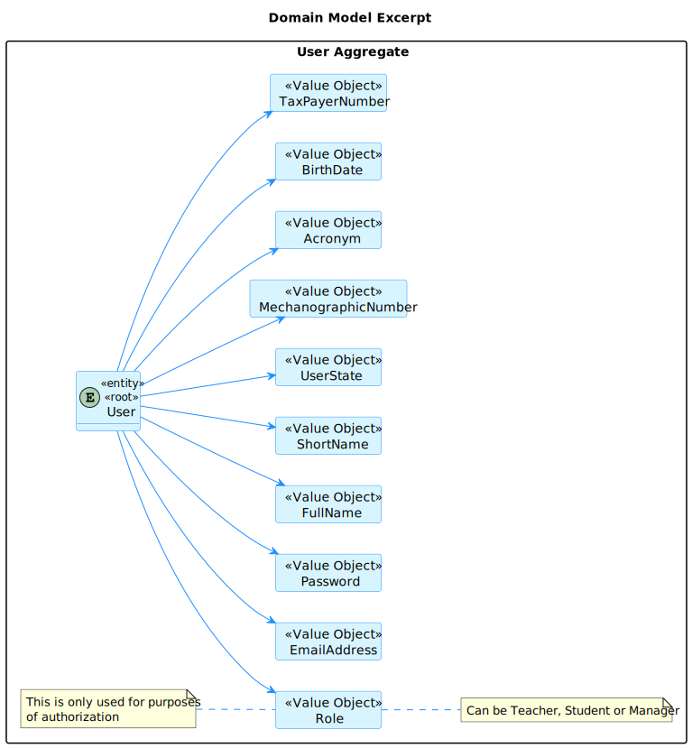
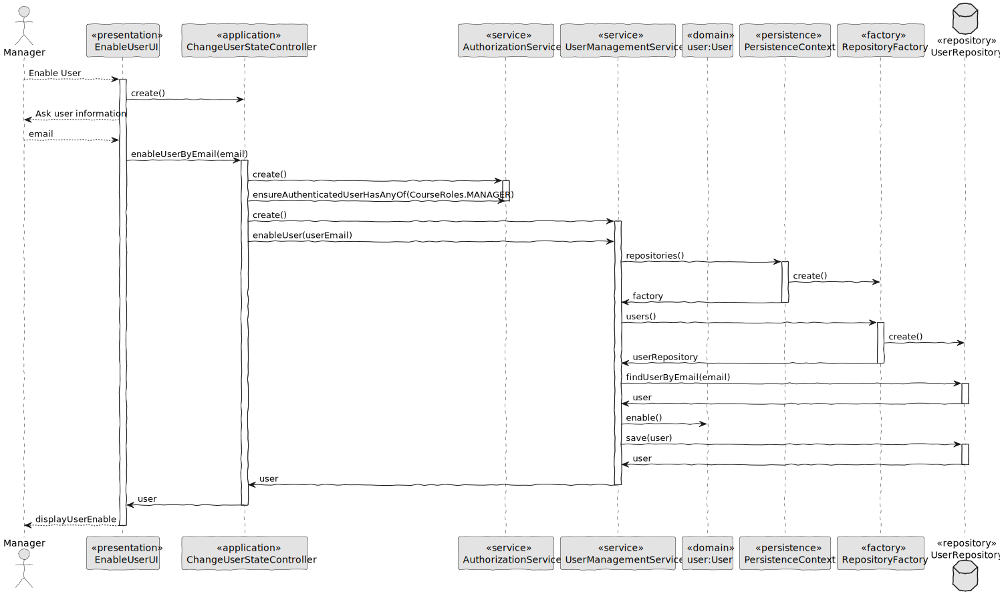
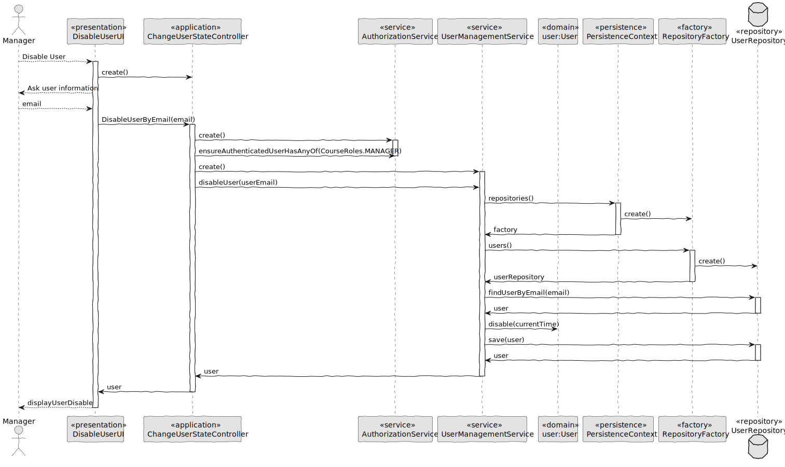
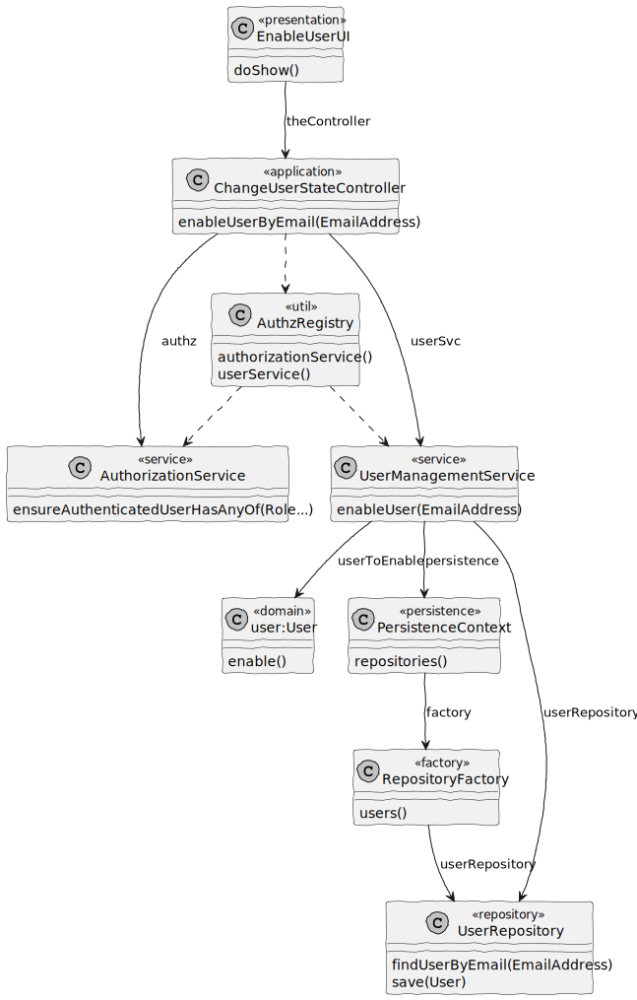

# US 1001 - Change User State

## 1. Context

In Sprint B client wants us to develop a feature for our System. He wants that a Manager to be able to disable/enable, Teachers and Students, as well as Managers.

## 2. Requirements

As Manager, I want to be able to disable/enable users of the system 

## 3. Analysis

Information in System Specification

	FRU01 - Management of Users Create, disable/enable, and list users of the system(Teachers and Students, as well as Managers)


This is an excerpt of our domain Model, it provides the clear idea of how the User should be identified according to the information in System Specification.



We added the UserState as a Value Object of the User so that it is easy to know which users are enable and which are disable.

### 4.1. Realization

#### 4.1.1. Sequence Diagram Enable User



#### 4.1.2. Sequence Diagram Disable User



### 4.2. Class Diagram

#### 4.2.1 Class Diagram Change User State Enable


#### 4.2.2 Class Diagram Change User State Disable




### 4.3. Applied Patterns

#### 4.3.1. Factory

- Our PersistenceContext will create a RepositoryFactory based on the configuration file then the RepositoryFactory will create the repository that we need in order to persist our domain entity.


#### 4.3.2 Single Responsibility Principle (SRP)

- Ensure that each object has a clear and well-defined responsibility within the domain.

#### 4.3.3 Tell, Don't Ask

- Ensure that objects do not expose their internal state or behaviour to the outside world. On the contrary, objects should receive commands telling them what they should do, rather than being asked for information about their current state.

#### 4.3.4 Singleton Pattern

- Only one instance, and provides a global point of access to that instance. 
- The Authentication Registry is a singleton, since from this class we can only get aninstance of the authentication service, the authorization service and the user management service. 

#### 4.3.5 Model-View-Controller (MVC)

- Model is responsible for managing the data and business logic of the application. (AuthorizationService)
- View is responsible for presenting the data to the user in a human-readable format. (ChangeUserStateUI)
- Controller is responsible for handling the user input and updating the model and the view accordingly. (ChangeUserStateController)


### 4.4. Tests

**Test 1:** *Verifies that it is not possible to enable User that is already enabled.*

```Java
@Test
void enableUserThatIsAlreadyEnableThenThrowException() {
    EmailAddress userEmail = EmailAddress.valueOf(STRING_EMAIL);
    User user = managerUser();
    when(userRepository.findUserByEmail(userEmail)).thenReturn(Optional.of(user));

    assertThrows(IllegalStateException.class,
                () ->userSvc.enableUser(userEmail));
    }
````

**Test 2:** *Verifies that it is possible to enable User that is disabled.*

```Java
@Test
void enableUserWhenValidEmailAddressProvided() {
    EmailAddress userEmail = EmailAddress.valueOf(STRING_EMAIL);
    User user = mock(User.class);
    when(userRepository.findUserByEmail(userEmail)).thenReturn(Optional.of(user));
    when(userRepository.save(eq(user))).thenReturn(user);

    User enabledUser = userSvc.enableUser(userEmail);

    verify(userRepository, times(1)).findUserByEmail(userEmail);
    verify(user, times(1)).enable();
    verify(userRepository, times(1)).save(user);
    assertEquals(user, enabledUser);
}
````

**Test 3:** *Verifies that when email address is not found will thow Exception.*

```Java
@Test
void disableUserWhenEmailAddressNotFoundThenThrowException() {
    EmailAddress userEmail = EmailAddress.valueOf(STRING_EMAIL);
    when(userRepository.findUserByEmail(userEmail)).thenReturn(Optional.empty());

    assertThrows(
            NoSuchElementException.class,
            () -> {
                userSvc.disableUser(userEmail);
            });

    verify(userRepository, times(1)).findUserByEmail(userEmail);
}
````

**Test 4:** *Verifies that it is possible to disable User that is enabled.*

```Java
@Test
void disableUserWhenValidEmailAddressProvided() {
    EmailAddress userEmail = EmailAddress.valueOf(STRING_EMAIL);
    User user = mock(User.class);
    when(userRepository.findUserByEmail(userEmail)).thenReturn(Optional.of(user));
    when(userRepository.save(eq(user))).thenReturn(user);

    User disabledUser = userSvc.disableUser(userEmail);

    verify(userRepository, times(1)).findUserByEmail(userEmail);
    verify(user, times(1)).disable(any());
    verify(userRepository, times(1)).save(user);
    assertEquals(user, disabledUser);
}
````


## 5. Implementation

**EnableUserUI**

```Java
package presentation.usermanagement;

import eapli.framework.general.domain.model.EmailAddress;
import eapli.framework.io.util.Console;
import eapli.framework.presentation.console.AbstractUI;
import org.usermanagement.controller.ChangeUserStateController;

import java.util.NoSuchElementException;

public class EnableUserUI extends AbstractUI {
    private final ChangeUserStateController theController = new ChangeUserStateController();

    /**
     * Manager want to enable a user.
     * Ask Manager email of user to enable.
     * @return false
     */
    @Override
    protected boolean doShow() {
        try{
            final String email = Console.readLine("E-Mail:");

            EmailAddress emailAddress = EmailAddress.valueOf(email);

            theController.enableUserByEmail(emailAddress);

            System.out.println("User enabled with success!");
        } catch (NoSuchElementException | IllegalArgumentException e){
            System.out.println("This user doesn't exist");
        } catch (IllegalStateException e) {
            System.out.println(e.getMessage());
        }

        return false;
    }

    @Override
    public String headline() {
        return "Activate User";
    }
}
````

**DisableUserUI**

```Java
package presentation.usermanagement;

import eapli.framework.general.domain.model.EmailAddress;
import eapli.framework.io.util.Console;
import eapli.framework.presentation.console.AbstractUI;
import org.usermanagement.controller.ChangeUserStateController;

import java.util.NoSuchElementException;

public class DisableUserUI extends AbstractUI {
    private final ChangeUserStateController theController = new ChangeUserStateController();

    /**
     * Manager want to disable a user.
     * Ask Manager email of user to disale.
     * @return false
     */
    @Override
    protected boolean doShow() {
        try{
            final String email = Console.readLine("E-Mail:");

            EmailAddress emailAddress = EmailAddress.valueOf(email);

            theController.disableUserByEmail(emailAddress);

            System.out.println("User disabled with success!");
        } catch (NoSuchElementException | IllegalArgumentException e){
            System.out.println("This user doesn't exist");
        } catch (IllegalStateException e) {
            System.out.println(e.getMessage());
        }

        return false;
    }

    @Override
    public String headline() {
        return "Disable User";
    }
}
````

**ChangeUserStateController**

```Java
package org.usermanagement.controller;

import eapli.framework.general.domain.model.EmailAddress;
import org.authz.application.AuthorizationService;
import org.authz.application.AuthzRegistry;
import org.user.management.CourseRoles;
import org.usermanagement.domain.model.User;
import org.usermanagement.domain.model.UserManagementService;

public class ChangeUserStateController {
    /**
     * Authorization service instance.
     */
    private final AuthorizationService authz = AuthzRegistry
                                    .authorizationService();

    /**
     * User management service instance.
     */
    private final UserManagementService userSvc = AuthzRegistry.userService();

    /**
     * Enable user.
     * @param userEmail user email to enable
     * @return User enabled
     */
    public User enableUserByEmail(final EmailAddress userEmail){
        authz.ensureAuthenticatedUserHasAnyOf(CourseRoles.MANAGER);

        return userSvc.enableUser(userEmail);
    }

    /**
     * Disable user.
     * @param userEmail user email to disable
     * @return User disabled
     */
    public User disableUserByEmail(final EmailAddress userEmail){
        authz.ensureAuthenticatedUserHasAnyOf(CourseRoles.MANAGER);

        return userSvc.disableUser(userEmail);
    }
}
````

**UserManagementService**

```Java
package org.usermanagement.domain.model;

import eapli.framework.general.domain.model.EmailAddress;
import eapli.framework.infrastructure.authz.application.PasswordPolicy;
import eapli.framework.infrastructure.authz.domain.model.Role;
import eapli.framework.time.util.CurrentTimeCalendars;
import org.springframework.beans.factory.annotation.Autowired;
import org.springframework.security.crypto.password.PasswordEncoder;
import org.springframework.stereotype.Service;
import org.user.management.CourseRoles;
import org.usermanagement.domain.repositories.UserRepository;

import java.time.LocalDateTime;
import java.util.Calendar;

@Service
public class UserManagementService {
    /**
     * UserRepository.
     */
    private final UserRepository userRepository;
    /**
     * PasswordEncoder.
     */
    private final PasswordEncoder encoder;
    /**
     * PasswordPolicy with rules.
     */
    private final PasswordPolicy policy;

    /**
     * Generate MecanographicNumber Multiplier.
     */
    private static final int GENERATE_MUL = 100000;

    /**
     *
     * @param userRepo
     * @param encoderp
     * @param policyp
     */
    @Autowired
    public UserManagementService(final UserRepository userRepo,
                                 final PasswordPolicy policyp,
                                 final PasswordEncoder encoderp) {
        userRepository = userRepo;
        this.policy = policyp;
        this.encoder = encoderp;
    }

    /**
     * Registers a new user in the system allowing to
     * specify when the user account was created.
     * @param shortName
     * @param rawPassword
     * @param fullName
     * @param email
     * @param role
     * @param birthDate
     * @param taxPayerNumber
     * @param acronym
     * @param createdOn
     * @return User
     */
    public User registerNewUser(final String shortName,
                                final String rawPassword,
                                final String fullName, final String email,
                                final Role role, final String birthDate,
                                final String taxPayerNumber,
                                final String acronym,
                                final Calendar createdOn) {
        final var userBuilder = new UserBuilder(policy, encoder);

        userBuilder.with(shortName, rawPassword, fullName,
                        email, birthDate, role, taxPayerNumber)
                .createdOn(createdOn)
                .withAcronym(acronym);

        if (CourseRoles.STUDENT.equals(role)) {
            userBuilder.withMecanographicNumber(generateMecNumber());
        }

        final var newUser = userBuilder.build();

        return userRepository.save(newUser);
    }

    /**
     * Generate MecanographicNumber for users with role Student.
     * @return String for builder create MecanographicNumber
     */
    private String generateMecNumber() {
        MecanographicNumber mecanographicNumber = userRepository
                                .findMaxYearMecanographicNumber();

        if (mecanographicNumber == null) {
            return String.valueOf(
                    LocalDateTime.now().getYear() * GENERATE_MUL + 1);
        }

        mecanographicNumber.nextNumber();

        return mecanographicNumber.value();
    }

    /**
     * Registers a new user in the system.
     * @param shortName
     * @param rawPassword
     * @param fullName
     * @param email
     * @param role
     * @param birthDate
     * @param taxPayerNumber
     * @param acronym
     * @return User
     */
    public User registerNewUser(final String shortName,
                                final String rawPassword,
                                final String fullName, final String email,
                                final Role role, final String birthDate,
                                final String taxPayerNumber,
                                final String acronym) {
        return registerNewUser(shortName, rawPassword, fullName, email,
                role, birthDate, taxPayerNumber,
                acronym, CurrentTimeCalendars.now());
    }

    /**
     *
     * @return all users no matter their status
     */
    public Iterable<User> allUsers() {
        return userRepository.findAll();
    }

    /**
     * Find user by email and enable.
     * @param userEmail EmailAddress of user
     * @return the user enabled.
     */
    public User enableUser(final EmailAddress userEmail) {
        final User userToEnable = userRepository
                .findUserByEmail(userEmail).get();

        userToEnable.enable();

        return userRepository.save(userToEnable);
    }

    /**
     * Find user by email and disable.
     * @param userEmail EmailAddress of user
     * @return the user disabled.
     */
    public User disableUser(final EmailAddress userEmail) {
        final User userToDisable = userRepository
                .findUserByEmail(userEmail).get();

        userToDisable.disable(CurrentTimeCalendars.now());

        return userRepository.save(userToDisable);
    }
}
````

## 6. Integration/Demonstration

## Enable User

Login as a Manager

```txt
+= Login ======================================================================+

Email: managerteste123@email.com

Password: PasswordManager1


+==============================================================================+
```

Menu Manager choose "Enable User"

```txt
+= eCourse ====================================================================+

1. Manage eCourse Users
2. Manage eCourse Courses
0. Exit

Please choose an option
1

>> Manage eCourse Users
1. Create Users
2. Enable User
3. Disable User
4. List Users
0. Return 

Please choose an option
```

Input email of user to be enabled

```txt
+= Activate User ==============================================================+

E-Mail:
student1@email.com
User enabled with success!
+==============================================================================+
```

---------------------------------------------------------------

## Disable User

Login as a Manager

```txt
+= Login ======================================================================+

Email: managerteste123@email.com

Password: PasswordManager1


+==============================================================================+
```

Menu Manager choose "Disable User"

```txt
+= eCourse ====================================================================+

1. Manage eCourse Users
2. Manage eCourse Courses
0. Exit

Please choose an option
1

>> Manage eCourse Users
1. Create Users
2. Enable User
3. Disable User
4. List Users
0. Return 

Please choose an option
```

Input email of user to be disabled

```txt
+= Disable User ===============================================================+

E-Mail:
student1@email.com
User disabled with success!
+==============================================================================+
```