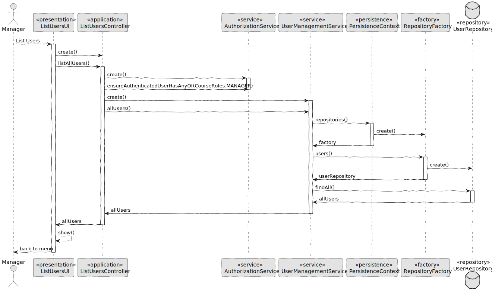
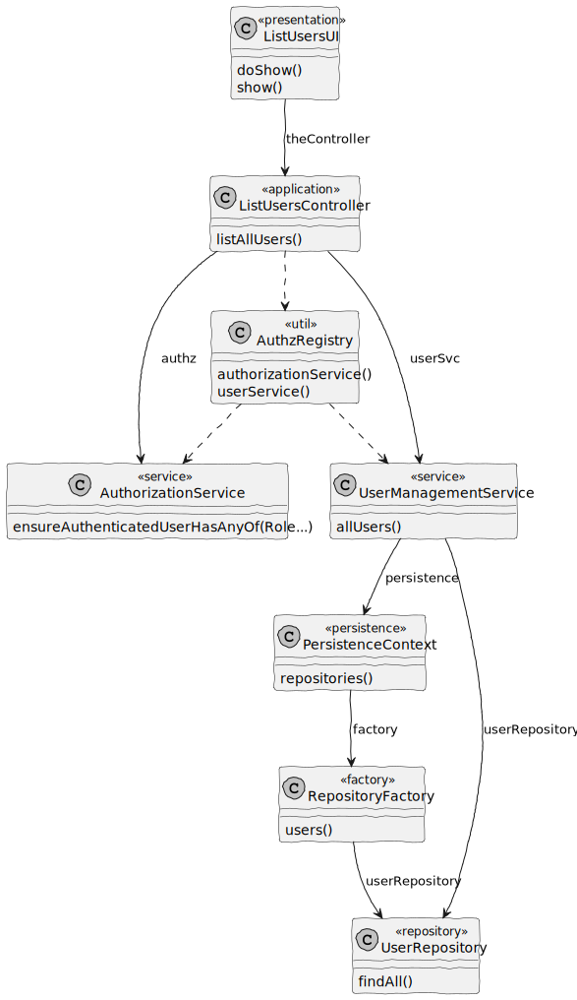

# US 1001 - List Users

## 1. Context

In Sprint B client wants us to develop a feature for our System. He wants that a Manager to be able to list Teachers and Students, as well as Managers.

## 2. Requirements

As Manager, I want to be able to list users of the system

## 3. Analysis

Information in System Specification

	FRU01 - Management of Users Create, disable/enable, and list users of the system(Teachers and Students, as well as Managers)~

Information in Forum

	"Is it necessary to know who created a specific user? There is no requirement specific to all these questions. However, I do not know if the system must support "something" related to these questions. I think this is something related to the design of the solution, that you and your team must decide when designing the solution in order to meet the existing requirements."

## 4. Design

### 4.1. Realization

#### 4.1.1. Sequence Diagram List Users



### 4.2. Class Diagram List Users



### 4.3. Applied Patterns

#### 4.3.1. Factory

- Our PersistenceContext will create a RepositoryFactory based on the configuration file then the RepositoryFactory will create the repository that we need in order to persist our domain entity.

#### 4.3.2 Service

- Services are operations or functions that are not naturally in line with the responsibility of an entity or value object. They are used to model operations that involve multiple objects or complex behaviour.

#### 4.3.3 Single Responsibility Principle (SRP)

- Ensure that each object has a clear and well-defined responsibility within the domain.

#### 4.3.4 Tell, Don't Ask

- Ensure that objects do not expose their internal state or behaviour to the outside world. On the contrary, objects should receive commands telling them what they should do, rather than being asked for information about their current state.

#### 4.3.5 Singleton Pattern

- Only one instance, and provides a global point of access to that instance. 
- The Authentication Registry is a singleton, since from this class we can only get aninstance of the authentication service, the authorization service and the user management service.

#### 4.3.6 Model-View-Controller (MVC)

- Model is responsible for managing the data and business logic of the application. (UserManagementService, AuthorizationService)
- View is responsible for presenting the data to the user in a human-readable format. (ListUsersUI)
- Controller is responsible for handling the user input and updating the model and the view accordingly. (ListUsersController)


### 4.4. Tests

**Test 1:** *Verifies if is possible to return empty list of Users*

```Java
@Test
void testAllUsersReturnsEmptyList() {
    when(userRepository.findAll()).thenReturn(new ArrayList<>());

    Iterable<User> allUsers = userSvc.allUsers();

    assertTrue(((List<User>) allUsers).isEmpty());
    verify(userRepository, times(1)).findAll();
}
````

**Test 2:** *Verifies if is returning a List with Users*

```Java
@Test
void testAllUsersReturnsNonEmptyList() {
    List<User> users = new ArrayList<>();
    User user1 = managerUser();
    User user2 = studentUser();
    users.add(user1);
    users.add(user2);

    when(userRepository.findAll()).thenReturn(users);

    Iterable<User> allUsers = userSvc.allUsers();

    assertEquals(users, allUsers);
    verify(userRepository, times(1)).findAll();
}
````

## 5. Implementation

**ListUsersUI**

```Java
package presentation.usermanagement;

import eapli.framework.presentation.console.AbstractUI;
import org.usermanagement.controller.ListUsersController;
import org.usermanagement.domain.model.User;

public class ListUsersUI extends AbstractUI {
    private final ListUsersController theController = new ListUsersController();

    /**
     * Manager want to list all users.
     * @return false
     */
    @Override
    protected boolean doShow() {
        Iterable<User> allUsers = theController.listAllUsers();

        for (User user : allUsers) {
            System.out.println(user.shortName().value()
                    + " | " + user.emailAddress()
                    + " | " + user.role()
                    + " | " + user.isActive());
        }

        return false;
    }

    @Override
    public String headline() {
        return "List Users (Short Name | Email | Role | User State)";
    }
}
````


**ListUsersController**

```Java
package org.usermanagement.controller;

import org.authz.application.AuthorizationService;
import org.authz.application.AuthzRegistry;
import org.user.management.CourseRoles;
import org.usermanagement.domain.model.User;
import org.usermanagement.domain.model.UserManagementService;

public class ListUsersController {
    /**
     * Authorization service instance.
     */
    private final AuthorizationService authz = AuthzRegistry
            .authorizationService();

    /**
     * User management service instance.
     */
    private final UserManagementService userSvc = AuthzRegistry.userService();

    /**
     * Manager want to list all users.
     * @return Iterable<User>
     */
    public Iterable<User> listAllUsers(){
        authz.ensureAuthenticatedUserHasAnyOf(CourseRoles.MANAGER);

        return userSvc.allUsers();
    }
}
````


**UserManagementService**

```Java
package org.usermanagement.domain.model;

import eapli.framework.general.domain.model.EmailAddress;
import eapli.framework.infrastructure.authz.application.PasswordPolicy;
import eapli.framework.infrastructure.authz.domain.model.Role;
import eapli.framework.time.util.CurrentTimeCalendars;
import org.springframework.beans.factory.annotation.Autowired;
import org.springframework.security.crypto.password.PasswordEncoder;
import org.springframework.stereotype.Service;
import org.user.management.CourseRoles;
import org.usermanagement.domain.repositories.UserRepository;

import java.time.LocalDateTime;
import java.util.Calendar;

@Service
public class UserManagementService {
    /**
     * UserRepository.
     */
    private final UserRepository userRepository;
    /**
     * PasswordEncoder.
     */
    private final PasswordEncoder encoder;
    /**
     * PasswordPolicy with rules.
     */
    private final PasswordPolicy policy;

    /**
     * Generate MecanographicNumber Multiplier.
     */
    private static final int GENERATE_MUL = 100000;

    /**
     *
     * @param userRepo
     * @param encoderp
     * @param policyp
     */
    @Autowired
    public UserManagementService(final UserRepository userRepo,
                                 final PasswordPolicy policyp,
                                 final PasswordEncoder encoderp) {
        userRepository = userRepo;
        this.policy = policyp;
        this.encoder = encoderp;
    }

    /**
     * Registers a new user in the system allowing to
     * specify when the user account was created.
     * @param shortName
     * @param rawPassword
     * @param fullName
     * @param email
     * @param role
     * @param birthDate
     * @param taxPayerNumber
     * @param acronym
     * @param createdOn
     * @return User
     */
    public User registerNewUser(final String shortName,
                                final String rawPassword,
                                final String fullName, final String email,
                                final Role role, final String birthDate,
                                final String taxPayerNumber,
                                final String acronym,
                                final Calendar createdOn) {
        final var userBuilder = new UserBuilder(policy, encoder);

        userBuilder.with(shortName, rawPassword, fullName,
                        email, birthDate, role, taxPayerNumber)
                .createdOn(createdOn)
                .withAcronym(acronym);

        if (CourseRoles.STUDENT.equals(role)) {
            userBuilder.withMecanographicNumber(generateMecNumber());
        }

        final var newUser = userBuilder.build();

        return userRepository.save(newUser);
    }

    /**
     * Generate MecanographicNumber for users with role Student.
     * @return String for builder create MecanographicNumber
     */
    private String generateMecNumber() {
        MecanographicNumber mecanographicNumber = userRepository
                                .findMaxYearMecanographicNumber();

        if (mecanographicNumber == null) {
            return String.valueOf(
                    LocalDateTime.now().getYear() * GENERATE_MUL + 1);
        }

        mecanographicNumber.nextNumber();

        return mecanographicNumber.value();
    }

    /**
     * Registers a new user in the system.
     * @param shortName
     * @param rawPassword
     * @param fullName
     * @param email
     * @param role
     * @param birthDate
     * @param taxPayerNumber
     * @param acronym
     * @return User
     */
    public User registerNewUser(final String shortName,
                                final String rawPassword,
                                final String fullName, final String email,
                                final Role role, final String birthDate,
                                final String taxPayerNumber,
                                final String acronym) {
        return registerNewUser(shortName, rawPassword, fullName, email,
                role, birthDate, taxPayerNumber,
                acronym, CurrentTimeCalendars.now());
    }

    /**
     *
     * @return all users no matter their status
     */
    public Iterable<User> allUsers() {
        return userRepository.findAll();
    }

    /**
     * Find user by email and enable.
     * @param userEmail EmailAddress of user
     * @return the user enabled.
     */
    public User enableUser(final EmailAddress userEmail) {
        final User userToEnable = userRepository
                .findUserByEmail(userEmail).get();

        userToEnable.enable();

        return userRepository.save(userToEnable);
    }

    /**
     * Find user by email and disable.
     * @param userEmail EmailAddress of user
     * @return the user disabled.
     */
    public User disableUser(final EmailAddress userEmail) {
        final User userToDisable = userRepository
                .findUserByEmail(userEmail).get();

        userToDisable.disable(CurrentTimeCalendars.now());

        return userRepository.save(userToDisable);
    }
}
````


## 6. Integration/Demonstration

Login as a Manager

```txt
+= Login ======================================================================+

Email: managerteste123@email.com

Password: PasswordManager1


+==============================================================================+
```


Menu Manager choose "List Users"

```txt
+= eCourse ====================================================================+

1. Manage eCourse Users
2. Manage eCourse Courses
0. Exit

Please choose an option
1

>> Manage eCourse Users
1. Create Users
2. Enable User
3. Disable User
4. List Users
0. Return 

Please choose an option
```


All users in the system will render on screen

```txt
+= List Users (Short Name | Email | Role | User State) ========================+

manager | managerbootstr@email.com | MANAGER | true
Samuel | managerteste123@email.com | MANAGER | true
Henrique | teacher@email.com | TEACHER | true
Maria | teacher2@email.com | TEACHER | true
Pedro | student1@email.com | STUDENT | true
Bruna | student2@email.com | STUDENT | true
+==============================================================================+
```