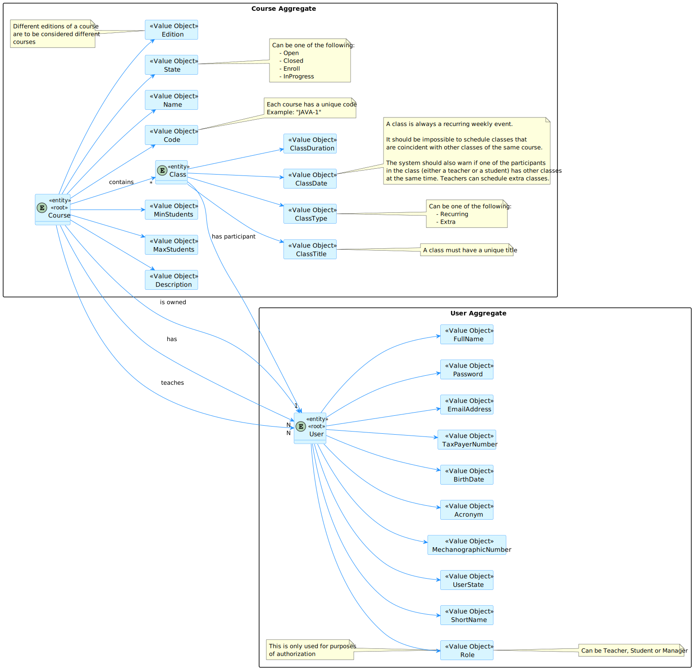
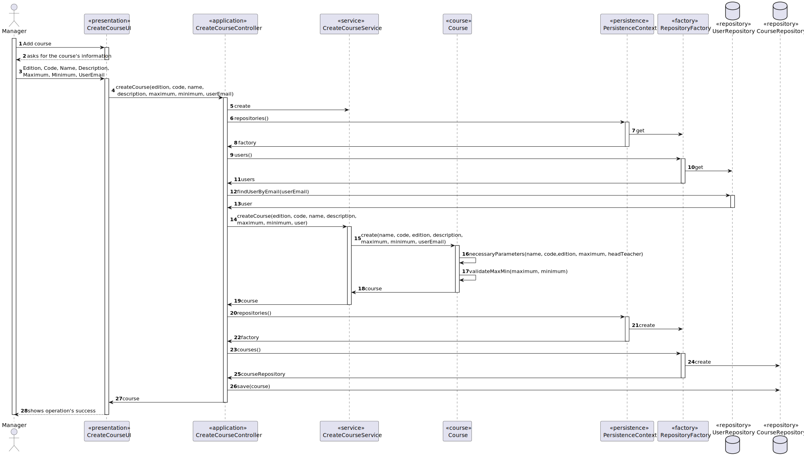
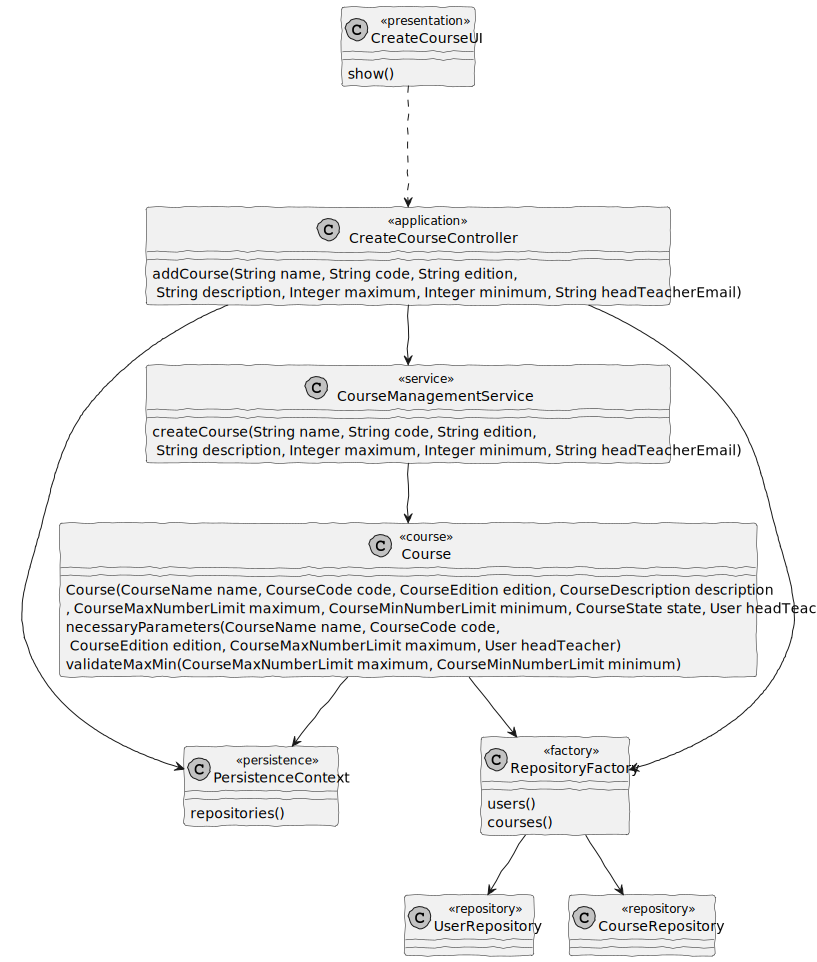

# US 1002

## 1. Context

It is required for the manager to be able to create courses

## 2. Requirements

-As a Manager, I want to create courses.

-Different editions of a course are to be considered different
courses (e.g., Intro-Math-Sem01, Intro-Math-Sem02). Only managers are able to execute
this functionality.

## 3. Analysis

## 4. Design

### 4.1. Realization

### 4.2. Class Diagram

### 4.3. Applied Patterns

### 4.3.1 Model-View-Controller (MVC)

- Model is responsible for managing the courses that are added and the logic behind what is shown.(Course, User, CourseManagementService, CourseRepository, UserRepository, AuthorizationService)
- View is responsible for showing what is needed to create a given course. (AddCourseUI)
- Controller is responsible to block any attempt to create a course which doesn't follow the rules.(AddCourseController)

### 4.3.2 Factory Pattern

- This pattern enables objects to be created, instantiating this product without exposing the logic to the client.(CourseFactory)

### 4.4. Tests

**Test 1:** *Verifies that a course can be created*

    @Test
    void createCourseTest(){
        builder.with("Pedro","Password1","Pedro Alves","pedro@email.com", "23/05/2002", CourseRoles.TEACHER,"333333333")
                .createdOn(Calendar.getInstance())
                .withAcronym("PPA");

        final User user = builder.build();

        userRepo.save(user);

        when(userRepo.findUserByEmail(EmailAddress.valueOf("pedro@email.com"))).thenReturn(Optional.of(user));

        Course c1 = new Course(CourseName.of("Matemática"), CourseCode.of("MAT-1"),
                CourseEdition.of("INTRO-MAT-SEM01"), CourseDescription.of("Mathematics from the beginning of time"),
                CourseState.of(String.valueOf(CourseStateConstants.CLOSED)), CourseMaxNumberLimit.of(100),
                CourseMinNumberLimit.of(10), user,
                new HashSet<>(), new HashSet<>());

        when(repo.findByCode(CourseCode.of("MAT-1"))).thenReturn(Optional.of(c1));

        ArgumentCaptor<Course> captor = ArgumentCaptor.forClass(Course.class);

        service.createCourse("Matemática", "MAT-1", "INTRO-MAT-SEM01",
                "Mathematics from the beginning of time", 100, 10, user);

        verify(repo).save(captor.capture());
    }

**Test 2:** *Verify nam of the course can't be null*

    @Test
    void ensureHasName() {
        assertThrows(IllegalArgumentException.class, () ->
                factory.createCourse(null,
                        "MAT-1",
                        "INTRO-MAT-SEM01",
                        "Mathematics",
                        100,
                        10,
                        user));
    }

**Test 3:** *Verify Code can't be null*

    @Test
    void ensureHasCode() {
        assertThrows(IllegalArgumentException.class, () ->
                factory.createCourse("Mathematics",
                        null,
                        "INTRO-MAT-SEM01",
                        "Mathematics",
                        100,
                        10,
                        user));
    }

**Test 4:** *Verify edition can't be null*

    @Test
    void ensureHasEdition() {
        assertThrows(IllegalArgumentException.class, () ->
                factory.createCourse("Mathematics",
                        "MAT-1",
                        null,
                        "Mathematics",
                        100,
                        10,
                        user));
    }

**Test 5:** *Verify the maximum can't be 0*

    @Test
    void ensureHasMaximum() {
        assertThrows(NullPointerException.class, () ->
                factory.createCourse("Mathematics",
                        "MAT-1",
                        "INTRO-MAT-SEM01",
                        "Mathematics",
                        0,
                        0,
                        user));
    }

**Test 6:** *Verify the differece can't be null or lower than 0*

    @Test
    void ensureMaximumBiggerMinimum() {
        assertThrows(NullPointerException.class, () ->
                factory.createCourse("Mathematics",
                        "MAT-1",
                        "INTRO-MAT-SEM01",
                        "Mathematics",
                        10,
                        20,
                        user));
    }

**Test 7:** *Verify there is a teacher as a head teacher*

    @Test
    void ensureHasTeacher() {
        assertThrows(IllegalArgumentException.class, () ->
                factory.createCourse("Mathematics",
                        "MAT-1",
                        "INTRO-MAT-SEM01",
                        "Mathematics",
                        100,
                        10,
                        null));
    }

## 5. Implementation

**5.1**Creation of a Course

- Service

        public Course createCourse(final String name,
            final String code,
            final String edition,
            final String description,
            final Integer max,
            final Integer min,
            final User headTeacher){
            Course course = factory.createCourse(name,
            code,
            edition,
            description,
            max,
            min,
            headTeacher);

            return courseRepo.save(course);
        }
- Factory

        public Course createCourse(final String name,
                               final String code,
                               final String edition,
                               final String description,
                               final Integer max,
                               final Integer min,
                               final User headTeacher){
        Course course = factory.createCourse(name,
                code,
                edition,
                description,
                max,
                min,
                headTeacher);

        return courseRepo.save(course);
    }

*It is also a best practice to include a listing (with a brief summary) of the major commits regarding this requirement.*

## 6. Integration/Demonstration

- For this functionality to be available, after running the rebuild-all.bat, the only users who can
  access this functionality are managers;

- After logging in as a Manager, the option should be the no.2 (Manage eCourse Courses);

- The menu for all the options to manage courses shows up and the chosen option shall be the 3rd one (Create a new Course)

- Then, all the needed information will be asked : name, code, edition, maximum and minimum number of people, and the email of the teacher to be headTeacher.

- If all information respects the needs for a course to be created, a success message will be shown.

*It is also important to explain any scripts or instructions required to execute an demonstrate this functionality*

## 7. Observations

*This section should be used to include any content that does not fit any of the previous sections.*

*The team should present here, for instance, a critical prespective on the developed work including the analysis of alternative solutioons or related works*

*The team should include in this section statements/references regarding third party works that were used in the development this work.* 