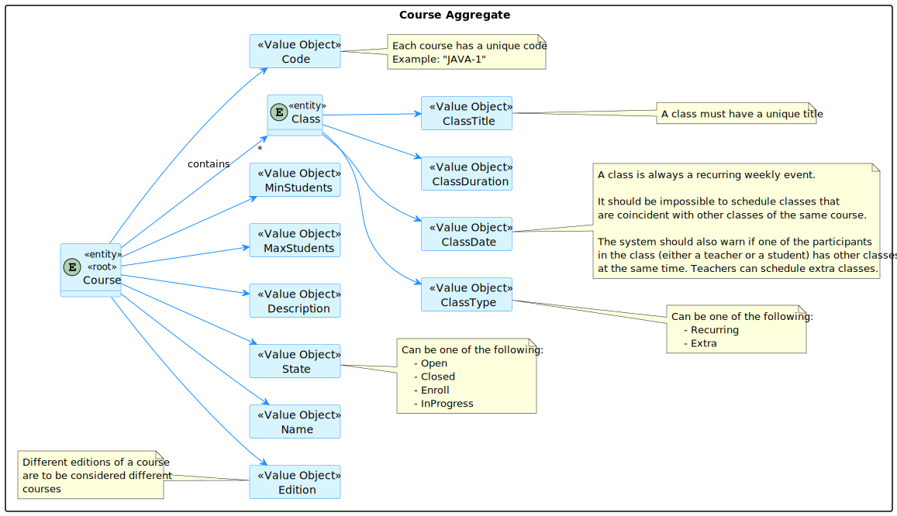
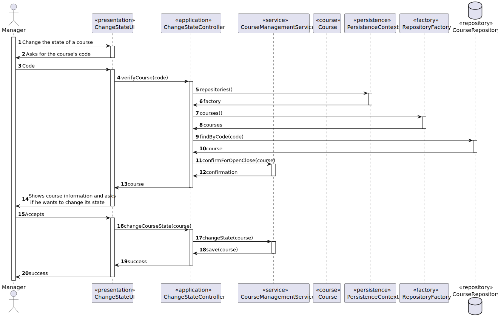
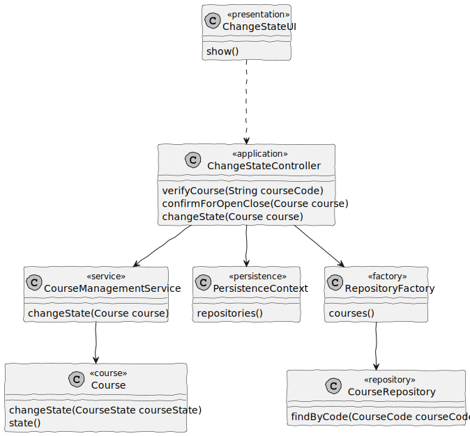

# US 1004

## 1. Context

It is intended to open and close the courses from enrollment to follow the workflow

## 2. Requirements

- As a Manager, I want to open and close courses
- Open/Close Course : Only managers are able to execute this functionality.
- A course state should change with this (and only this order): Closed -> Open -> Enroll -> In Progress -> Closed ...

## 3. Analysis

## 4. Design

### 4.1. Realization

### 4.2. Class Diagram

### 4.3. Applied Patterns

### 4.4. Tests

**Test 1:** *Verifies the method throws an exception if the course's state is "Enroll"*

    @Test
    void confirmForOpenCloseEnrollTest(){
        builder.with("Pedro","Password1","Pedro Alves","pedro@email.com", "23/05/2002", CourseRoles.TEACHER,"333333333")
                .createdOn(Calendar.getInstance())
                .withAcronym("PPA");

        final User user = builder.build();

        userRepo.save(user);

        when(userRepo.findUserByEmail(EmailAddress.valueOf("pedro@email.com"))).thenReturn(Optional.of(user));

        Course c1 = new Course(CourseName.of("Matemática"),
                CourseCode.of("MAT-1"),
                CourseEdition.of("INTRO-MAT-SEM01"),
                CourseDescription.of("Mathematics"),
                CourseState.of(CourseStateConstants.ENROLL.toString()),
                CourseMaxNumberLimit.of(100),
                CourseMinNumberLimit.of(10),
                user, new HashSet<>(), new HashSet<>());

        assertThrows(IllegalArgumentException.class,()-> service.confirmForOpenClose(c1));
    }

**Test 2:** *Verifies the method throws an exception if the course's state is "Open"*

    @Test
    void confirmForOpenCloseOpenedTest(){
        builder.with("Pedro","Password1","Pedro Alves","pedro@email.com", "23/05/2002", CourseRoles.TEACHER,"333333333")
        .createdOn(Calendar.getInstance())
        .withAcronym("PPA");

        final User user = builder.build();

        userRepo.save(user);

        when(userRepo.findUserByEmail(EmailAddress.valueOf("pedro@email.com"))).thenReturn(Optional.of(user));

        Course c1 = new Course(CourseName.of("Matemática"),
                CourseCode.of("MAT-1"),
                CourseEdition.of("INTRO-MAT-SEM01"),
                CourseDescription.of("Mathematics"),
                CourseState.of(CourseStateConstants.OPEN.toString()),
                CourseMaxNumberLimit.of(100),
                CourseMinNumberLimit.of(10),
                user, new HashSet<>(), new HashSet<>());

        assertThrows(IllegalArgumentException.class,()-> service.confirmForOpenClose(c1));
    }

**Test 3:** *This test will change the state and confirm that the return of confirmForEnrollment(Course course) will always be true because its state is either Enroll or Open*

    @Test
    void courseStateChange(){
        builder.with("Pedro","Password1","Pedro Alves","pedro@email.com", "23/05/2002", CourseRoles.TEACHER,"333333333")
                .createdOn(Calendar.getInstance())
                .withAcronym("PPA");

        final User user = builder.build();

        userRepo.save(user);

        when(userRepo.findUserByEmail(EmailAddress.valueOf("pedro@email.com"))).thenReturn(Optional.of(user));

        Course c1 = new Course(CourseName.of("Matemática"),
                CourseCode.of("MAT-1"),
                CourseEdition.of("INTRO-MAT-SEM01"),
                CourseDescription.of("Mathematics"),
                CourseState.of(CourseStateConstants.ENROLL.toString()),
                CourseMaxNumberLimit.of(100),
                CourseMinNumberLimit.of(10),
                user, new HashSet<>(), new HashSet<>());

        Assertions.assertTrue(service.confirmForEnrollment(c1));
        service.changeState(c1);
        Assertions.assertTrue(service.confirmForOpenClose(c1));
        service.changeState(c1);
        Assertions.assertTrue(service.confirmForOpenClose(c1));
        service.changeState(c1);
        Assertions.assertTrue(service.confirmForEnrollment(c1));
    }

## 5. Implementation

**5.1** *The changes are automatic*

    public Course changeState(Course c){
        txt.beginTransaction();
        CourseState state = c.state();

        if(state.equals(CourseStateConstants.CLOSED)) {

            c.changeState(CourseStateConstants.OPEN);

        } else if(state.equals(CourseStateConstants.OPEN)) {

            c.changeState(CourseStateConstants.ENROLL);

        } else if(state.equals(CourseStateConstants.ENROLL)) {

            c.changeState(CourseStateConstants.IN_PROGRESS);

        } else {
            c.changeState(CourseStateConstants.CLOSED);
        }

        txt.commit();

        return courseRepo.save(c);
    }

*It is also a best practice to include a listing (with a brief summary) of the major commits regarding this requirement.*

## 6. Integration/Demonstration

- For this functionality to be available, after running the rebuild-all.bat, the only users who can
  access this functionality are managers;

- After logging in as a Manager, the option should be the no.2 (Manage eCourse Courses);

- The menu for all the options to manage courses shows up and the chosen option shall be the 5th one (Open/Close a Course)

- It will be asked what the course code is and, if a Course with that Code is found, its state will be checked:

  1.If the state is either In Progress or Closed, the UI will show its current state and ask for confirmation on changing it(to Enroll or In Progress, respectively);
  2.If the state is either Open or Enroll, an exception will be thrown and the state won't be able to be changed.

- The operation's success or not will be known by the user, either if it does or does not change.

## 7. Observations

This User Story combined with US1003 is a way to change the state of any course at any given time.

Although the order is restrained and there can't be any jumps from any state to any other (for example, from Closed to Enroll), this solves the possible problem of changing to a state it cannot change.

The confirmation or denial of the state are important because both show the current state of the course with the given course code.

*The team should include in this section statements/references regarding third party works that were used in the development this work.* 