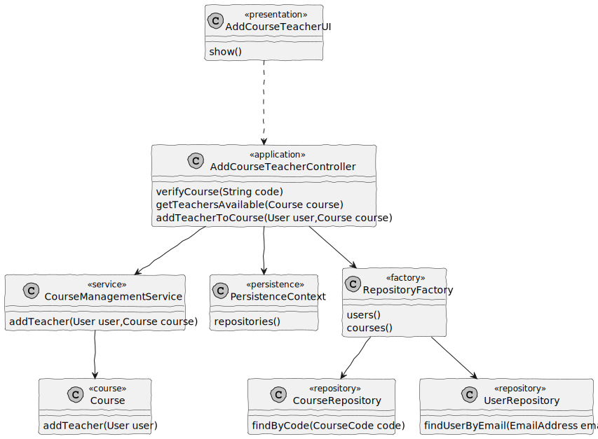

# US 1005

## 1. Context

It is intended for the course to have a list of teachers

## 2. Requirements

- As a manager, I want to set the teachers courses
- Set Course Teachers : Each course may have several teachers and must have
  only one Teacher in Charge. Only managers are able to execute this functionality

## 3. Analysis

## 4. Design

### 4.1. Realization

### 4.2. Class Diagram

### 4.3. Applied Patterns

### 4.3.1 Model-View-Controller (MVC)

- Model is responsible for managing the teachers that are added to the courses and the logic behind what is shown.(Course, User, CourseManagementService, CourseRepository, UserRepository, AuthorizationService)
- View is responsible for showing what is needed to add a teacher to a given course. (AddCourseTeacherUI)
- Controller is responsible to stop a teacher to be added to a course which doesn't follow the rules.(AddCourseTeacherController)

### 4.4. Tests

**Test 1:** *Verifies thata teacher is added correctly and that the course is saved with it*

    @Test
    void addTeacherTest(){
        builder.with("Pedro","Password1","Pedro Alves","pedro@email.com", "23/05/2002", CourseRoles.TEACHER,"333333333")
                .createdOn(Calendar.getInstance())
                .withAcronym("PPA");

        final User user = builder.build();

        builder.with("Joao","Password2","Joao Alves","joao@email.com", "23/05/1992", CourseRoles.TEACHER,"333223333")
                .createdOn(Calendar.getInstance())
                .withAcronym("PAP");

        final User user2 = builder.build();

        Course c1 = new Course(CourseName.of("Matemática"), CourseCode.of("MAT-1"),
                CourseEdition.of("INTRO-MAT-SEM01"), CourseDescription.of("Mathematics from the beginning of time"),
                CourseState.of(String.valueOf(CourseStateConstants.CLOSED)), CourseMaxNumberLimit.of(100),
                CourseMinNumberLimit.of(10), user,
                new HashSet<>(), new HashSet<>());

        when(service.addTeacher(user2, c1)).thenReturn(c1);
    }

**Test 2** : *Verify the return of only the teacher which was not added*

    @Test
    void getTeachersAvailableTest(){
        builder.with("Pedro","Password1","Pedro Alves","pedro@email.com", "23/05/2002", CourseRoles.TEACHER,"333333333")
                .createdOn(Calendar.getInstance())
                .withAcronym("PPA");

        final User user = builder.build();

        builder.with("Joao","Password2","Joao Alves","joao@email.com", "23/05/1992", CourseRoles.TEACHER,"333223333")
                .createdOn(Calendar.getInstance())
                .withAcronym("PAP");

        final User user2 = builder.build();

        Course c1 = new Course(CourseName.of("Matemática"), CourseCode.of("MAT-1"),
                CourseEdition.of("INTRO-MAT-SEM01"), CourseDescription.of("Mathematics from the beginning of time"),
                CourseState.of(String.valueOf(CourseStateConstants.CLOSED)), CourseMaxNumberLimit.of(100),
                CourseMinNumberLimit.of(10), user,
                new HashSet<>(), new HashSet<>());

        service.addTeacher(user, c1);

        Set<User> users = new HashSet<>();
        users.add(user2);

        when(service.getTeachersAvailable(c1)).thenReturn(users);
    }

## 5. Implementation

**5.1** Addition to the course

    public Course addTeacher(User user, Course c){
        c.addTeacher(user);
        return courseRepo.save(c);
    }

**5.2** Verification of what teachers can be added

    public Set<User> getTeachersAvailable(Course course){
        Set<User> inCourse = course.getTeachers();

        Set<User> allTeachersAvailable = new HashSet<>();

        Set<User> allUsers = getTeachers();

        for(User user: allUsers){
            int count = 0;

            for(User inUser : inCourse){
                if(user.emailAddress().toString().equals(inUser.emailAddress().toString())){
                    count++;
                    break;
                }
            }

            if(count==0){
                allTeachersAvailable.add(user);
            }
        }

        return allTeachersAvailable;
    }

## 6. Integration/Demonstration

- For this functionality to be available, after running the rebuild-all.bat, the only users who can
  access this functionality are managers;

- After logging in as a Manager, the option should be the no.2 (Manage eCourse Courses);

- The menu for all the options to manage courses shows up and the chosen option shall be the 6th one (Add a Teacher to a Course)

- Then, it will be asked the code of the course to be added a teacher.

- After confirming it exists in the system, it will be shown all teachers that are not inside the course, but are registered in the system.

-The user should right the email, and the teacher will be added to the course.

*It is also important to explain any scripts or instructions required to execute an demonstrate this functionality*

## 7. Observations

*This section should be used to include any content that does not fit any of the previous sections.*

*The team should present here, for instance, a critical prespective on the developed work including the analysis of alternative solutioons or related works*

*The team should include in this section statements/references regarding third party works that were used in the development this work.* 