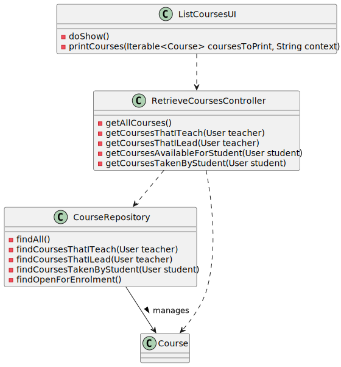

# US 1006 - As User, I want to list all the courses that are available to me

## 1. Context

It is necessary for the user to be able to list all the courses that are available to him.

## 2. Requirements

- As a Manager, all the courses of the system should be listed, since he won't enroll in any course and needs to verify if the course he wants to create already exists.
- As a Teacher, all the courses that he is teaching/is leading should be listed, the Manager is responsible for setting the course teachers.
- As a Student, all the open and available courses (that he is not enrolled in) should be listed, so that he can enroll in them. He shall also se, separately, the courses that he is enrolled in.

## 3. Analysis

Information in System Specification

    FRC05 - List Courses All users are able to execute this functionality.


    In this domain model excerpt we can clearly see that the user is related to the course in 3 different ways.
    The manager creates the courses, the teacher teaches, and the student takes the course.

### 4.1. Realization


### 4.2. Class Diagram



### 4.3. Applied Patterns

#### 4.3.1 Model-View-Controller (MVC)

- Model is responsible for managing the data and business logic of the application. (CourseRepository, Course, User, AuthorizationService)
- View is responsible for presenting the data to the user in a human-readable format. (ListCoursesUI)
- Controller is responsible for handling the user input and updating the model and the view accordingly. (RetrieveCoursesController)


    Note: since this was a reporting use case, there won't be any creational/behavioral patterns. (e.g. Factory, Builder, Observer, etc.)


### 4.4. Tests

```java
package org.course.controller;

import org.domain.model.Course;
import org.domain.repositories.CourseRepository;
import org.junit.jupiter.api.BeforeEach;
import org.junit.jupiter.api.Disabled;
import org.junit.jupiter.api.Test;
import org.junit.runner.RunWith;
import org.mockito.Mock;
import org.mockito.junit.MockitoJUnitRunner;
import org.usermanagement.domain.model.User;

import java.util.ArrayList;

import static org.mockito.Mockito.*;

@RunWith(MockitoJUnitRunner.class)
class RetrieveCoursesControllerTest {
    @Mock
    CourseRepository repoMock;

    RetrieveCoursesController ctrl;
    Iterable<Course> courses;
    User user;

    @BeforeEach
    void setUp() {
        repoMock = mock(CourseRepository.class);

        ctrl = new RetrieveCoursesController(repoMock);

        courses = new ArrayList<>();

        user = mock(User.class);
    }

    @Test
    void getAllCourses() {
        when(repoMock.findAll())
                .thenReturn(courses);

        ctrl.getAllCourses();

        verify(repoMock)
                .findAll();
    }

    @Test
    void getCoursesThatITeach() {
        when(repoMock.findCoursesThatITeach(user))
                .thenReturn(courses);

        ctrl.getCoursesThatITeach(user);

        verify(repoMock)
                .findCoursesThatITeach(user);
    }

    @Test
    void getCoursesThatILead() {
        when(repoMock.findCoursesThatILead(user))
                .thenReturn(new ArrayList<>());

        ctrl.getCoursesThatILead(user);

        verify(repoMock)
                .findCoursesThatILead(user);
    }

    @Test
    void getCoursesAvailableForStudent() {


        when(repoMock.findOpenForEnrolment())
                .thenReturn(courses);
        when(repoMock.findCoursesTakenByStudent(user))
                .thenReturn(courses);

        ctrl.getCoursesAvailableForStudent(user);

        verify(repoMock)
                .findOpenForEnrolment();
        verify(repoMock)
                .findCoursesTakenByStudent(user);
    }

    @Test
    void getCoursesTakenByStudent() {
        when(repoMock.findCoursesTakenByStudent(user))
                .thenReturn(courses);

        ctrl.getCoursesTakenByStudent(user);

        verify(repoMock)
                .findCoursesTakenByStudent(user);
    }

}
```

- These tests serve to verify that the controller is calling the correct methods from the repo.
- Repo is mocked, so that we can verify that the controller is calling the correct methods.


## 5. Implementation

### 5.1. Controller (chooses what to get from the repo in order to show in the UI)

```java
package org.course.controller;

import eapli.framework.application.UseCaseController;
import org.domain.model.Course;
import org.domain.repositories.CourseRepository;
import org.persistence.PersistenceContext;
import org.usermanagement.domain.model.User;

import java.util.List;

@UseCaseController
public class RetrieveCoursesController {

    private final CourseRepository repo;

    public RetrieveCoursesController(CourseRepository repo) {
        this.repo = repo;
    }

    public Iterable<Course> getAllCourses(){
        return repo.findAll();
    }

    public Iterable<Course> getCoursesThatITeach(User teacher){
        return repo.findCoursesThatITeach(teacher);
    }

    public Iterable<Course> getCoursesThatILead(User teacher){
        return repo.findCoursesThatILead(teacher);
    }

    public Iterable<Course> getCoursesAvailableForStudent(User student){
        List<Course> courses = (List<Course>) repo.findOpenForEnrolment();

        courses.removeAll((List<Course>) getCoursesTakenByStudent(student));

        return courses;
    }

    public Iterable<Course> getCoursesTakenByStudent(User student){
        return repo.findCoursesTakenByStudent(student);
    }

}
```

- As we can see, depending on the user type, the controller will get different courses from the repo.

### 5.2. JPA Auto transaction repository  methods (gets the data from the database)

```java
package org.persistence;


import eapli.framework.infrastructure.repositories.impl.jpa.JpaAutoTxRepository;
import org.domain.model.Course;
import org.domain.model.CourseCode;
import org.domain.model.CourseStateConstants;
import org.domain.repositories.CourseRepository;
import org.usermanagement.domain.model.User;

import javax.persistence.TypedQuery;
import java.util.Map;
import java.util.Optional;

public class JpaAutoTxCourseRepository
        extends JpaAutoTxRepository<Course, CourseCode, CourseCode>
        implements CourseRepository {
    // implementation is hidden, only showing the methods that are relevant to this use case

    @Override
    public Iterable<Course> findCoursesThatITeach(User teacher) {
        final TypedQuery<Course> query = createQuery(
                // query to get the courses that the teacher teaches 
                // (filtering by the teacher email from the UserSession)
                // joining with the teacher List
                "SELECT c FROM Course c JOIN c.teachers t WHERE t.email = :teacher_email",
                Course.class
        );

        query.setParameter("teacher_email", teacher.emailAddress());

        return query.getResultList();
    }

    @Override
    public Iterable<Course> findCoursesThatILead(User teacher) {
        final TypedQuery<Course> query = createQuery(
                // query to get the courses that the teacher leads
                // (filtering by the teacher email from the UserSession)
                // joining with the headTeacher
                "SELECT c FROM Course c JOIN c.headTeacher ht WHERE ht.email = :teacher_email",
                Course.class
        );

        query.setParameter("teacher_email", teacher.emailAddress());

        return query.getResultList();
    }

    @Override
    public Iterable<Course> findOpenForEnrolment() {
        final TypedQuery<Course> query = createQuery(
                // open for enrolment means that the course is in the ENROLL state
                "SELECT c FROM Course c WHERE c.state = :state",
                Course.class
        );

        query.setParameter("state", CourseStateConstants.ENROLL);

        return query.getResultList();
    }

    @Override
    public Iterable<Course> findCoursesTakenByStudent(User student) {
        final TypedQuery<Course> query = createQuery(
                // query to get the courses that the student is enrolled in
                // (filtering by the student email from the UserSession)
                // joining with the student List
                "SELECT c FROM Course c JOIN c.students s WHERE s.email = :student_email",
                Course.class
        );


        query.setParameter("student_email", student.emailAddress());

        return query.getResultList();
    }

    @Override
    public Iterable<Course> findAll() {
        // query to get all courses (only relevant to the manager)
        return this.repo.findAll();
    }
}
```
- The data will be dependent on the user type and will be filtered through a JPQL query since this is a JPA repository.
- Other types of repositories (e.g. InMemory) would have different implementations.


## 6. Integration/Demonstration

#### For this functionality, we need to login, and the results will depend on the UserSession ####

### Manager example

```text
All Courses existent

Course MAT-1
Name: Matemática
Edition: INTRO-MAT-SEM01
Description: Mathematics from the begining of time
State: Enroll
Max students: 100
Minimun students: 10
Head Teacher: teacher@email.com

Course PT-1
Name: Português
Edition: INTRO-PT-01
Description: Portuguese for every ERASMUS student
State: Enroll
Max students: 200
Minimun students: 20
Head Teacher: teacher2@email.com

Course APROG-3
Name: Algoritmia e Programação
Edition: APROG-SEM01
Description: Basics and fundamentals for java
State: Enroll
Max students: 400
Minimun students: 30
Head Teacher: teacher@email.com

Course APROG-5
Name: Algoritmia e Programação
Edition: APROG-SEM03
Description: Basics and fundamentals for java
State: Closed
Max students: 400
Minimun students: 30
Head Teacher: teacher2@email.com
```

### Teacher example

```text
Courses that I lead

Course MAT-1
Name: Matemática
Edition: INTRO-MAT-SEM01
Description: Mathematics from the begining of time
State: Enroll
Max students: 100
Minimun students: 10
Head Teacher: teacher@email.com

Course APROG-3
Name: Algoritmia e Programação
Edition: APROG-SEM01
Description: Basics and fundamentals for java
State: Enroll
Max students: 400
Minimun students: 30
Head Teacher: teacher@email.com


Courses that I teach

Course MAT-1
Name: Matemática
Edition: INTRO-MAT-SEM01
Description: Mathematics from the begining of time
State: Enroll
Max students: 100
Minimun students: 10
Head Teacher: teacher@email.com

Course APROG-5
Name: Algoritmia e Programação
Edition: APROG-SEM03
Description: Basics and fundamentals for java
State: Closed
Max students: 400
Minimun students: 30
Head Teacher: teacher2@email.com
```

### Student example

```text
Courses available for me

Course APROG-3
Name: Algoritmia e Programação
Edition: APROG-SEM01
Description: Basics and fundamentals for java
State: Enroll
Max students: 400
Minimun students: 30
Head Teacher: teacher@email.com


Courses that I am taking or took

Course MAT-1
Name: Matemática
Edition: INTRO-MAT-SEM01
Description: Mathematics from the begining of time
State: Enroll
Max students: 100
Minimun students: 10
Head Teacher: teacher@email.com

Course PT-1
Name: Português
Edition: INTRO-PT-01
Description: Portuguese for every ERASMUS student
State: Enroll
Max students: 200
Minimun students: 20
Head Teacher: teacher2@email.com
```