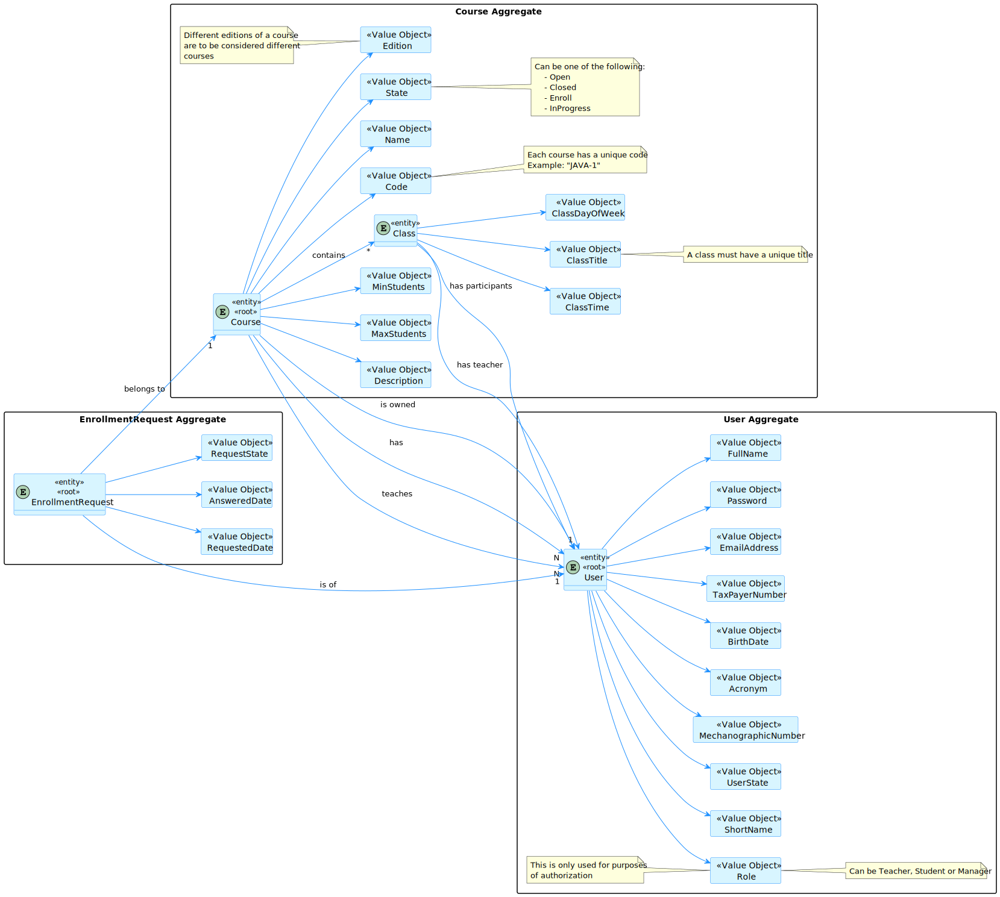
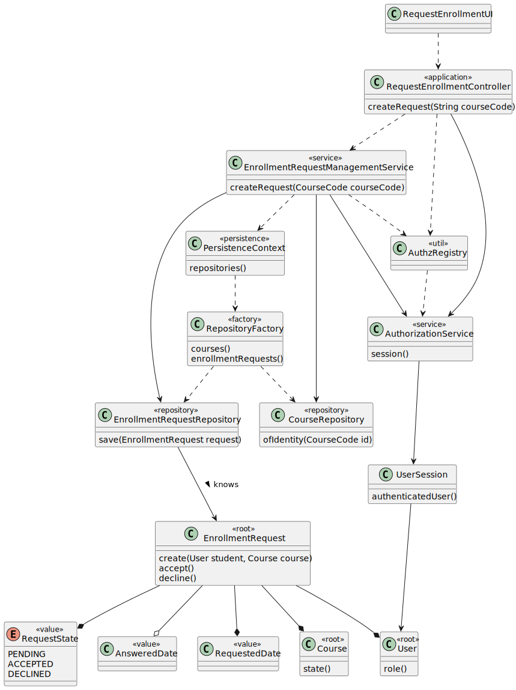
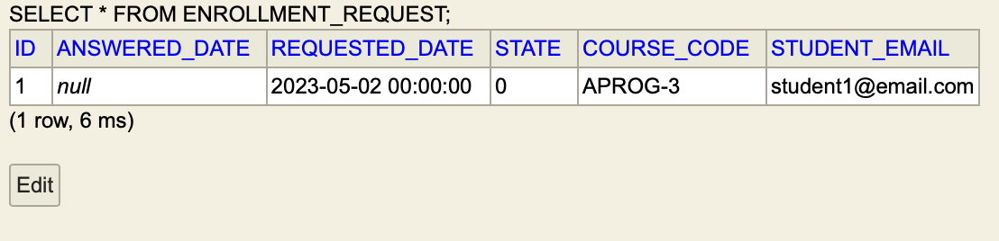

# US 1008 - As a Student, I want to request my enrollment in a course.

## 1. Context

In order for the student to be able to attend to classes of a course, the student needs to be enrolled in the correspondent course, so he needs to make a request to enroll, and then it is the manager's responsibility to accept or reject the request.
This User Story will be handling the request of the student to enroll in a course.

## 2. Requirements

As a student, I shall provide the course code of the course I want to enroll in.
However, I can only enroll in a course if I am not already enrolled in it and the course state is "Open for Enrollment" (CourseStateConstants.ENROLL in our app).

## 3. Analysis


- We have chosen to create a concept of "Enrollment request" that is used to connect a course and a user, in a way that does not say that the user is already enrolled, it says that the user is yet to be accepted or declined.

## 4. Design

### 4.1. Realization


### 4.2. Class Diagram


- The controller uses a service that manages requests to create the request with the current user session.
- This makes it so that the controller is only responsible for guiding the user story and not perform business logic.
- For easier application use, we made this user story dependent on US 1006, so we only need to type the course code and not select it from a list.
- The only input is a string, our application will manage the rest.

### 4.3. Applied Patterns

#### MVC (Model-View-Controller)

- Model is responsible for managing the data and business logic of the application. (CourseRepository, EnrollmentRequestRepository, User, Course, EnrollmentRequest, AuthorizationService, EnrollmentRequestManagementService)
- View is responsible for presenting the data to the user in a human-readable format. (RequestEnrollmentUI)
- Controller is responsible for handling the user input and updating the model and the view accordingly. (RequestEnrollmentController)

#### Factory
- For the creation of the EnrollmentRequest, we have used a factory method to create the object, so that we can have a single point of creation and we can easily change the creation process if needed.

#### Repository
- For the persistence of the EnrollmentRequest, we have used a repository to manage the persistence of the EnrollmentRequest objects.
- This is an interface, so we can easily change the persistence method if needed(In our case, it is JPA with auto transactional context, as it says in our app settings).
- This also goes along with the Single Responsibility Principle, as the repository is only responsible for the persistence of the EnrollmentRequest objects.
- This also respects the Information Expert pattern from GRASP, as the repository is a place that knows all EnrollmentRequest objects, so it shall also be responsible for the persistence of them.

#### Service Layer
- Since the creation of the EnrollmentRequest is a complex process, we have used a service to manage the creation of the EnrollmentRequest objects.
- It has dependencies, the Management Service of a EnrollmentRequest is helpful in order to display some of the functionalities, so we might use it in the future.
- The controllers are only responsible for guiding the user story and not perform business logic, so we have used a service to manage the creation of the EnrollmentRequest objects.

#### Dependency Injection
- The service (for example) has a dependency on all repositories, so we have used dependency injection to inject the repositories into the service, making it easier to change implementations if needed and test it better(with mocks, it is helpful).

### 4.4. Tests

#### 4.4.1. Domain Unit Tests

```java
class org.springframework.domain.EnrollmentRequestTest {
    // Some examples... might want to see actual class for tests in detail
    @Test
    void create() {

        user = buildStudent();
        course = createValidCourse();

        EnrollmentRequest.create(user, course);

    }

    @Test
    void ensureNotTeacher(){
        // needs to be a student
        user = buildTeacher();
        course = createValidCourse();

        assertThrows(
                IllegalArgumentException.class,
                () -> EnrollmentRequest.create(user, course)
        );
    }

    @Test
    void ensureCanOnlyEnrollIfEnrollState(){
        // needs to be in enroll state
        user = buildStudent();
        course = createInvalidCourse();

        assertThrows(
                IllegalArgumentException.class,
                () -> EnrollmentRequest.create(user, course)
        );
    }
}
````

#### 4.4.2. Service Integration Tests

```java
class EnrollmentRequestManagementServiceTest {
    // Set up mocks
    @BeforeEach
    void setUp() {
            courseCode = mock(CourseCode.class);
        this.request = mock(EnrollmentRequest.class);

        courseRepo = mock(CourseRepository.class);
        enrollmentRequestRepo = mock(EnrollmentRequestRepository.class);
        userRepo = mock(UserRepository.class);
        txt = mock(TransactionalContext.class);

        service = new EnrollmentRequestManagementService(
            courseRepo,
            enrollmentRequestRepo,
            userRepo,
            txt
        );
    }
    // Some examples... might want to see actual class for tests in detail
    // mostly to verify if correct methods are called
    @Test
    void createRequest() {
            user = buildStudent();
            course = createValidCourse();


            when(courseRepo.findByCode(courseCode)).thenReturn(Optional.of(course));
            when(enrollmentRequestRepo.findByCourseAndStudent(course, user)).thenReturn(null);
            when(enrollmentRequestRepo.save(any())).thenReturn(this.request);

            service.createRequest(courseCode, user);

            verify(courseRepo).findByCode(courseCode);
            verify(enrollmentRequestRepo).findByCourseAndStudent(course, user);
            verify(enrollmentRequestRepo).save(any());
    }
}
```

## 5. Implementation

### 5.1. Service Class

```java
@Service
public class EnrollmentRequestManagementService {
    // with a given course code and user, creates an enrollment request on the repository
    public EnrollmentRequest createRequest(CourseCode courseCode, User student){

        Course course = this.courseRepo
                .findByCode(courseCode)
                .orElseThrow(
                        () -> new IllegalArgumentException(
                                "Course with code " +
                                        courseCode.value() +
                                        " does not exist"
                        )
                );

        Preconditions.ensure(
                this
                        .enrollmentRequestRepo
                        .findByCourseAndStudent(course, student) == null,
                "Student " +
                        student.identity() +
                        " already requested to enroll in " +
                        courseCode.value() +
                        " course."
        ); ;

        EnrollmentRequest request = EnrollmentRequest.create(student, course);

        return this.enrollmentRequestRepo.save(request);
    }
}
```

### 5.2. Domain Class

```java
    package org.springframework.domain;


import eapli.framework.domain.model.AggregateRoot;
import eapli.framework.validations.Preconditions;
import org.domain.model.Course;
import org.domain.model.CourseStateConstants;
import org.user.management.CourseRoles;
import org.usermanagement.domain.model.User;

import javax.persistence.*;

import java.util.Objects;

/**
 * The type Enrollment request.
 */
@Entity
@Table(
        name = "enrollment_request",
        uniqueConstraints = @UniqueConstraint(
                columnNames = {
                        "student_email",
                        "course_code"
                }
        )
)
public class EnrollmentRequest implements AggregateRoot<Long> {

    @Id
    @GeneratedValue(strategy = GenerationType.IDENTITY)
    private Long id;

    @ManyToOne(fetch = FetchType.EAGER, cascade = CascadeType.PERSIST)
    @JoinColumn(name = "student_email")
    private User student;

    @ManyToOne(fetch = FetchType.EAGER, cascade = CascadeType.PERSIST)
    @JoinColumn(name = "course_code")
    private Course course;

    private RequestedDate requestedDate;
    private AnsweredDate answeredDate;

    @Enumerated(EnumType.STRING)
    private RequestState state;


    /**
     * Instantiates a new Enrollment request.
     */
    protected EnrollmentRequest() {
        // for ORM
    }

    private EnrollmentRequest(User student, Course course) {
        this.student = student;
        this.course = course;
        this.requestedDate = RequestedDate.init();
        this.state = RequestState.PENDING;
        this.answeredDate = null;
    }

    /**
     * Create enrollment request.
     *
     * @param student the student
     * @param course  the course
     * @return the enrollment request
     */
    public static EnrollmentRequest create(User student, Course course) {
        Preconditions.noneNull(student, course);
        Preconditions.ensure(
                student.role().equals(CourseRoles.STUDENT.toString()),
                "Only students can be enrolled"
        );
        Preconditions.ensure(
                course.state().equals(CourseStateConstants.ENROLL),
                "This course is not available for enrollment"
        );
        return new EnrollmentRequest(student, course);
    }

    /**
     * equals method.
     * @param o
     * @return
     */
    @Override
    public boolean equals(Object o) {
        if (this == o) return true;
        if (o == null || getClass() != o.getClass()) return false;

        EnrollmentRequest that = (EnrollmentRequest) o;

        if (!Objects.equals(student, that.student)) return false;
        return Objects.equals(course, that.course);
    }

    @Override
    public boolean sameAs(Object other) {
        return false;
    }

    /**
     * Accept request.
     */
    public void accept() {
        Preconditions.ensure(
                !this.state.equals(RequestState.ACCEPTED),
                "Already accepted requests cannot be accepted again"
        );
        this.state = RequestState.ACCEPTED;
        this.answeredDate = AnsweredDate.init();
    }

    /**
     * Reject request.
     */
    public void reject() {
        Preconditions.ensure(
                !this.state.equals(RequestState.REJECTED),
                "Already rejected requests cannot be rejected again"
        );
        this.state = RequestState.REJECTED;
        this.answeredDate = AnsweredDate.init();
    }

    @Override
    public Long identity() {
        return id;
    }
}
```

## 6. Integration/Demonstration

### 6.1. Non existent course
```text
>> Manage eCourse Courses
1. List Available Courses
2. Request Enrollment in a Course
0. Return 

Please choose an option
2
Course Code of course to enroll: seghwrthwrthwrh

Course with code seghwrthwrthwrh does not exist
```

### 6.2. Successful request
```text
>> Manage eCourse Courses
1. List Available Courses
2. Request Enrollment in a Course
0. Return 

Please choose an option
2
Course Code of course to enroll: APROG-3

Request for course APROG-3 created successfully.
```



### 6.3. Already requested
```text
>> Manage eCourse Courses
1. List Available Courses
2. Request Enrollment in a Course
0. Return 

Please choose an option
2
Course Code of course to enroll: APROG-3

Student student1@email.com already requested to enroll in APROG-3 course.
```
