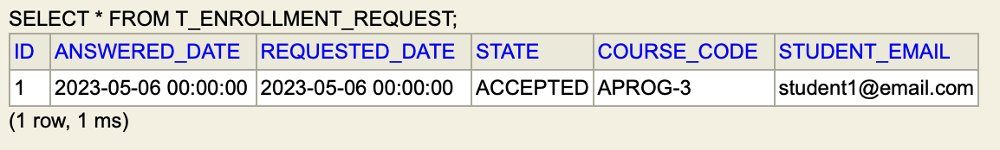

# US 1009 - As a Manager, I want to approve or reject students applications to courses.

## 1. Context

Requests made by students are stored in the database.
And now? How can the manager approve or reject them?
This User Story will handle that, to accept or reject pending requests.

## 2. Requirements

This functionality depends on the existence of:

- The functionality of listing all the requests made by students. (US1008)
- Existing courses in enroll state. (US1003)
- Pending requests made by students. (US1008)

## 3. Analysis


    
    A request is made of a student to a course. So this is all we need to perform our user story.
    The manager (a user with that role) will accept already existing requests, and reject them.

## 4. Design

### 4.1. Realization


### 4.2. Class Diagram


- The controller leaves business logic to the service for acceptance or rejection of requests, as it is only an end-point.
- This makes it so that the controller is only responsible for guiding the user story and not perform business logic.
- For easier client side on executing the user story, we make the client select the request, instead of giving the information needed for it to be found in the repository.

### 4.3. Applied Patterns

#### MVC (Model-View-Controller)

- Model is responsible for managing the data and business logic of the application. (CourseRepository, EnrollmentRequestRepository, User, Course, EnrollmentRequest, AuthorizationService, EnrollmentRequestManagementService)
- View is responsible for presenting the data to the user in a human-readable format. (AnswerEnrollmentRequestUI)
- Controller is responsible for handling the user input and updating the model and the view accordingly. (AnswerEnrollmentRequestController)

#### Dependency Injection
- The service needs repositories, so we pass them by parameter. This makes testing easier and also, since the controller needs the enrollment request repository, it can give the service its own, instead of two distinct creations.

#### Repository
- Since the repository knows all the requests, it is its duty to save them after being altered, so the database is consistent with the information.
- By calling the save method, we are hiding the actual implementation of the repository, so we don't need to know anything about databases in order to use it.

#### Service Layer
- The service layer is responsible for all the business logic, so it is the one that knows what to do with the requests.
- There is no other class in the project that knows the necessary logic to alter/create a request successfully, the service is responsible for that.

### 4.4. Tests

```java
class EnrollmentRequestManagementServiceTest {
    @Test
    void acceptRequest() {
        EnrollmentRequest request = mock(EnrollmentRequest.class);

        when(enrollmentRequestRepo.save(request)).thenReturn(request);

        service.acceptRequest(request);

        verify(request).accept();
        verify(enrollmentRequestRepo).save(request);
        verify(courseRepo).save(request.course());
    }

    @Test
    void rejectRequest() {
        EnrollmentRequest request = mock(EnrollmentRequest.class);

        when(enrollmentRequestRepo.save(request)).thenReturn(request);

        service.rejectRequest(request);

        verify(request).reject();
        verify(enrollmentRequestRepo).save(request);
        verifyNoInteractions(courseRepo);
    }
}
```

- The domain tests and the creation tests were already made in the previous user story, so we just needed to do integration tests, in order to see if the service is calling the right methods.

## 5. Implementation

### 5.1. Controller

```java
@UseCaseController
public class RequestEnrollmentController {

    /**
     * The Service.
     */
    private final EnrollmentRequestManagementService service;
    /**
     * The Authz service.
     */
    private final AuthorizationService authzService;

    /**
     * Instantiates a new Request enrollment controller.
     *
     * @param authzServicep the authz service
     */
    public RequestEnrollmentController(
            final AuthorizationService authzServicep
    ) {
        this.authzService = authzServicep;
        this.service = new EnrollmentRequestManagementService(
                PersistenceContext.repositories().courses(),
                PersistenceContext.repositories().enrollmentRequests()
        );
    }


    /**
     * Create enrollment request.
     *
     * @param courseCodeString the course code string
     * @return the enrollment request
     */
    public EnrollmentRequest createRequest(final String courseCodeString) {
        authzService.ensureAuthenticatedUserHasAnyOf(CourseRoles.STUDENT);
        return this.service.createRequest(
                CourseCode.of(courseCodeString),
                authzService
                        .session()
                        .orElseThrow(
                            () -> new IllegalArgumentException(
                                    "There is no user Logged."
                            )
                        )
                        .authenticatedUser()
        );
    }
}
```
- This only serves as a end-point, to provide all the pending requests to the UI and to redirect the selected request from the UI to the service, accepted or rejected.

### 5.2. Service

```java
@UseCaseController
public class RequestEnrollmentController {

    /**
     * The Service.
     */
    private final EnrollmentRequestManagementService service;
    /**
     * The Authz service.
     */
    private final AuthorizationService authzService;

    /**
     * Instantiates a new Request enrollment controller.
     *
     * @param authzServicep the authz service
     */
    public RequestEnrollmentController(
            final AuthorizationService authzServicep
    ) {
        this.authzService = authzServicep;
        this.service = new EnrollmentRequestManagementService(
                PersistenceContext.repositories().courses(),
                PersistenceContext.repositories().enrollmentRequests()
        );
    }


    /**
     * Create enrollment request.
     *
     * @param courseCodeString the course code string
     * @return the enrollment request
     */
    public EnrollmentRequest createRequest(final String courseCodeString) {
        authzService.ensureAuthenticatedUserHasAnyOf(CourseRoles.STUDENT);
        return this.service.createRequest(
                CourseCode.of(courseCodeString),
                authzService
                        .session()
                        .orElseThrow(
                            () -> new IllegalArgumentException(
                                    "There is no user Logged."
                            )
                        )
                        .authenticatedUser()
        );
    }
}
```

- The role of the service is managing all the operations that are supposed to be done with requests, so only the service knows what to do with requests (Information Expert).

### 5.3. JPA example repository

```java
package org.persistence;

import eapli.framework.domain.repositories.TransactionalContext;
import eapli.framework.infrastructure.repositories.impl.jpa.JpaAutoTxRepository;
import org.domain.model.Course;
import org.enrollment.request.domain.EnrollmentRequest;
import org.enrollment.request.domain.RequestState;
import org.enrollment.request.repositories.EnrollmentRequestRepository;
import org.usermanagement.domain.model.User;

import javax.persistence.NoResultException;
import javax.persistence.TypedQuery;
import java.util.List;
import java.util.Map;
import java.util.Optional;

/**
 * The type Jpa auto tx enrollment request repository.
 */
public class JpaAutoTxEnrollmentRequestRepository
        extends JpaAutoTxRepository<EnrollmentRequest, Long, Long>
        implements EnrollmentRequestRepository {
    /**
     * save enrollment request.
     * @param request
     * @return
     */
    @Override
    public EnrollmentRequest save(final EnrollmentRequest request) {
        return this.repo.save(request);
    }

    /**
     * find pending requests.
     * @return
     */
    @Override
    public List<EnrollmentRequest> findPendingRequests() {
        TypedQuery<EnrollmentRequest> query = createQuery(
                "SELECT er FROM EnrollmentRequest er WHERE er.state = :state",
                EnrollmentRequest.class
        );

        query.setParameter("state", RequestState.PENDING);

        return query.getResultList();
    }
}
```
- As we can see, in this user story, we use a JPQL query to find all the pending requests, and we use the save method from the repo to save the request(accepted or rejected).

## 6. Integration/Demonstration

### 6.1. Non existent index

```text
+= eCourse ====================================================================+

1. Manage eCourse Users
2. Manage eCourse Courses
9. Shared Boards
0. Exit

Please choose an option
2

>> Manage eCourse Courses
1. List Available Courses
2. Accept or Reject a Enrollment Request
0. Return 

Please choose an option
2

+= Answer Request =============================================================+

Pending Requests
1 - Request 1
Student: student1@email.com
Course: APROG-3

Select an option: 5

Invalid option, try again.
+==============================================================================+
```

### 6.2. Index 0 or below

```text
+= eCourse ====================================================================+

1. Manage eCourse Users
2. Manage eCourse Courses
9. Shared Boards
0. Exit

Please choose an option
2

>> Manage eCourse Courses
1. List Available Courses
2. Accept or Reject a Enrollment Request
0. Return 

Please choose an option
2

+= Answer Request =============================================================+

Pending Requests
1 - Request 1
Student: student1@email.com
Course: APROG-3

Select an option: 0

Invalid option, try again.
+==============================================================================+
```

```
+= eCourse ====================================================================+

1. Manage eCourse Users
2. Manage eCourse Courses
9. Shared Boards
0. Exit

Please choose an option
2

>> Manage eCourse Courses
1. List Available Courses
2. Accept or Reject a Enrollment Request
0. Return 

Please choose an option
2

+= Answer Request =============================================================+

Pending Requests
1 - Request 1
Student: student1@email.com
Course: APROG-3

Select an option: -1

Invalid option, try again.
+==============================================================================+
```

```
+= eCourse ====================================================================+

1. Manage eCourse Users
2. Manage eCourse Courses
9. Shared Boards
0. Exit

Please choose an option
2

>> Manage eCourse Courses
1. List Available Courses
2. Accept or Reject a Enrollment Request
0. Return 

Please choose an option
2

+= Answer Request =============================================================+

Pending Requests
1 - Request 1
Student: student1@email.com
Course: APROG-3

Select an option: aebwethbwtb
Invalid option, try again.
+==============================================================================+
```

### 6.3. Valid index accept

```text
+= eCourse ====================================================================+

1. Manage eCourse Users
2. Manage eCourse Courses
9. Shared Boards
0. Exit

Please choose an option
2

>> Manage eCourse Courses
1. List Available Courses
2. Accept or Reject a Enrollment Request
0. Return 

Please choose an option
2

+= Answer Request =============================================================+

Pending Requests
1 - Request 1
Student: student1@email.com
Course: APROG-3

Select an option: 1

1 - Accept
2 - Reject
Select an option: 1

Enrollment Request accepted with success!
+==============================================================================+
```




- As we can see, the request was accepted and the student was added to the course(student1@email.com).

### 6.4. Valid index reject

```text
+= eCourse ====================================================================+

1. Manage eCourse Users
2. Manage eCourse Courses
9. Shared Boards
0. Exit

Please choose an option
2

>> Manage eCourse Courses
1. List Available Courses
2. Accept or Reject a Enrollment Request
0. Return 

Please choose an option
2

+= Answer Request =============================================================+

Pending Requests
1 - Request 1
Student: student1@email.com
Course: APROG-3

Select an option: 1

1 - Accept
2 - Reject
Select an option: 2

Enrollment Request rejected with success!
+==============================================================================+
```


- For this I re-ran the bootstrap and created a request, as we can see it updated to rejected.
