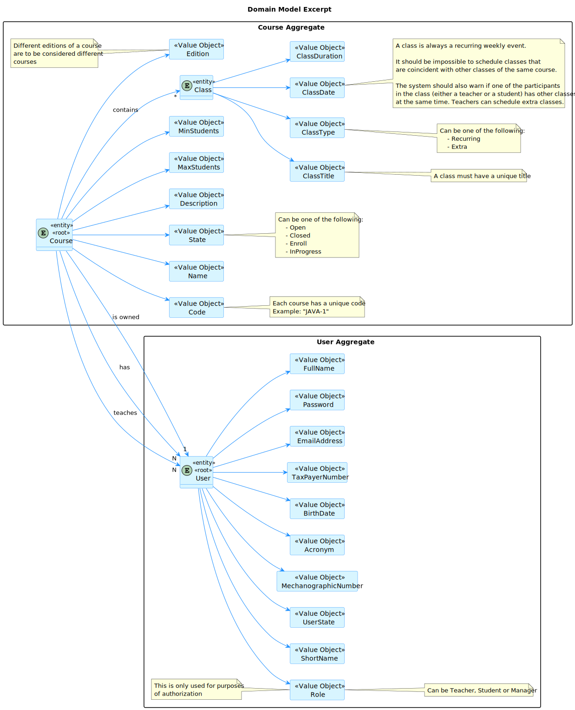
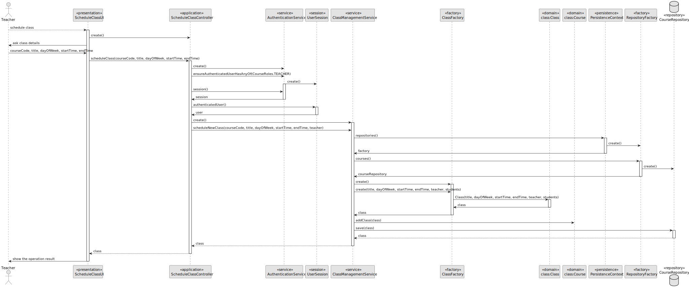
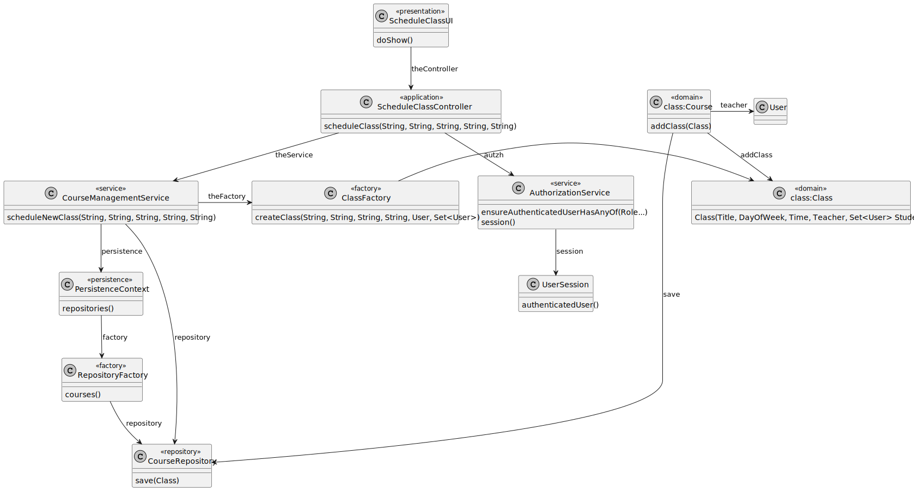
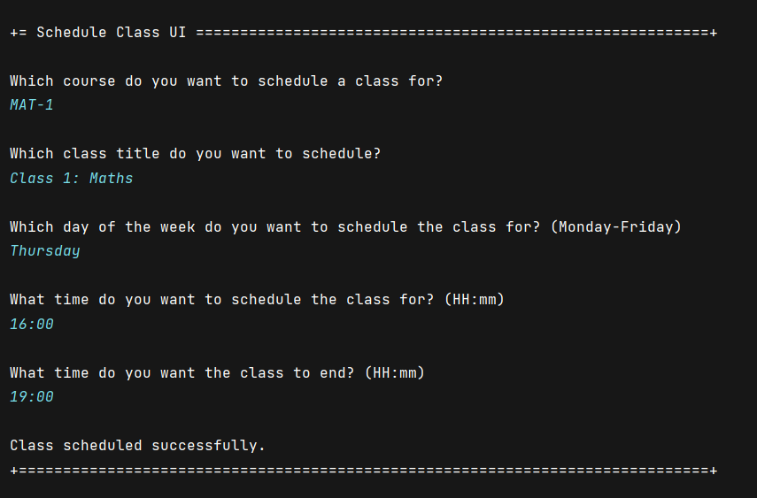
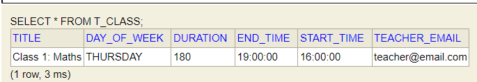

# US 1010

## 1. Context

This is the first time this task is being developed, since it was assigned in the present sprint (Sprint B).

This [User Story](../../Glossary.md)  relates [Teachers](../../Glossary.md), [Courses](../../Glossary.md) and [Classes](../../Glossary.md).

Teachers are responsible for scheduling classes. A class is always a recurring weekly event.  A class must have a **unique title**, **date** and **duration**.

## 2. Requirements

**US 1010** As Teacher, I want to schedule a class.

- The Teacher can only schedule a class if they are set in the course.
- The Teacher can only schedule a class if they do not have a class scheduled at the same time.
- The Teacher can only schedule a class if there are no other classes of the same course scheduled at the same time.
- The System warns if one of the participants in the class (either a teacher or a student) has other classes at the same time.

Regarding these requirements we understand that this User Story relates to [US1006](../US_1006/readme.md).

### 2.1 Client Specifications

## 3. Analysis

### 3.1. Domain Model



### 3.2 Implementation Analysis

After analyzing the requirements and the dependencies of this User Story, we concluded that the following classes are involved in this functionality:

- **ScheduleClassUI (UI)** - The user interface of the functionality.
- **ScheduleClassController (Controller)** - The controller of the functionality.
- **CourseManagementService (Service)** - The service of the functionality.
- **ClassFactory (Factory)** - The builder of the functionality. It is used to build a class.
- **PersistenceContext (Persistence)** - The persistence context of the functionality.
- **RepositoryFactory (Factory)** - The repository factory of the functionality.
- **CourseRepository (Repository)** - The repository of the functionality.
- **Class (Domain)** - The domain class of the functionality.
- **Course (Domain)** - The domain class of the functionality - the course knows the classes it has.

## 4. Design

### 4.1. Sequence Diagram



### 4.2. Class Diagram



### 4.3. Applied Patterns

Some main design patterns were applied in this functionality, namely:
- **Single Responsibility Principle (SRP)**: A class should have only one reason to change and only one responsibility.
  - For example, in this User Story, every class has only one responsibility. For example, the class `Class` has only one responsibility: to represent a class.
- **Open/Closed Principle (OCP)**: Software entities (classes, modules, functions, etc.) should be open for extension, but closed for modification.
  - For example, in this User Story, the class `Class` is open for extension, since it is possible to extend it with new attributes and methods. However, it is closed for modification, since it is not possible to modify the existing attributes and methods.
- **High Cohesion**: A class should have a single, well-defined purpose.
  - For example, in this User Story, the class `Class` has a single, well-defined purpose: to represent a class.
- **Factory Method**: Define an interface for creating an object, but let subclasses decide which class to instantiate. Factory Method lets a class defer instantiation to subclasses.
  - For example, in this User Story, the class `ClassFactory` is a factory method, since it is used to build a class.
- **Service Layer**: Defines an application's boundary with a layer of services that establishes a set of available operations and coordinates the application's response in each operation.
  - For example, in this User Story, the class `CourseManagementService` is a service layer, since it defines the application's boundary with a layer of services that establishes a set of available operations and coordinates the application's response in each operation.


### 4.4. Tests

````
@Test
public void testCreateValidClass() {

        ClassFactory classFactory = new ClassFactory();

        Class aClass = classFactory.createClass(classTitle, classDayOfWeek, classStartTime, classEndTime, teacher, new HashSet<>());

        assertEquals(classTitle, aClass.title().toString());
        assertEquals(classDayOfWeek, aClass.dayOfWeek().toString());
        assertEquals(classStartTime, aClass.time().startTime().toString());
        assertEquals(classEndTime, aClass.time().endTime().toString());

    }

    @Test
    public void testCreateInvalidClassWithNullClassTitle() {

        ClassFactory classFactory = new ClassFactory();
        assertThrows(NullPointerException.class,
                () -> classFactory.createClass(null, classDayOfWeek, classStartTime, classEndTime, teacher, new HashSet<>()));
    }

    @Test
    public void testCreateInvalidClassWithNullClassDay() {

        ClassFactory classFactory = new ClassFactory();
        assertThrows(NullPointerException.class,
                () -> classFactory.createClass(classTitle, null, classStartTime, classEndTime, teacher, new HashSet<>()));
    }

    @Test
    public void testCreateInvalidClassWithNullClassStartTime() {

        ClassFactory classFactory = new ClassFactory();
        assertThrows(NullPointerException.class,
                () -> classFactory.createClass(classTitle, classDayOfWeek, null, classEndTime, teacher, new HashSet<>()));
    }

    @Test
    public void testCreateInvalidClassWithNullClassEndTime() {

        ClassFactory classFactory = new ClassFactory();
        assertThrows(NullPointerException.class,
                () -> classFactory.createClass(classTitle, classDayOfWeek, classStartTime, null, teacher, new HashSet<>()));
    }

    @Test
    public void testCreateInvalidClassWithInvalidClassStartTime() {

        ClassFactory classFactory = new ClassFactory();
        assertThrows(IllegalArgumentException.class,
                () -> classFactory.createClass(classTitle, classDayOfWeek, "05:00", classEndTime, teacher, new HashSet<>()));
    }

    @Test
    public void testCreateInvalidClassWithInvalidClassEndTime() {

        ClassFactory classFactory = new ClassFactory();
        assertThrows(IllegalArgumentException.class,
                () -> classFactory.createClass(classTitle, classDayOfWeek, classStartTime, "05:00", teacher, new HashSet<>()));
    }

    @Test
    public void testCreateInvalidClassWithSameClassStartTimeAndEndTime() {

        ClassFactory classFactory = new ClassFactory();
        assertThrows(IllegalArgumentException.class,
                () -> classFactory.createClass(classTitle, classDayOfWeek, "05:00", "05:00", teacher, new HashSet<>()));
    }

    @Test
    public void testCompareTwoEqualClasses() {

        ClassFactory classFactory = new ClassFactory();
        Class aClass = classFactory.createClass(classTitle, classDayOfWeek, classStartTime, classEndTime, teacher, new HashSet<>());
        Class anotherClass = classFactory.createClass(classTitle, classDayOfWeek, classStartTime, classEndTime, teacher, new HashSet<>());

        assertEquals(aClass, anotherClass);
    }

    @Test
    public void testCompareTwoDifferentClassTitleClasses() {

        ClassFactory classFactory = new ClassFactory();
        Class aClass = classFactory.createClass(classTitle, classDayOfWeek, classStartTime, classEndTime, teacher, new HashSet<>());
        Class anotherClass = classFactory.createClass("Another Class Title", classDayOfWeek, classStartTime, classEndTime, teacher, new HashSet<>());

        assertNotEquals(aClass, anotherClass);
    }

    @Test
    public void testCompareTwoDifferentClassDayOfWeekClasses() {

        ClassFactory classFactory = new ClassFactory();
        Class aClass = classFactory.createClass(classTitle, classDayOfWeek, classStartTime, classEndTime, teacher, new HashSet<>());
        Class anotherClass = classFactory.createClass(classTitle, "TUESDAY", classStartTime, classEndTime, teacher, new HashSet<>());

        assertNotEquals(aClass, anotherClass);
    }

    @Test
    public void testCompareTwoDifferentStartTimeClasses() {

        ClassFactory classFactory = new ClassFactory();
        Class aClass = classFactory.createClass(classTitle, classDayOfWeek, classStartTime, classEndTime, teacher, new HashSet<>());
        Class anotherClass = classFactory.createClass(classTitle, classDayOfWeek, "09:00", classEndTime, teacher, new HashSet<>());

        assertNotEquals(aClass, anotherClass);
    }

    @Test
    public void testCompareTwoDifferentEndTimeClasses() {

        ClassFactory classFactory = new ClassFactory();
        Class aClass = classFactory.createClass(classTitle, classDayOfWeek, classStartTime, classEndTime, teacher, new HashSet<>());
        Class anotherClass = classFactory.createClass(classTitle, classDayOfWeek, classStartTime, "11:00", teacher, new HashSet<>());

        assertNotEquals(aClass, anotherClass);
    }

    @Test
    public void testCompareClassWithNull() {

        ClassFactory classFactory = new ClassFactory();
        Class aClass = classFactory.createClass(classTitle, classDayOfWeek, classStartTime, classEndTime, teacher, new HashSet<>());

        assertNotEquals(aClass, null);
    }

    @Test
    public void testCompareClassWithDifferentClass() {

        ClassFactory classFactory = new ClassFactory();
        Class aClass = classFactory.createClass(classTitle, classDayOfWeek, classStartTime, classEndTime, teacher, new HashSet<>());

        assertNotEquals(aClass, new Object());
    }
}
````

## 5. Implementation

**ScheduleClassUI**

```java
public class ScheduleClassUI extends AbstractUI {

    private final Scanner scanner = new Scanner(System.in);

    private final ScheduleClassController controller = new ScheduleClassController(AuthzRegistry.authorizationService());

    @Override
    protected boolean doShow() {
        try {

            System.out.println("Which course do you want to schedule a class for?");
            String courseCode = scanner.nextLine();
            System.out.println();

            System.out.println("Which class title do you want to schedule?");
            String classTitle = scanner.nextLine();
            System.out.println();

            System.out.println("Which day of the week do you want to schedule the class for? (Monday-Friday)");
            String dayOfWeek = scanner.nextLine();
            System.out.println();

            System.out.println("What time do you want to schedule the class for? (HH:mm)");
            String startTime = scanner.nextLine();
            System.out.println();

            System.out.println("What time do you want the class to end? (HH:mm)");
            String endTime = scanner.nextLine();
            System.out.println();

            controller.scheduleClass(courseCode, classTitle, dayOfWeek, startTime, endTime);

            System.out.println("Class scheduled successfully.");

        } catch (IllegalArgumentException iae) {
            System.out.println(iae.getMessage());
        }
        return true;
    }

    @Override
    public String headline() {
        return "Schedule Class UI";
    }
}
````

**ScheduleClassController**

````
public class ScheduleClassController {

    private final AuthorizationService authz;


    private final CourseManagementService courseManagementService;

    private final CourseRepository courseRepository;

    public ScheduleClassController(final AuthorizationService authzService) {
        this.authz = authzService;
        this.courseManagementService = new CourseManagementService(PersistenceContext.repositories().users(), PersistenceContext.repositories().courses(), PersistenceContext.repositories().newTransactionalContext(), authzService);
        this.courseRepository = PersistenceContext.repositories().courses();
    }

    public Course scheduleClass(String courseCode,
                                String classTitle,
                                String dayOfWeek,
                                String startTime,
                                String endTime) {
        authz.ensureAuthenticatedUserHasAnyOf(CourseRoles.TEACHER);

        Preconditions.ensure(courseCode != null, "Course code must not be null");

        UserSession session = authz.session().orElse(null);

        return courseManagementService.scheduleNewClass(courseCode, classTitle, dayOfWeek, startTime, endTime, session.authenticatedUser());
    }
}
````

## 6. Integration/Demonstration



