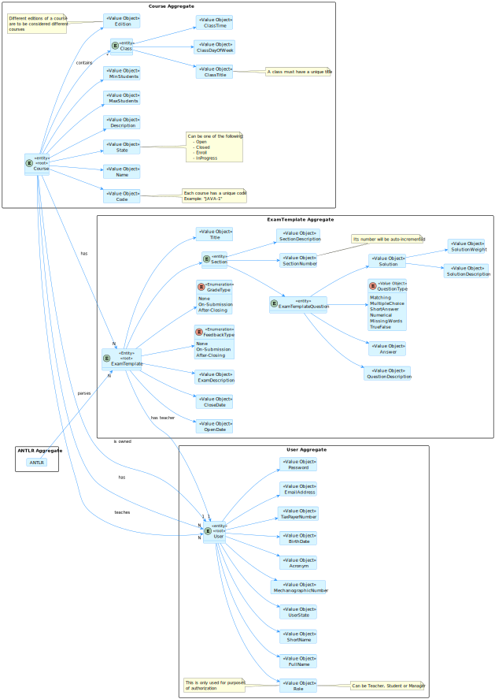
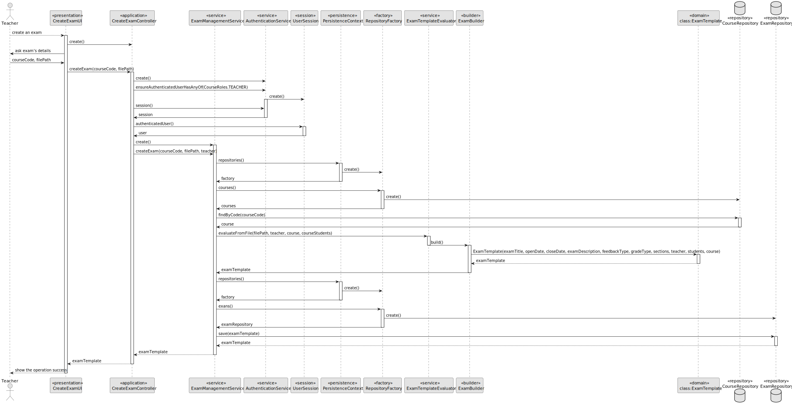
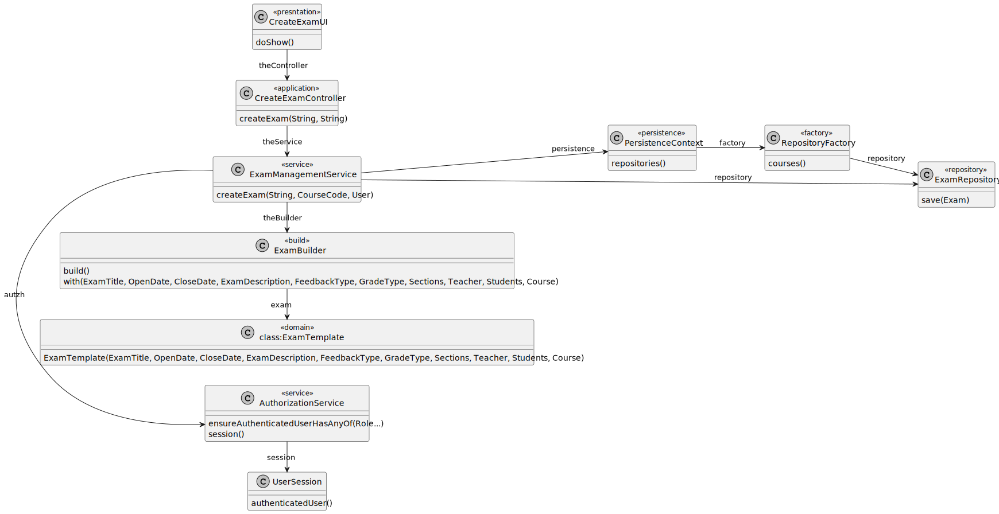
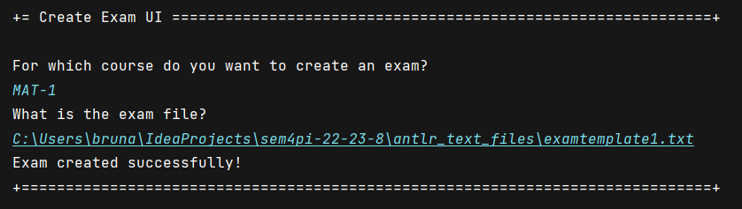
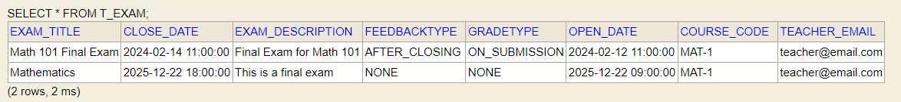

# US 2001.1

## 1. Context

This is the first time this task is being developed, since it was assigned in the present sprint (Sprint B).

This [User Story](../../Glossary.md)  relates [Teachers](../../Glossary.md), [Courses](../../Glossary.md) and [Exams](../../Glossary.md).

Teachers are responsible for creating and updating exams. An exam is related to a specific course and has a **unique title**, **header**, **open date** and **close date**.

The exam's header includes global settings such as the type of **feedback** (none, on-submission, after-closing) and the type of **grade** (none, on-submission, after-closing). It may also contain a **description**.

An exam must have at least one **section**. A section is a set of **questions** that are related to a specific topic and may contain a **description** which explains the section's topic. The section's **title** includes their number.

There are six different question types: **matching**, **multiple choice**, **short answer**, **numerical**, **select missing words** and **true/false**. Each question type has its own settings.

## 2. Requirements

**US 2001** As Teacher, I want to create an exam.

- The Teacher can only create an exam if there are no other exams of the same course with the same open date and close date.
- The Teacher can only create an exam if there is at least one section.

Regarding these requirements we understand that this User Story relates to [US1006](../US_1006/readme.md).

## 3. Analysis

### 3.1. Domain Model



### 3.2 Implementation Analysis

After analyzing the requirements and the dependencies of this User Story, we concluded that the following classes are involved in this functionality:

- **CreateExamUI (UI)** - The user interface of the functionality.
- **CreateExamController (Controller)** - The controller of the functionality.
- **ExamManagementService (Service)** - The service of the functionality.
- **ExamBuilder (Builder)** - The builder of the functionality. It is used to build a class.
- **PersistenceContext (Persistence)** - The persistence context of the functionality.
- **RepositoryFactory (Factory)** - The repository factory of the functionality.
- **ExamRepository (Repository)** - The repository of the functionality.
- **ExamTemplate (Domain)** - The domain class of the functionality.

## 4. Design

### 4.1. Sequence Diagram



### 4.2. Class Diagram



### 4.3. Applied Patterns

Some main design patterns were applied in this functionality, namely:
- **Single Responsibility Principle (SRP)**: A class should have only one reason to change and only one responsibility.
    - For example, in this User Story, the class `CreateExamController` has the responsibility of controlling the creation of an exam.
- **Service Layer**: Defines an application's boundary with a layer of services that establishes a set of available operations and coordinates the application's response in each operation.
  - For example, in this User Story, the class `ExamManagementService` is a service layer, since it defines the application's boundary with a layer of services that establishes a set of available operations and coordinates the application's response in each operation.
- **Builder**: It is used to build a class.
  - For example, in this User Story, the class `ExamBuilder` is a builder, since it is used to build the class `ExamTemplate`.

## 5. Implementation

### 5.1 Grammar definitions

|       CODE       |            MEANING            |
|:----------------:|:-----------------------------:|
|      MQUES:      |       Matching question       |
|     MCQUES:      |   Multiple Choice question    |
|     SAQUES:      |     Short Answer question     |
|      NQUES:      |      Numerical question       |
|     SWQUES:      | Select missing words question |
|     TFQUES:      |      True/False question      |
|       OPT:       |         Option number         |
|       SOL:       |       Question solution       |
|    OPEN_DATE:    |     Open date of the exam     |
|   CLOSE_DATE:    |    Close date of the exam     |
|  FEEDBACK_TYPE   |   Feedback type of the exam   |
|    GRADE_TYPE    |    Grade type of the exam     |
| EXAM_DESCRIPTION |    Description of the exam    |
|       EXAM       |       Title of the exam       |
|     SECTION      |     Title of the section      |
|     NONE         |   For feedback or grade type  |
|      ONSUB       |  For feedback or grade type   |
|      AFTER       |  For feedback or grade type   |

```antlrv4
grammar ExamTemplate;


start: exam ;


exam: create_exam_header create_section+;

create_section : ID_SECTION ' '*? DESCRIPTION ' '*? ';' NEWLINE*? quest+;

quest: matching_quest
    | multiple_choice_quest
    | short_answer_quest
    | numerical_quest
    | select_words_quest
    | true_false_quest
    ;

matching_quest: MATCHING ' '*? DESCRIPTION ' '*? ';' NEWLINE*? create_option+ create_solution+;

multiple_choice_quest: MULTIPLE_CHOICE ' '*? DESCRIPTION ' '*? ';' NEWLINE*? create_option+ create_solution+;

short_answer_quest: SHORT_ANSWER ' '*? DESCRIPTION ' '*? ';' NEWLINE*? create_solution+;

numerical_quest: NUMERICAL ' '*? DESCRIPTION ' '*? ';' NEWLINE*? create_solution;

select_words_quest: SELECT_WORDS ' '*? DESCRIPTION ' '*? ';' NEWLINE*? create_solution+;

true_false_quest: TRUE_FALSE ' '*? DESCRIPTION ' '*? ';' NEWLINE*? create_true_false_solution;


create_option : ID_OPTION ' '*? DESCRIPTION ' '*? ';' NEWLINE*?;

create_solution : ID_SOLUTION ' '*? SOLUTION_TEXT ' '*? ';' NEWLINE*?;
create_true_false_solution : ID_SOLUTION ' '*? TRUE_FALSE_SOLUTION_TEXT ' '*? ';' NEWLINE*?;

create_exam_header : create_exam create_exam_description create_open_date create_close_date create_feedback_type create_grade_type;

create_exam : ID_EXAM ' '*? DESCRIPTION ' '*? ';' NEWLINE*?;
create_exam_description : ID_EXAM_DESCRIPTION ' '*? DESCRIPTION ' '*? ';' NEWLINE*?;
create_open_date : ID_OPEN_DATE ' '*? DATE ' '*? ';' NEWLINE*?;
create_close_date : ID_CLOSE_DATE ' '*? DATE ' '*? ';' NEWLINE*?;
create_feedback_type : ID_FEEDBACK_TYPE ' '*? TIME_TYPE ' '*? ';' NEWLINE*?;
create_grade_type : ID_GRADE_TYPE ' '*? TIME_TYPE ' '*? ';' NEWLINE*?;


ID_OPTION : 'OPT';
ID_SOLUTION : 'SOL';
ID_EXAM : 'EXAM';
ID_EXAM_DESCRIPTION : 'EXAM_DESCRIPTION';
ID_OPEN_DATE : 'OPEN_DATE';
ID_CLOSE_DATE : 'CLOSE_DATE';
ID_FEEDBACK_TYPE : 'FEEDBACK_TYPE';
ID_GRADE_TYPE : 'GRADE_TYPE';
ID_SECTION : 'SECTION';

DATE: '(' [0-9][0-9] '-' [0-9][0-9] '-' [0-9][0-9][0-9][0-9] ' ' [0-9][0-9] ':' [0-9][0-9] ')';

TIME_TYPE : 'NONE' | 'ONSUB' | 'AFTER' ;

MATCHING : 'MQUES';
MULTIPLE_CHOICE : 'MCQUES';
SHORT_ANSWER : 'SAQUES';
NUMERICAL : 'NQUES';
SELECT_WORDS : 'SWQUES';
TRUE_FALSE : 'TFQUES';

SOLUTION_TEXT : '|' SOL_DESCRIPTION '|' DECIMAL '|' ;

TRUE_FALSE_SOLUTION_TEXT : '<' TRUE_FALSE_SOL_DESCRIPTION '|' DECIMAL '>';


SOL_DESCRIPTION : .*? ;

TRUE_FALSE_SOL_DESCRIPTION : 'True' | 'False';

DESCRIPTION : '"' .*? '"';

NUMBER : [1-9][0-9]*?( '.' [0-9]+ ) ?;

NEWLINE : '\r'? '\n';

DECIMAL : [0-9] '.' [0-9][0-9];
```

### 5.2 Classes

**CreateExamUI**

```java
public class CreateExamUI extends AbstractUI {

    Scanner scanner = new Scanner(System.in);

    private final CreateExamController ctrl = new CreateExamController(AuthzRegistry.authorizationService());

    @Override
    protected boolean doShow() {
        try {
            System.out.println("For which course do you want to create an exam?");

            String courseCode = scanner.nextLine();

            System.out.println("What is the exam file?");

            String filePath = scanner.nextLine();

            ExamTemplate exam = ctrl.createExam(courseCode, filePath);

            System.out.println("Exam created successfully!");


        } catch(IllegalArgumentException iae){
            System.out.println(iae.getMessage());
        } catch(IOException ioe){
            System.out.println("File doesn't exist or is not accessible.\nTry again.");
        }
        return true;
    }

    @Override
    public String headline() {
        return "Create Exam UI";
    }
}
```

**CreateExamController**

```java
public class CreateExamController {

    private final ExamManagementService service;

    private final AuthorizationService authz;

    public CreateExamController() {
        this.authz = null;
        this.service = null;
    }

    public CreateExamController(
            final AuthorizationService authzServicep
    ) {
        this.authz = authzServicep;
        this.service = new ExamManagementService(
                PersistenceContext.repositories().exams(),
                PersistenceContext.repositories().courses()
        );
    }


    public ExamTemplate createExam(String courseCode,
                                   String filePath) throws IOException {
        authz.ensureAuthenticatedUserHasAnyOf(CourseRoles.TEACHER);

        Preconditions.ensure(courseCode != null, "Course code must not be null");

        UserSession session = authz.session().orElse(null);

        assert session != null;
        User teacher = session.authenticatedUser();

        return service.createExam(filePath, CourseCode.of(courseCode), teacher);
    }
}
```

## 6. Integration/Demonstration



