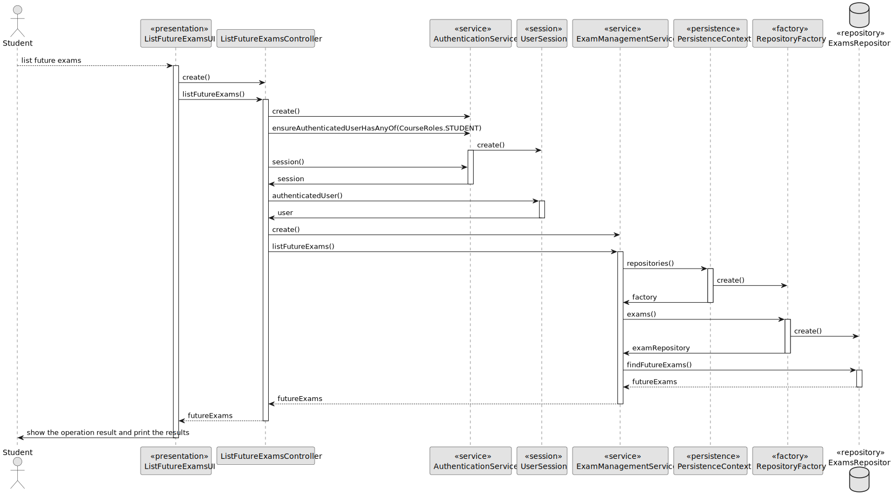
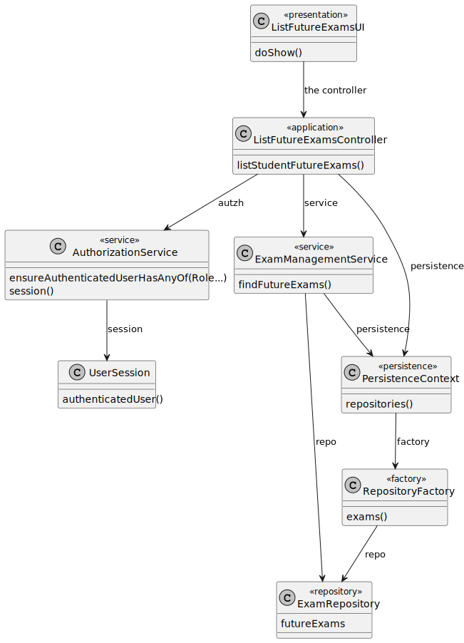
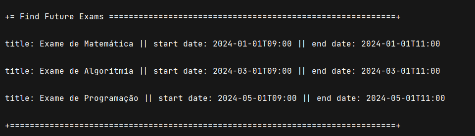

# US 2002

## 1. Context

This is the first time this task is being developed, since it was assigned in the present sprint (Sprint B).

This [User Story](../../Glossary.md)  relates [Students](../../Glossary.md), [Courses](../../Glossary.md) and [Exams](../../Glossary.md).

Students can view their future exams. An exam is related to a specific course and has a **unique title**, **description**, **open date** and **close date**.

## 2. Requirements

**US 1010** As Student, I want to view a list of my future exams.

- The Student can only view exams in the courses they are enrolled in.
- The Student can only view exams whose close date has not passed yet.

Regarding these requirements we understand that this User Story relates to [US2001](../US_2001/readme.md).

## 3. Analysis

### 3.1. Domain Model

### 3.2 Implementation Analysis

After analyzing the requirements and the dependencies of this User Story, we concluded that the following classes should be used:

- **ListFutureExamsUI**: The user interface of this functionality.
- **ListFutureExamsController**: The controller of this functionality.
- **ExamManagementService**: The service of this functionality.
- **ExamRepository**: The repository of this functionality.

## 4. Design

### 4.1. Sequence Diagram



### 4.2. Class Diagram



### 4.3. Applied Patterns

Some main design patterns were applied in this functionality, namely:
- **Single Responsibility Principle (SRP)**: A class should have only one reason to change and only one responsibility.
  - For example, in this User Story, the class `ListFutureExamsUI` is responsible for the user interaction.


## 5. Implementation

**ListFutureExamsUI**

```java
public class ListFutureExamsUI extends AbstractUI {

    private final ListFutureExamsController ctrl = new ListFutureExamsController(AuthzRegistry.authorizationService());

    @Override
    protected boolean doShow() {

        try {

            Iterable<ExamTemplate> exams = ctrl.listFutureExams();

            if (exams.iterator().hasNext()) {
                for (ExamTemplate exam : exams) {
                    System.out.println(exam);
                }
            } else {
                System.out.println("The student does not have future exams");
            }
        } catch (IllegalArgumentException iae) {
            System.out.println(iae.getMessage());
        }

        return true;
    }

    @Override
    public String headline() {
        return "Find Future Exams";
    }
}
```

**ListFutureExamsController**

```java
public class ListFutureExamsController {

    private final ExamManagementService service;

    private final AuthorizationService authz;

    public ListFutureExamsController(
            final AuthorizationService authzServicep
    ) {
        this.authz = authzServicep;
        this.service = new ExamManagementService(
                PersistenceContext.repositories().exams(),
                PersistenceContext.repositories().courses()
        );
    }

    public Iterable<ExamTemplate> listFutureExams() {

        authz.ensureAuthenticatedUserHasAnyOf(CourseRoles.STUDENT);

        UserSession session = authz.session().orElse(null);

        assert session != null;
        User student = session.authenticatedUser();

        return service.listFutureExams(student);

    }
}
```

## 6. Integration/Demonstration


