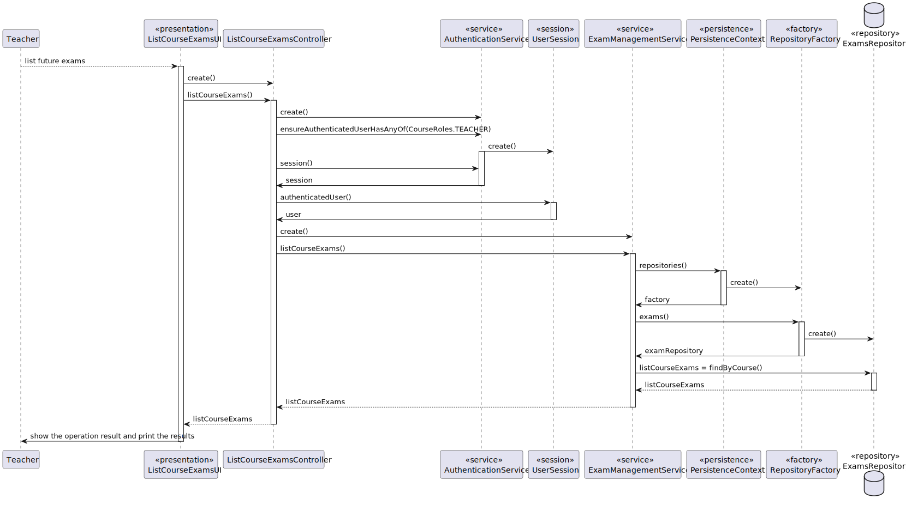
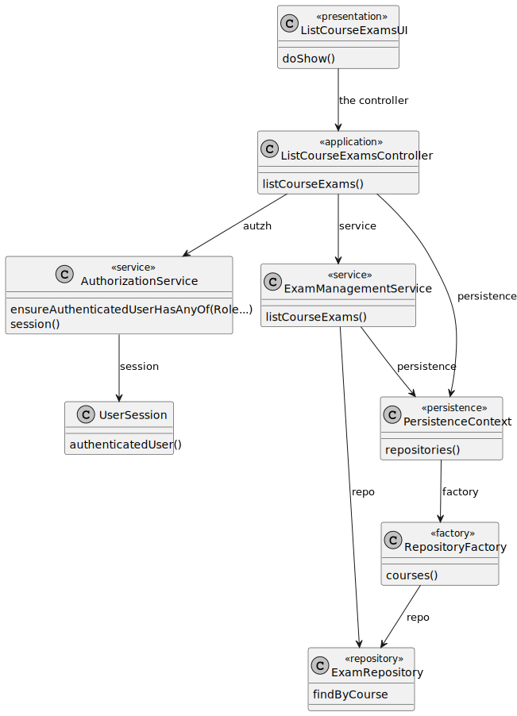
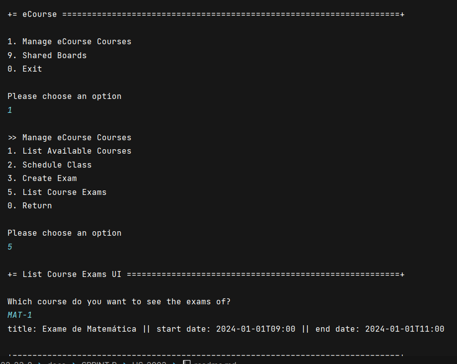

# US 2003

## 1. Context

This is the first time this task is being developed, since it was assigned in the present sprint (Sprint B).

This [User Story](../../Glossary.md)  relates [Teachers](../../Glossary.md), [Courses](../../Glossary.md) and [Exams](../../Glossary.md).

Teachers can view all the exams of a course. An exam is related to a specific course and has a **unique title**, **description**, **open date** and **close date**.

## 2. Requirements

**US 2003** As Teacher, I want to view a list of all exams in a course.

- The Teacher can only view the exams of a course if they are set in the course.
- The Teacher can only view the exams of a course if the course has exams.

Regarding these requirements we understand that this User Story relates to [US2001](../US_2001/readme.md).

## 3. Analysis

After analyzing the requirements and the dependencies of this User Story, we concluded that the following classes should be created:

## 4. Design

### 4.1. Sequence Diagram



### 4.2. Class Diagram



### 4.3. Applied Patterns

Some main design patterns were applied in this functionality, namely:
- **Single Responsibility Principle (SRP)**: A class should have only one reason to change and only one responsibility.
    - For example, in this User Story,
- **Open/Closed Principle (OCP)**: Software entities (classes, modules, functions, etc.) should be open for extension, but closed for modification.
    - For example, in this User Story,

## 5. Implementation

**ListCourseExamsUI**

```java
public class ListCourseExamsUI extends AbstractUI {

    Scanner scanner = new Scanner(System.in);

    private final ListCourseExamsController ctrl = new ListCourseExamsController(AuthzRegistry.authorizationService());


    @Override
    protected boolean doShow() {

        try {

            System.out.println("Which course do you want to see the exams of?");

            String courseCode = scanner.nextLine();

            Iterable<ExamTemplate> exams = ctrl.listCourseExams(courseCode);

            if (exams.iterator().hasNext()){
                for (ExamTemplate exam : exams) {
                    System.out.println(exam);
                }
            } else {
                System.out.println("There are no exams for this course");
            }

        } catch (IllegalArgumentException iae) {
            System.out.println(iae.getMessage());
        }

        return true;
    }

        @Override
        public String headline () {
            return "List Course Exams UI";
        }
    }
   ```

**ListCourseExamsController**

```java
public class ListCourseExamsController {

    private final ExamManagementService service;

    private final AuthorizationService authz;

    public ListCourseExamsController(
            final AuthorizationService authzServicep
    ) {
        this.authz = authzServicep;
        this.service = new ExamManagementService(
                PersistenceContext.repositories().exams(),
                PersistenceContext.repositories().courses()
        );
    }

    public Iterable<ExamTemplate> listCourseExams(String courseCode) {
        authz.ensureAuthenticatedUserHasAnyOf(CourseRoles.TEACHER);

        Preconditions.ensure(courseCode != null, "Course code must not be null");

        UserSession session = authz.session().orElseThrow();
        User teacher = session.authenticatedUser();

        return service.listCourseExams(courseCode, teacher);
    }
}
```

## 6. Integration/Demonstration


