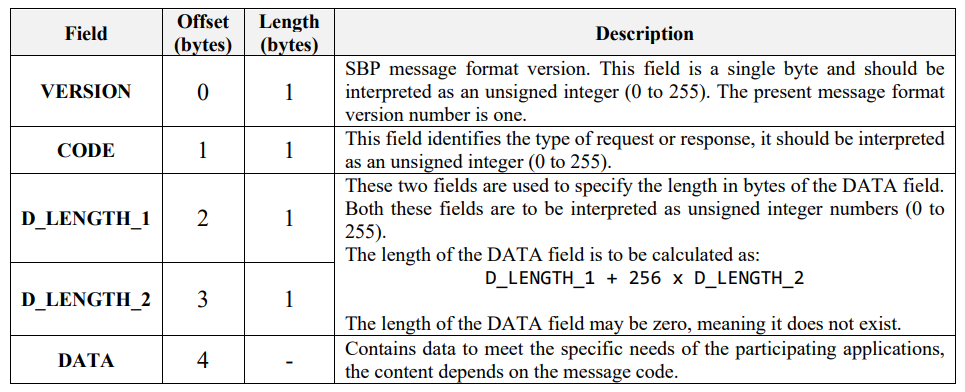
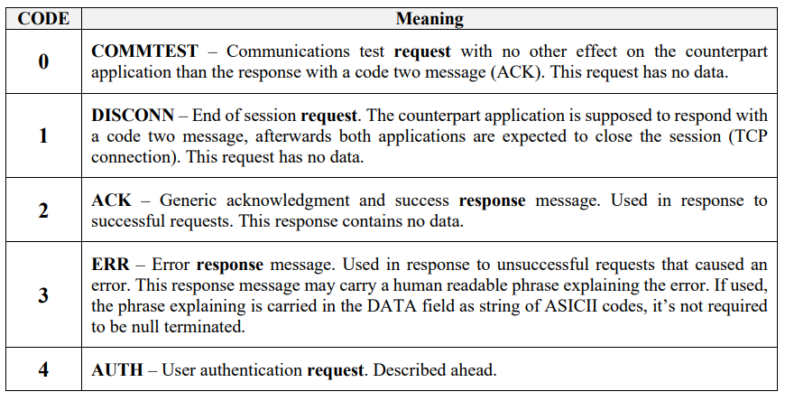
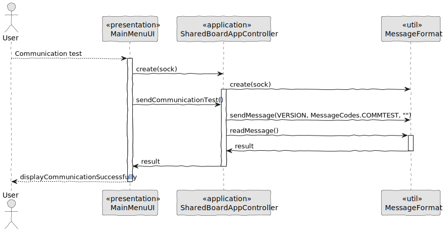
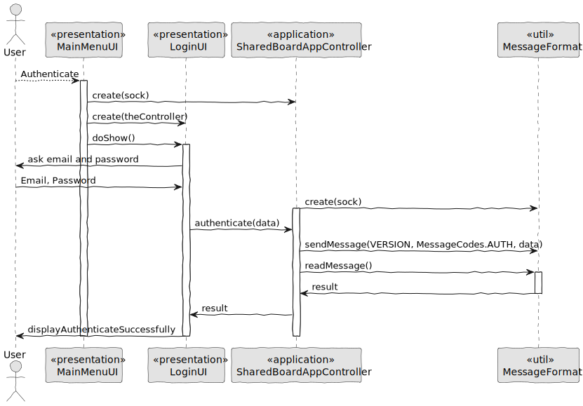
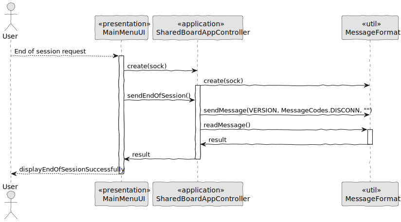
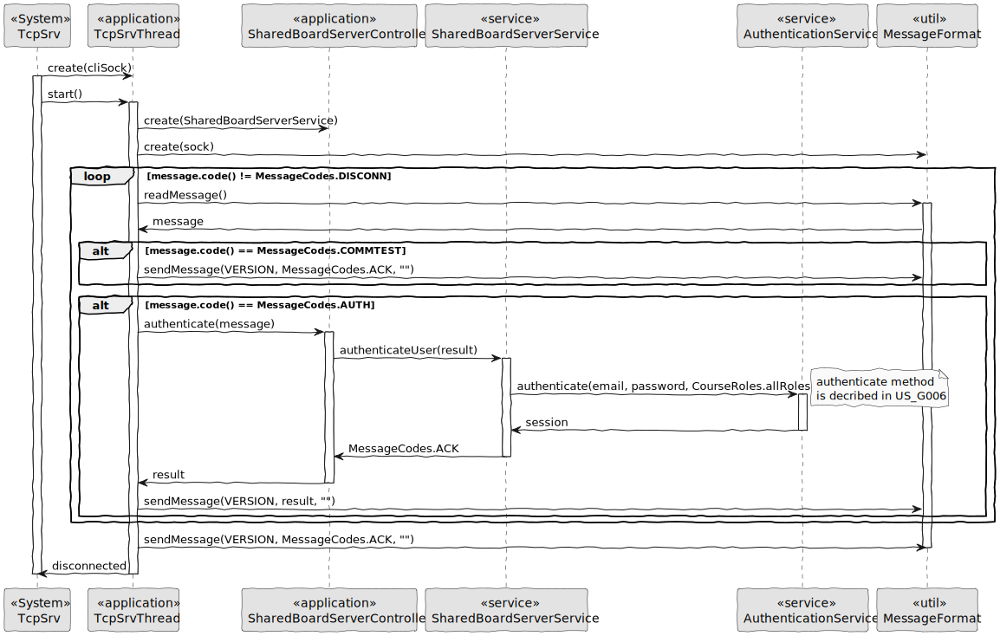
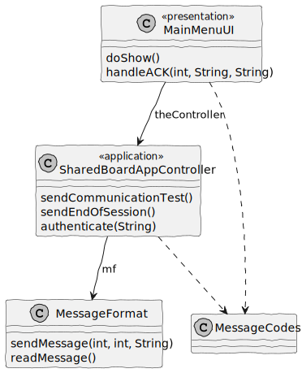
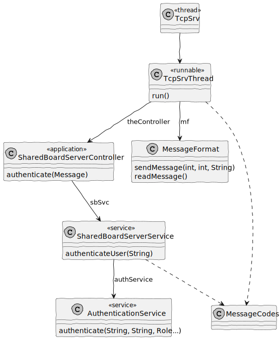

# US 3001

## 1. Context

In Sprint B client wants us to prepare the communication infrastruture for the Shared Boards and the depoyment of the solution.

## 2. Requirements

As Project Manager, I want the team to prepare the communication infrastruture for the Shared Boards and the deployment of the solution.

It must follow a client-server architecture, where a client application is used to access the shared boards that should be implemented in a server. Communications between these two components must follow specific protocol described in a document from RCOMP ("Application Protocol"). Also, the client application can not access the relational database, it can only access the server application.
The solution should be deployed using several network nodes. It is expected that, at least, the relational database server and the shared board server be deployed in nodes different from localhost, preferably in the cloud.

The only dependecy is User will be authenticated when message code is AUTH. So we need authentication.

## 3. Analysis

Information in Application Protocol

    The client application (Shared Board App) is the one that takes
    the initiative of requesting a TCP connection establishment with the counterpart server application (Shared Board Server), which should accept incoming connection requests.
    Once the TCP connection is established, the client-server is no longer mandatory
    Every request (sent by the client or the server) has a mandatory response


Message Format



Message Codes




Information in Application Protocol

    The user authentication is achieved by a username and password pair, both will be provided to the client application (Shared Board App) by the local user running it.

    The username and the password values are incorporated in the AUTH request at the DATA field as two null terminated strings of ASICII codes, first the username, followed by the password.

    The response to an AUTH request may be an ACK, meaning the authentication was successful, or an ERR, meaning it has failed. In the latter case, additional AUTH requests could be tried by the client.


## 4. Design

### 4.1. Realization

#### 4.1.1. Sequence Diagram

Shared Board App Communication test




Shared Board App Authenticate




End of session request




Shared Board Server



### 4.2. Class Diagram

Shared Board App



Shared Board Server



### 4.3. Applied Patterns

### 4.4. Tests

**Test 1:** *Create a socket connection and check if send Message is working as supposed*

```java
@Test
public void testSendMessage() throws IOException {
    final Socket socket = mock(Socket.class);
    final ByteArrayOutputStream byteArrayOutputStream = new ByteArrayOutputStream();
    when(socket.getOutputStream()).thenReturn(byteArrayOutputStream);
    MessageFormat messageFormat = new MessageFormat(socket);


    messageFormat.sendMessage(VERSION, CODE, TEXT);

    byte[] capturedData = byteArrayOutputStream.toByteArray();

    assertEquals(VERSION, capturedData[0]);
    assertEquals(CODE, capturedData[1]);
    assertEquals(TEXT_LENGTH % 256, capturedData[2]);
    assertEquals(TEXT_LENGTH / 256, capturedData[3]);
    assertEquals(TEXT, new String(capturedData, 4, TEXT_LENGTH));

    verify(socket, times(1)).getOutputStream();
    verify(socket, times(1)).getInputStream();
}
````

**Test 2:** *Create a socket connection and check if read Message is working as supposed. Should be 0 in every result because nobody wrote.*

```java
@Test
public void testReadMessageWithData() throws IOException {
    byte[] data = new byte[TEXT_LENGTH];

    Socket socket = mock(Socket.class);
    InputStream inputStream = new ByteArrayInputStream(data);
    when(socket.getInputStream()).thenReturn(inputStream);

    MessageFormat messageFormat = new MessageFormat(socket);

    Message result = messageFormat.readMessage();

    assertEquals(0, result.version());
    assertEquals(0, result.code());
    assertEquals(0, result.d_length_1());
    assertEquals(0, result.d_length_2());
    assertEquals(0, result.data().length);

    verify(socket, times(1)).getInputStream();
}
````


## 5. Implementation

**Shared Board App (Main)**

```java
package org.shared.board.app;

import java.io.IOException;
import java.net.InetAddress;
import java.net.Socket;
import java.net.UnknownHostException;

public class Main {
    private static InetAddress serverIP;
    private static Socket sock;

    public static void main(String args[]) throws Exception {
        if(args.length!=1) {
            System.out.println("Server IPv4/IPv6 address or DNS name is required as argument");
            System.exit(1);
        }

        try {
            serverIP = InetAddress.getByName(args[0]);
        } catch(UnknownHostException ex) {
            System.out.println("Invalid server specified: " + args[0]);
            System.exit(1);
        }

        try {
            sock = new Socket(serverIP, 9999);
        } catch(IOException ex) {
            System.out.println("Failed to establish TCP connection");
            System.exit(1);
        }

        MainMenuUI ui = new MainMenuUI(sock);
        ui.doShow();
    }
}
````

**Shared Board App (MainMenuUI)**

```Java
package org.shared.board.app;

import org.shared.board.common.MessageCodes;

import java.io.BufferedReader;
import java.io.IOException;
import java.io.InputStreamReader;
import java.net.Socket;

public class MainMenuUI {
    private Socket sock;
    private SharedBoardAppController theController;

    public MainMenuUI(Socket sockp) {
        this.sock = sockp;
        this.theController = new SharedBoardAppController(sockp);
    }

    public void handleACK(int codeResult,
                          String messageOK,
                          String messageBAD){
        if(codeResult == MessageCodes.ACK){
            System.out.println(messageOK);
        } else {
            System.out.println(messageBAD);
        }
    }

    public void doShow() throws IOException {
        BufferedReader in = new BufferedReader(new InputStreamReader(System.in));
        String input = "";
        int choice = 0, codeResult;

        do {
            System.out.println("1 - Communication test");
            System.out.println("2 - Authenticate");
            System.out.println("0 - End of session request");
            System.out.println("\nOption - ");
            try {
                input = in.readLine();
                choice = Integer.parseInt(input);
            } catch(NumberFormatException ex) {
                choice = -1;
            } catch (IOException e) {
                throw new RuntimeException(e);
            }

            switch (choice) {
                case 1:
                    codeResult = theController.sendCommunicationTest();

                    handleACK(codeResult,
                            "Communication test with success!\n",
                            "Problem with communication test!\n");

                    break;
                case 2:
                    LoginUI loginUI = new LoginUI(theController);
                    loginUI.doShow();
                    break;
                case 0:
                    codeResult = theController.sendEndOfSession();

                    if(codeResult == MessageCodes.ACK){
                        System.out.println("End of session request with success!\n");
                        choice = -1;
                    } else {
                        System.out.println("Problem with end of session request!\n");
                    }

                    break;
                default:
                    System.out.println("Invalid choice");
                    break;
            }

        } while(choice != -1);

        sock.close();
    }
}
````

**Shared Board App (LoginUI)**

```Java
package org.shared.board.app;

import org.shared.board.common.Message;
import org.shared.board.common.MessageCodes;

import java.io.BufferedReader;
import java.io.IOException;
import java.io.InputStreamReader;
import java.nio.charset.StandardCharsets;

public class LoginUI {
    private BufferedReader in = new BufferedReader(new InputStreamReader(System.in));
    private SharedBoardAppController theController;

    public LoginUI(SharedBoardAppController theController) {
        this.theController = theController;
    }

    /**
     * Ask user Email and Password to authenticate.
     */
    protected void doShow() {
        try {
            System.out.print("Email: ");
            String email = in.readLine();

            System.out.print("Password: ");
            String password = in.readLine();
            System.out.println();

            String data = email + "\0" + password + "\0";

            Message result = theController.authenticate(data);

            if(result.code() == MessageCodes.ACK){
                System.out.println("User authenticated successfully!\n");
            } else {
                String errorData;

                if(result.data().length > 0){
                    errorData = new String(result.data(), StandardCharsets.US_ASCII);
                } else {
                    errorData = "Invalid credentials!";
                }

                System.out.println(errorData + "\n");
            }
        } catch (IOException e) {
            throw new RuntimeException(e);
        }
    }
}

````

**Shared Board App (SharedBoardAppController)**

```Java
package org.shared.board.app;

import org.shared.board.common.Message;
import org.shared.board.common.MessageCodes;
import org.shared.board.common.MessageFormat;

import java.net.Socket;

public class SharedBoardAppController {
    private Socket sock;
    private MessageFormat mf;

    public static final int VERSION = 1;

    public SharedBoardAppController(Socket sock) {
        this.sock = sock;
        this.mf = new MessageFormat(sock);
    }

    public int sendCommunicationTest(){
        mf.sendMessage(VERSION, MessageCodes.COMMTEST, "");

        Message result = mf.readMessage();

        return result.code();
    }

    public int sendEndOfSession(){
        mf.sendMessage(VERSION, MessageCodes.DISCONN, "");

        Message result = mf.readMessage();

        return result.code();
    }

    public Message authenticate(String data){
        mf.sendMessage(VERSION, MessageCodes.AUTH, data);

        Message result = mf.readMessage();

        return result;
    }
}
````

**Shared Board Server (TcpSrv)**

```Java
package org.shared.board.server;

import eapli.framework.infrastructure.authz.domain.model.PlainTextEncoder;
import org.authz.application.AuthzRegistry;
import org.persistence.PersistenceContext;
import org.usermanagement.domain.model.ECoursePasswordPolicy;

import java.io.IOException;
import java.net.ServerSocket;
import java.net.Socket;

class TcpSrv {
    static ServerSocket sock;

    public static void main(String args[]) throws Exception {
        Socket cliSock;

        try {
            sock = new ServerSocket(9999);
            System.out.println("Server is listening");
        } catch(IOException ex) {
            System.out.println("Failed to open server socket");
            System.exit(1);
        }

        AuthzRegistry.configure(
                PersistenceContext.repositories().users(),
                new PlainTextEncoder(),
                new ECoursePasswordPolicy()
        );

        while(true) {
            cliSock = sock.accept();
            new Thread(new TcpSrvThread(cliSock)).start();
        }
    }
}
````

**Shared Board Server (TcpSrvThread)**

```Java
package org.shared.board.server;

import org.shared.board.common.Message;
import org.shared.board.common.MessageCodes;
import org.shared.board.common.MessageFormat;

import java.io.IOException;
import java.net.InetAddress;
import java.net.Socket;

public class TcpSrvThread implements Runnable {
    private Socket sock;

    private SharedBoardServerController theController;

    public TcpSrvThread(Socket cli_s) {
        sock = cli_s;
        theController = new SharedBoardServerController(new SharedBoardServerService());
    }

    public void run() {
        Message message;
        InetAddress clientIP;

        clientIP = sock.getInetAddress();

        System.out.println("New client connection from " + clientIP.getHostAddress() +
                    ", port number " + sock.getPort());
        try {
            MessageFormat mf = new MessageFormat(sock);

            do {
                message = mf.readMessage();

                if (message.code() == MessageCodes.COMMTEST) {
                    mf.sendMessage(1, MessageCodes.ACK, "");
                }

                if(message.code() == MessageCodes.AUTH){
                    try{
                        int result = theController.authenticate(message);

                        mf.sendMessage(1, result, "");
                    } catch (IllegalArgumentException e){
                        mf.sendMessage(1, MessageCodes.ERR, e.getMessage());
                    }
                }
            } while(message.code() != MessageCodes.DISCONN);

            mf.sendMessage(1, MessageCodes.ACK, "");
            System.out.println("Client " + clientIP.getHostAddress() + ", port number: " + sock.getPort() +
                        " disconnected");

            sock.close();
        } catch(IOException ex) {
            System.out.println("IOException");
        }
    }
}
````

**Shared Board Server (SharedBoardServerController)**

```Java
package org.shared.board.server;

import org.shared.board.common.Message;

import java.nio.charset.StandardCharsets;

public class SharedBoardServerController {
    private SharedBoardServerService sbSvc;

    public SharedBoardServerController(SharedBoardServerService sbSvcp) {
        this.sbSvc = sbSvcp;
    }

    public int authenticate(Message data){
        String result = new String(data.data(), StandardCharsets.US_ASCII);

        return sbSvc.authenticateUser(result);
    }
}
````

## 6. Integration/Demonstration

When Client start communication with server:

```txt
Server is listening
New client connection from 10.8.82.139, port number 52991
```

Communication Test request

```txt
1 - Communication test
2 - Authenticate
0 - End of session request

Option -
1
Communication test with success!
```

When Client end communication with server:

```txt
Client 10.8.82.139, port number: 52991 disconnected
```

End of session request

```txt
1 - Communication test
2 - Authenticate
0 - End of session request

Option -
0
End of session request with success!
```

Authenticate

```txt
1 - Communication test
2 - Authenticate
0 - End of session request

Option -
2
```

Form to Authenticate

```txt
Email: student1@email.com
Password: PasswordStudent1

User authenticated successfully!
```

## 7. Observations

The username considered in our application is the email, so when logging in, the email and password are requested. We talked to the teacher of RCOMP this solution is also accepted.