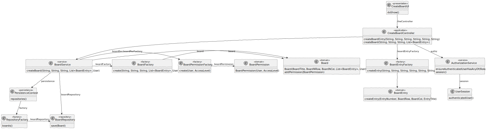

# US 3002

## 1. Context

In Sprint B client wants us to develop a feature for our System. He wants that a User to be able to create a board

## 2. Requirements

As User, I want to create a board.

The only dependecy is User needs to be authenticated to access to this feature.


## 3. Analysis

Information in System Specification

    It has a unique title. It is divided into a certain number of columns and rows. Therefore it has a certain number of cells. 
    For the moment it makes sense to define the maximum number of rows to 20 and of columns to 10. But this should be a setting in a property file.
    Columns and rows may have titles. They may also be identified by an integer number from 1 to the maximum number.
    The user that creates the board is its owner. The owner can share the board with other users.
    Users may have read or write access to the board.

Information in Forum

    "Can a user own more than one board?" 
    Yes.

    "As stated in the system specifications document, "Columns and rows may have titles. They may also be identified by an integer number from 1 to the maximum number", we wanted to clarify if it should be possible to have a column with no title and no identifier.Also, can the identifier of a column/row change once it's assigned?"

    In order for user to post content into a cell they must identify the cell. Therefore, I think at least, ir should be possible to identify the cell by the number of its column and the number of its row. If the cells have titles, these titles can be used to identify the cells. However, it should always be possible to identify a cell by the column number and row number.
    Regarding changing the title of the columns and rows after creating the board, there is nothing explicit about that. Therefore, I would accept the solution that does not support that possibility.

This is an excerpt of our domain Model, it provides the clear idea of how the Shared Board should be identified according to the information in System Specification.


## 4. Design

### 4.1. Realization

#### 4.1.1. Sequence Diagram


### 4.2. Class Diagram



### 4.3. Applied Patterns

#### 4.3.1. Factory

- Our PersistenceContext will create a RepositoryFactory based on the configuration file then the RepositoryFactory will create the repository that we need in order to persist our domain entity.

#### 4.3.2 Service

- Services are operations or functions that are not naturally in line with the responsibility of an entity or value object. They are used to model operations that involve multiple objects or complex behaviour.

#### 4.3.3 Single Responsibility Principle (SRP)

- Ensure that each object has a clear and well-defined responsibility within the domain.

#### 4.3.4 Tell, Don't Ask

- Ensure that objects do not expose their internal state or behaviour to the outside world. On the contrary, objects should receive commands telling them what they should do, rather than being asked for information about their current state.


#### 4.3.5 Model-View-Controller (MVC)

- Model is responsible for managing the data and business logic of the application. (BoardService)
- View is responsible for presenting the data to the user in a human-readable format. (CreateBoardUI)
- Controller is responsible for handling the user input and updating the model and the view accordingly. (CreateBoardController)

### 4.4. Tests

**Test 1:** *Create a valid board*

```java
@Test
void testCreateBoardValid() {
    List<BoardEntry> allBoardEntrys = new ArrayList<>();
    User boardOwner = managerUser();

    BoardFactory factory = new BoardFactory();
    Board board = factory.create(boardTitle, boardNRow, boardNCol, allBoardEntrys, boardOwner);

    when(boardRepositoryMock.save(any(Board.class))).thenReturn(board);

    Board result = boardService.createBoard(
                boardTitle, boardNRow, boardNCol,
                allBoardEntrys, boardOwner);

    assertEquals(boardTitle, result.boardTitle().value());
    assertEquals(Integer.parseInt(boardNRow), result.boardNRow().value());
    assertEquals(Integer.parseInt(boardNCol), result.boardNCol().value());
    assertEquals(boardOwner, result.boardOwner());
    verify(boardRepositoryMock, times(1)).save(any(Board.class));
}
````

**Test 2:** *Create a board with invalid number of columns should throw exception.*

```java
@Test
void testCreateBoardWithInvalidBoardNColumn() {
    List<BoardEntry> allBoardEntrys = new ArrayList<>();
    User boardOwner = managerUser();

    BoardFactory factory = new BoardFactory();

    assertThrows(IllegalArgumentException.class,
                () -> factory.create(boardTitle, boardNRow, "-1", allBoardEntrys, boardOwner));

    verify(boardRepositoryMock, times(0)).save(any(Board.class));
}
````

**Test 3:** *Create a board with invalid number of rows should throw exception.*

```java
@Test
void testCreateBoardWithInvalidBoardNColumn() {
    List<BoardEntry> allBoardEntrys = new ArrayList<>();
    User boardOwner = managerUser();

    BoardFactory factory = new BoardFactory();

    assertThrows(IllegalArgumentException.class,
                () -> factory.create(boardTitle, boardNRow, "-1", allBoardEntrys, boardOwner));

    verify(boardRepositoryMock, times(0)).save(any(Board.class));
}
````

## 5. Implementation

**CreateBoardUI**

```java
package presentation.boards;

import eapli.framework.io.util.Console;
import eapli.framework.presentation.console.AbstractUI;
import org.boards.controller.CreateBoardController;
import org.domain.model.BoardEntry;

import java.util.ArrayList;
import java.util.List;

public class CreateBoardUI extends AbstractUI {
    private final CreateBoardController theController = new CreateBoardController();

    /**
     * The constant MIN_ROWS_COLUMNS.
     */
    private static final String MIN_ROWS_COLS = "1";

    /**
     * User want to create a new Board.
     * Ask User fields.
     * BoardTitle, BoardNRow, BoardNCol,
     * @return false
     */
    @Override
    protected boolean doShow() {
        final String boardTitle = Console.readLine("Board Title:");
        final String boardNCol = Console.readLine("Board Number of Columns:");
        final String boardNRow = Console.readLine("Board Number of Rows:");

        List<BoardEntry> allBoardEntrys = new ArrayList<>();


        try{
            //Board Entrys for columns
            System.out.println("----COLUMNS ENTRYS----");
            for(int i = 1; i <= Integer.parseInt(boardNCol); i++){
                System.out.println("Board Row position -> " + MIN_ROWS_COLS);
                System.out.println("Board Column position -> " + i);

                final String entryTitle = Console.readLine("Entry Title:");

                BoardEntry boardEntry = theController.createBoardEntry(
                        String.valueOf(i),
                        MIN_ROWS_COLS,
                        String.valueOf(i),
                        entryTitle,
                        boardNRow,
                        boardNCol
                );

                allBoardEntrys.add(boardEntry);
            }

            //Board Entrys for rows
            System.out.println("----ROWS ENTRYS----");
            for(int i = 2; i <= Integer.parseInt(boardNRow); i++){
                System.out.println("Board Row position -> " + i);
                System.out.println("Board Column position -> " + MIN_ROWS_COLS);

                final String entryTitle = Console.readLine("Entry Title:");

                BoardEntry boardEntry = theController.createBoardEntry(
                        String.valueOf(i),
                        String.valueOf(i),
                        MIN_ROWS_COLS,
                        entryTitle,
                        boardNRow,
                        boardNCol
                );

                allBoardEntrys.add(boardEntry);
            }

            theController.createBoard(boardTitle, boardNRow, boardNCol, allBoardEntrys);

            System.out.println("Board Successfully created!");
        } catch (IllegalArgumentException e){
            System.out.println(e.getMessage());
        }

        return true;
    }

    /**
     * @return String to headline
     */
    @Override
    public String headline() {
        return "Create Board";
    }
}
````

**CreateBoardController**

```Java
package org.boards.controller;

import eapli.framework.application.UseCaseController;
import org.authz.application.AuthorizationService;
import org.authz.application.AuthzRegistry;
import org.boards.service.BoardService;
import org.domain.model.Board;
import org.domain.model.BoardEntry;
import org.domain.model.BoardEntryFactory;
import org.persistence.PersistenceContext;
import org.user.management.CourseRoles;

import java.util.List;

/**
 * Controller class for adding a new user to the system.
 */
@UseCaseController
public class CreateBoardController {
    /**
     * Authorization service instance.
     */
    private final AuthorizationService authz = AuthzRegistry
                                            .authorizationService();

    /**
     * Create a board service with repository injection.
     */
    private final BoardService boardSvc = new BoardService(
            PersistenceContext.repositories().boards());

    /**
     * Create shared board.
     * @param boardTitlep Board Title
     * @param boardNRowp Board number of rows
     * @param boardNColp Board number of columns
     * @param allBoardEntrys Board entrys
     * @return Board
     */
    public Board createBoard(final String boardTitlep,
                             final String boardNRowp,
                             final String boardNColp,
                             final List<BoardEntry> allBoardEntrys) {
        authz.ensureAuthenticatedUserHasAnyOf(CourseRoles.allRoles());

        return boardSvc.createBoard(boardTitlep, boardNRowp, boardNColp,
                allBoardEntrys, authz.session().get().authenticatedUser());
    }

    /**
     * Create board entry.
     * @param entryNumberp Entry number
     * @param boardRowp Row position
     * @param boardColp Column position
     * @param entryTitlep Entry Title
     * @param boardNRowp Board number of rows
     * @param boardNColps Board number of columns
     * @return BoardEntry
     */
    public BoardEntry createBoardEntry(final String entryNumberp,
                                       final String boardRowp,
                                       final String boardColp,
                                       final String entryTitlep,
                                       final String boardNRowp,
                                       final String boardNColps) {
        authz.ensureAuthenticatedUserHasAnyOf(CourseRoles.allRoles());

        return new BoardEntryFactory().create(
                entryNumberp,
                boardRowp,
                boardColp,
                entryTitlep,
                boardNRowp,
                boardNColps
        );
    }
}
````

**BoardService**

```Java
package org.boards.service;

import org.domain.model.*;
import org.domain.repositories.BoardRepository;
import org.springframework.beans.factory.annotation.Autowired;
import org.springframework.stereotype.Service;
import org.usermanagement.domain.model.User;

import java.util.List;

@Service
public class BoardService {
    /**
     * UserRepository.
     */
    private final BoardRepository boardRepository;

    /**
     * @param boardRepo
     */
    @Autowired
    public BoardService(final BoardRepository boardRepo) {
        boardRepository = boardRepo;
    }

    /**
     * Create board.
     * @param boardTitlep
     * @param boardNRowp
     * @param boardNColp
     * @param allBoardEntrys
     * @param boardOwner
     * @return Board
     */
    public Board createBoard(final String boardTitlep,
                            final String boardNRowp,
                            final String boardNColp,
                            final List<BoardEntry> allBoardEntrys,
                            final User boardOwner) {
        BoardFactory boardFactory = new BoardFactory();
        BoardPermissionFactory boardPerFactory = new BoardPermissionFactory();

        Board newBoard = boardFactory.create(boardTitlep, boardNRowp,
                boardNColp, allBoardEntrys, boardOwner);

        BoardPermission boardPermission = boardPerFactory.create(
                boardOwner, AccessLevelType.WRITE);

        newBoard.addPermission(boardPermission);

        return boardRepository.save(newBoard);
    }
}
````

## 6. Integration/Demonstration

Login as a User

```txt
+= Login ======================================================================+

Email: student1@email.com

Password: PasswordStudent1


+==============================================================================+
```

Choose option "Shared Boards"

```txt
+= eCourse ====================================================================+

1. Manage eCourse Courses
9. Shared Boards
0. Exit

Please choose an option
```

Choose option "Create Board"

```txt
>> Shared Boards
1. Create Board
0. Return 

Please choose an option
```

Form to Create board

```txt
+= Create Board ===============================================================+

Board Title:
Board Title Test
Board Number of Columns:
3
Board Number of Rows:
3
----COLUMNS ENTRYS----
Board Row position -> 1
Board Column position -> 1
Entry Title:
Coluna 1
Board Row position -> 1
Board Column position -> 2
Entry Title:
Coluna 2
Board Row position -> 1
Board Column position -> 3
Entry Title:
Coluna 3
----ROWS ENTRYS----
Board Row position -> 2
Board Column position -> 1
Entry Title:
Row 2
Board Row position -> 3
Board Column position -> 1
Entry Title:
Row 3
Board Successfully created!
+==============================================================================+
```

## 7. Observations

Example of BoardEntry:

| Coluna 1 & Linha 1 | Coluna 2 & Linha 1 | Coluna 3 & Linha 1 |
|:------------------:|:------------------:|:------------------:|
| Coluna 1 & Linha 2 |                    |                    |
| Coluna 1 & Linha 3 |                    |                    |
|                    |                    |                    |