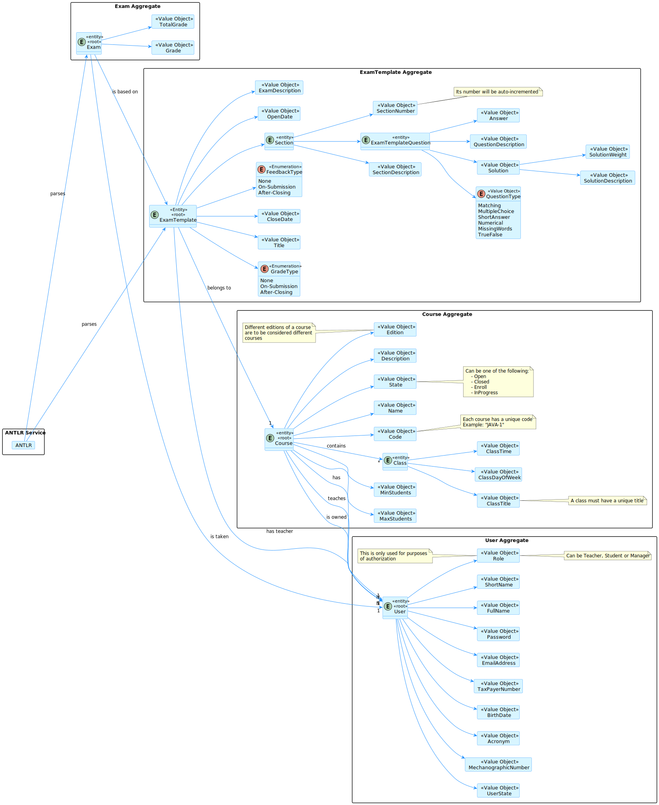
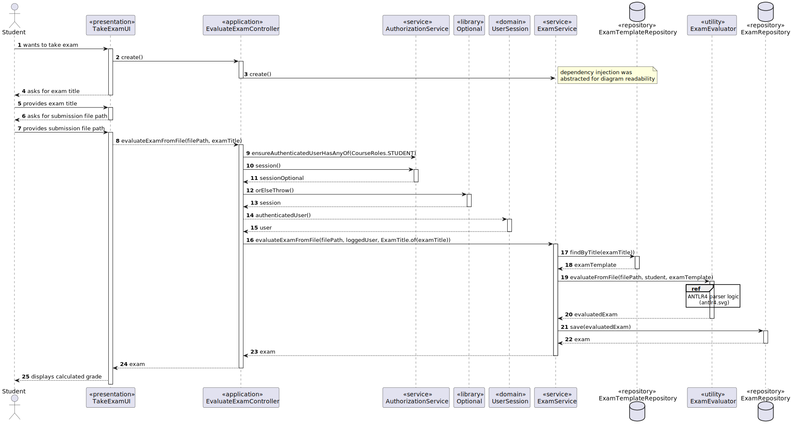
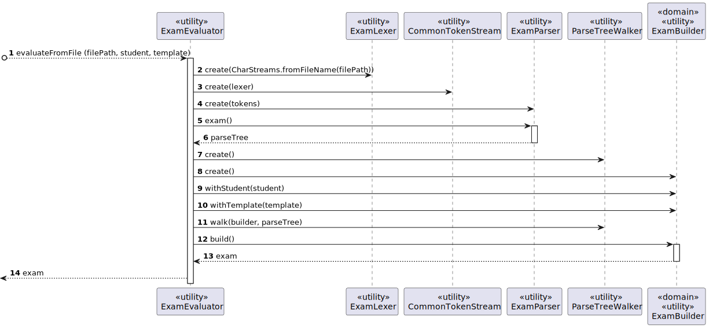
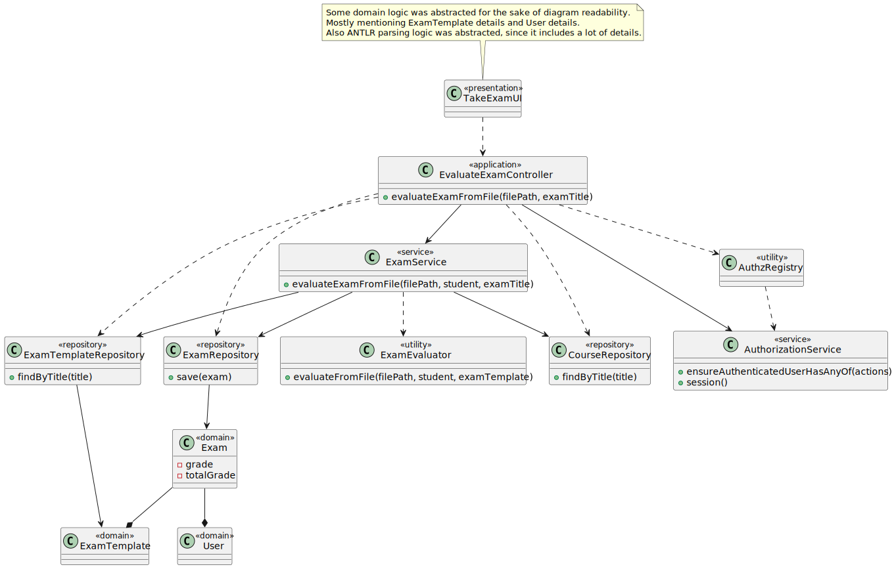
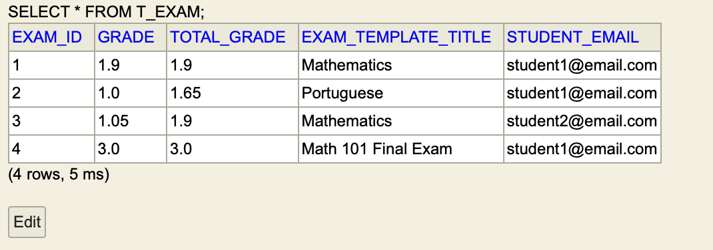

# US 2004 - As a Student, I want to take an exam.

## 1. Context

*After the teacher creates the template, is it of interest of the student of such course to take an exam, so this User Story will cover that.*

## 2. Requirements

### 2.1. Functional Requirements

- With a parser the student is able to pass a file with the answers to the exam. The parser will calculate the grade automatically.

### 2.2. Dependencies

- For this user story to be completed, there has to be a template to solve (US_2001).
- We also need *antlr4* to be able to parse the text file.

## 3. Analysis



- As a team, we decided that there should be an aggregate for the exam submission and the template is separated from the submission, since the template is created by the teacher and the submission is created by the student.

## 4. Design

### 4.1. Realization

### 4.1.1. Sequence Diagram of the user story


- The flow of the user story is simple, the student passes a file with the answers and the title of the exam to solve, the system searches for the template and calls the parser to evaluate and verificate the integrity of the exam.

### 4.1.2. Excerpt of ANTLR4 Parser Logic


- Since this part is a bit more complex and would make the sequence diagram a bit more confusing, we decided to abstract it to a separate sequence diagram.
- So the parser works like this, first we create the lexer, get the tokens from the lexer, create the parser with such tokens and finally let the parser do his job with the parse tree.
- We also used a listener coupled with the *Gang of Four* pattern *Builder*, except this builder is automatic in parts, since the parser builds the object through it (it is also a listener).

### 4.2. Class Diagram



- Since a lot of things are done in this user story, we decided to create a service, so our controller is only an end-point to our input and the service stays responsible for searching the template with such title, calling the parser, and saving the graded exam(business logic).
- The ExamEvaluator calls a parser generated by *antlr4* after doing the grammar that verifies our submission.

### 4.3. Applied Patterns

#### 4.3.1. MVC (Model-View-Controller)

- Model is responsible for managing the data and business logic of the application. (Exam, ExamTemplate, User)
- View is responsible for presenting the data to the user in a human-readable format. (TakeExamUI)
- Controller is responsible for handling the user input and updating the model and the view accordingly. (EvaluateExamController)

#### 4.3.2. Service Layer

- The service layer is responsible for handling the business logic of the application. (ExamService)
- It calls the parser, the exam template repository to find the template by its title, and the exam repository to save the graded exam.

#### 4.3.3. Repository
- For the storing of the graded exam, we use a repository to abstract the storage of the exam. (ExamRepository)
- We also use a repository to find the template by its title. (ExamTemplateRepository)
- We used this pattern in accordance with the Single Responsibility Principle, so the repositories are only responsible for storing and finding the objects(stored in the database or any other storing methodology).
- This is an interface so we are able to change the implementation of the repository without changing the code that uses it.

#### 4.3.4. Builder
- We use a builder, since the exam is a complicated object and is built by a parsing algorithm, so we use a builder to build the exam object. (ExamBuilder)
- It is a bit different than a normal builder, since the parser is the one that builds part of the object, contrary to a normal builder that builds the object with human help(input from humans, not parsed from a file).

#### 4.3.5. Dependency Injection
- The service is dependant on the repositories, so we inject them in the constructor of the service. (ExamService)
- This is a simple way of abstracting the repository implementation we want to use, if we want to change the implementation, we only need to change the constructor of the service.
- It is also useful to test, so we can inject a mock repository to test the service.

### 4.4. Tests

### 4.4.1. Domain Unit Tests

```java
class ExamTest {


    /*
     * Data and builders are missing so we can see better the flow of the unit tests.
     * Each test has its own purpose and is named accordingly.
     */

    @Test
    void ensureExamCannotHaveNegativeGrade(){
        assertThrows(
                IllegalArgumentException.class,
                () -> new Exam(
                        buildTemplate(),
                        buildStudent(),
                        -1.0,
                        1.0
                )
        );
    }

    @Test
    void ensureExamCannotHaveGradeHigherThanMaxGrade(){
        assertThrows(
                IllegalArgumentException.class,
                () -> new Exam(
                        buildTemplate(),
                        buildStudent(),
                        1.0,
                        0.5
                )
        );
    }

    @Test
    void ensureExamCannotBeSolvedByATeacher(){
        assertThrows(
                IllegalArgumentException.class,
                () -> new Exam(
                        buildTemplate(),
                        buildTeacher(),
                        0.5,
                        1.0
                )
        );
    }

    @Test
    void ensureCanCreateValidExam() throws IOException {

        Exam exam;

        exam = new Exam(
                buildTemplate(),
                buildStudent(),
                0.5,
                1.0
        );

        assertEquals(10, exam.schoolGrade());
        System.out.println("<--Valid Exam-->\n" + exam.toString() + "<--Valid Exam-->\n");
    }

    @Test
    void ensureIfNotDBSavedIdentityIsNull() throws IOException {
        Exam exam = new Exam(
                buildTemplate(),
                buildStudent(),
                0.5,
                1.0
        );

        assertNull(exam.identity());
    }

    @Test
    void ensureSameAsIsWorking() throws IOException {
        Exam exam1 = new Exam(
                buildTemplate(),
                buildStudent(),
                0.5,
                1.0
        );

        Exam exam2 = new Exam(
                buildTemplate(),
                buildStudent(),
                0.5,
                1.0
        );

        assertTrue(exam1.sameAs(exam2));
    }
    
}
````

### 4.4.2. Service Integration Test

```java
class ExamServiceTest {
    
    /*
     * Data and builders are missing so we can see better the flow of the integration test.
     * This test's purpose is to verify that the service is correctly using the repositories, and doing his task accordingly.
     * As we can see, we verify that the service calls the exam template repository to find the template with such title,
     * and finally saves in the exam repository.
     */
    
    @Mock ExamRepository repo;
    @Mock ExamTemplateRepository templateRepo;
    @Mock CourseRepository courseRepo;

    ExamTitle title;

    ExamTemplate template;

    ExamService service;

    User student;

    @BeforeEach
    void setUp() throws IOException {
        repo = mock(ExamRepository.class);
        templateRepo = mock(ExamTemplateRepository.class);
        courseRepo = mock(CourseRepository.class);

        title = ExamTitle.of("Mathematics");
        template = buildTemplate();
        student = buildStudent();

        service = new ExamService(repo, templateRepo, courseRepo);
    }

    @Test
    void testEvaluateExamFromFile() throws IOException {
        when(templateRepo.findByTitle(title)).thenReturn(Optional.of(template));

        service.evaluateExamFromFile(FILE_EXAM_RESOLUTION_1, student, title);

        verify(templateRepo, times(1)).findByTitle(title);
        verify(repo, times(1)).save(any());
    }
}
```


## 5. Implementation

### 5.1. ANTLR4 Grammar

```antlrv4
grammar Exam;


exam: exam_header '{' section+ '}';


exam_header: SUBMISSION_TITLE NAME;

section: SECTION_TITLE NAME '{' question+ '}';

question: matching_quest
              | multiple_choice_quest
              | short_answer_quest
              | numerical_quest
              | select_words_quest
              | true_false_quest
              ;

matching_quest: MATCHING NAME (('[' NAME (',' NAME)*  ']') | NULL_OPERATOR)  ';';

multiple_choice_quest: MULTIPLE_CHOICE NAME (('[' NAME (',' NAME)*  ']') | NULL_OPERATOR) ';';

short_answer_quest: SHORT_ANSWER NAME (('[' NAME ']') | NULL_OPERATOR) ';';

numerical_quest: NUMERICAL NAME (NUMBER | NULL_OPERATOR) ';';

select_words_quest: SELECT_WORDS NAME ('[' NAME (',' NAME)*  ']' | NULL_OPERATOR) ';';

true_false_quest: TRUE_FALSE NAME (TRUE_FALSE_OPT | NULL_OPERATOR) ';';


MATCHING : 'MQUES';
MULTIPLE_CHOICE : 'MCQUES';
SHORT_ANSWER : 'SAQUES';
NUMERICAL : 'NQUES';
SELECT_WORDS : 'SWQUES';
TRUE_FALSE : 'TFQUES';

SUBMISSION_TITLE: 'EXAM SUBMISSION';

SECTION_TITLE: 'SECTION';

NAME: '"' .*? '"';

NULL_OPERATOR: 'null';

NUMBER : [1-9][0-9]*( '.' [0-9]+ ) ?;

TRUE_FALSE_OPT : 'True' | 'False';

WS: [ \t\r\n]+ -> skip;
```

- Kind of works like a programming language, has its own blocks (create the submition/sections) and statements(questions).

### 5.2. Service Implementation

```java
package org.exam.application;

import eapli.framework.validations.Preconditions;
import org.domain.model.exam.Exam;
import org.domain.model.examtemplate.domain.ExamTemplate;
import org.domain.model.examtemplate.domain.ExamTitle;
import org.domain.repositories.CourseRepository;
import org.springframework.stereotype.Service;
import org.usermanagement.domain.model.User;
import repositories.ExamRepository;
import repositories.ExamTemplateRepository;

import java.io.IOException;

@Service
public class ExamService {
    private ExamRepository repo;
    private ExamTemplateRepository templateRepo;
    private CourseRepository courseRepo;

    public ExamService(ExamRepository repo, ExamTemplateRepository templateRepo, CourseRepository courseRepo) {
        this.repo = repo;
        this.templateRepo = templateRepo;
        this.courseRepo = courseRepo;
    }

    public Exam evaluateExamFromFile(String filePath, User student, ExamTitle examTitle) throws IOException {

        ExamTemplate examTemplate = templateRepo.findByTitle(examTitle)
                .orElseThrow(
                        () -> new IllegalArgumentException("Exam with such title does not exist.\nTry again.")
                );

        Preconditions.ensure(
                examTemplate.containsStudent(student),
                "Student is not enrolled in this exam.\nTry again."
        );


        Exam evaluated = ExamEvaluator.evaluateFromFile(filePath, student, examTemplate);

        return this.repo.save(evaluated);
    }

}
```

- Has the responsibility to call the parser and save the graded exam in the repository.

### 5.3. Domain Object (Exam)

```java
package org.domain.model.exam;

import eapli.framework.domain.model.AggregateRoot;
import eapli.framework.validations.Preconditions;
import org.domain.model.examtemplate.domain.ExamTemplate;
import org.user.management.CourseRoles;
import org.usermanagement.domain.model.User;

import javax.persistence.*;
import java.util.List;

@Entity
@Table(
        name = "T_EXAM",
        uniqueConstraints = @UniqueConstraint(
                columnNames = {
                        "exam_template_title",
                        "student_email"
                }
        )
)

public class Exam implements AggregateRoot<Long> {
    @Id
    @GeneratedValue(strategy = GenerationType.IDENTITY)
    @Column(name = "exam_id")
    private Long id;


    @ManyToOne(fetch = FetchType.EAGER)
    @JoinColumn(name = "exam_template_title")
    private ExamTemplate examTemplate;
    @ManyToOne(optional = false, fetch = FetchType.EAGER)
    @JoinColumn(name = "student_email")
    private User student;
    @Column(name = "grade")
    private Double grade;
    @Column(name = "total_grade")
    private Double totalGrade;

    protected Exam() {
        // for ORM
    }

    public Exam(
            ExamTemplate examTemplate,
            User student,
            Double grade,
            Double totalGrade
    ) {
        Preconditions.ensure(
                student.role().equals(CourseRoles.STUDENT.toString()),
                "The user must be a student"
        );
        Preconditions.ensure(
                grade >= 0 && grade <= totalGrade,
                "The grade must be between 0 and the total grade"
        );
        this.examTemplate = examTemplate;
        this.student = student;
        this.grade = grade;
        this.totalGrade = totalGrade;
    }

    @Override
    public boolean sameAs(Object other) {
        Exam exam = (Exam) other;

        return this.student.identity().equals(exam.student.identity())
                && this.examTemplate.identity().value()
                .equals(exam.examTemplate.identity().value());
    }

    @Override
    public Long identity() {
        return id;
    }

    public Double schoolGrade(){
        return (this.grade / this.totalGrade) * 20;
    }

    @Override
    public String toString() {
        return
        "Exam: " + this.examTemplate.identity().value() + "\n"
        + "Course: " + this.examTemplate.course().identity().value() + "\n"
        + "Student: " + this.student.identity() + "\n"
        + "Grade: " + this.schoolGrade() + "\n";
    }
}
```

### 5.4. Builder/Listener

```java
package org.domain.model.exam;

import eapli.framework.validations.Preconditions;
import org.antlr.v4.runtime.ParserRuleContext;
import org.antlr.v4.runtime.tree.ErrorNode;
import org.antlr.v4.runtime.tree.TerminalNode;
import org.domain.model.QuestionType;
import org.domain.model.Solution;
import org.domain.model.examtemplate.domain.ExamTemplate;
import org.domain.model.examtemplate.domain.ExamTemplateQuestion;
import org.user.management.CourseRoles;
import org.usermanagement.domain.model.User;

import java.util.List;
import java.util.Map;
import java.util.stream.Collectors;

public class ExamBuilder extends ExamBaseListener{
    private ExamTemplate examTemplate;
    private Double grade = 0.0;
    private User student;

    private int currentSection = 0;

    private int currentQuestion = 0;

    private Double totalGrade = 0.0;

    @Override
    public void enterExam_header(ExamParser.Exam_headerContext ctx) {
        Preconditions.ensure(
                ctx.NAME().getText().replaceAll("\"", "").equals(examTemplate.identity().value()),
                "Invalid Exam Submission.\nTry again."
        );
    }

    @Override
    public void enterSection(ExamParser.SectionContext ctx) {
        String sectionTitle = examTemplate.sections().get(currentSection).description().value();

        String titleReceived = ctx.NAME().getText().replaceAll("\"", "");
        Preconditions.ensure(
                titleReceived.equals(sectionTitle),
                "Invalid Exam Submission.\nTry again."
        );
    }

    @Override
    public void exitSection(ExamParser.SectionContext ctx) {
        currentSection++;
        currentQuestion = 0;
    }

    @Override
    public void exitQuestion(ExamParser.QuestionContext ctx) {
        currentQuestion++;
    }

    @Override
    public void enterMatching_quest(ExamParser.Matching_questContext ctx) {

        ExamTemplateQuestion question = examTemplate.sections()
                .get(currentSection).questions().get(currentQuestion);

        String questionText = ctx.NAME(0).getText().replaceAll("\"", "");

        Preconditions.ensure(
                question.type()
                        .equals(QuestionType.MATCHING) &&
                questionText.equals(question.description().value()),
                "Invalid Exam Submission.\nTry again."
        );

        if(ctx.NULL_OPERATOR() == null){
            for (int i = 0; i < ctx.NAME().size(); i++) {
                if(
                        ctx.NAME(i).getText()
                                .replaceAll("\"", "")
                                .equals(question.solutions().get(i).description())
                ){
                    grade += question.solutions().get(i).weight();
                }
            }
        }

        for (Solution solution : question.solutions()) {
            totalGrade += solution.weight();
        }
    }

    @Override
    public void enterMultiple_choice_quest(ExamParser.Multiple_choice_questContext ctx) {


        ExamTemplateQuestion question = examTemplate.sections()
                .get(currentSection).questions().get(currentQuestion);

        List<String> answers = question
                .solutions()
                .stream()
                .map(Solution::description)
                .collect(Collectors.toList());

        String questionText = ctx.NAME(0).getText().replaceAll("\"", "");

        Preconditions.ensure(
                question.type()
                        .equals(QuestionType.MULTIPLE_CHOICE) &&
                        questionText.equals(question.description().value()),
                "Invalid Exam Submission.\nTry again."
        );

        double weight = 0;

        if(ctx.NULL_OPERATOR() == null){

            for (int i = 1; i < ctx.NAME().size(); i++) {
                String answerGiven = ctx.NAME(i).getText().replaceAll("\"", "");
                if(answers.contains(answerGiven)){
                    weight += question.solutions().get(answers.indexOf(answerGiven)).weight();
                }else{
                    weight = 0;
                    break; // if option is not on the solutions, student automatically gets 0
                }
            }

            grade += weight;
        }

        for (int i = 0; i < question.solutions().size(); i++) {
            totalGrade += question.solutions().get(i).weight();
        }


    }

    @Override
    public void enterShort_answer_quest(ExamParser.Short_answer_questContext ctx) {

        double total = 0;

        ExamTemplateQuestion question = examTemplate.sections()
                .get(currentSection).questions().get(currentQuestion);

        String questionText = ctx.NAME(0).getText().replaceAll("\"", "");

        Preconditions.ensure(
                question.type()
                        .equals(QuestionType.SHORT_ANSWER) &&
                        questionText.equals(question.description().value()),
                "Invalid Exam Submission.\nTry again."
        );

        if (ctx.NULL_OPERATOR() == null) {
            for (Solution sol : question.solutions()) {
                if (sol.description().equals(
                        ctx.NAME(1).getText().replaceAll("\"", "")
                )) {
                    grade += sol.weight();
                }
            }
        }

        for (Solution sol : question.solutions()) {
            if (sol.weight() > total) {
                total = sol.weight();
            }
        }

        totalGrade += total;
    }

    @Override
    public void enterNumerical_quest(ExamParser.Numerical_questContext ctx) {

        ExamTemplateQuestion question = examTemplate.sections()
                .get(currentSection).questions().get(currentQuestion);

        String questionText = ctx.NAME().getText().replaceAll("\"", "");

        Preconditions.ensure(
                question.type()
                        .equals(QuestionType.NUMERICAL) &&
                        questionText.equals(question.description().value()),
                "Invalid Exam Submission.\nTry again."
        );

        if(ctx.NULL_OPERATOR() == null){

            if(question.solutions().get(0).description().equals(ctx.NUMBER().getText())){
                grade += question.solutions().get(0).weight();
            }
        }
        totalGrade += question.solutions().get(0).weight();
    }

    @Override
    public void enterSelect_words_quest(ExamParser.Select_words_questContext ctx) {

        ExamTemplateQuestion question = examTemplate.sections()
                .get(currentSection).questions().get(currentQuestion);

        String questionText = ctx.NAME(0).getText().replaceAll("\"", "");

        Preconditions.ensure(
                question.type()
                        .equals(QuestionType.MISSING_WORDS) &&
                        questionText.equals(question.description().value()),
                "Invalid Exam Submission.\nTry again."
        );

        if(ctx.NULL_OPERATOR() == null){
            for (int i = 1; i < ctx.NAME().size(); i++) {
                if(
                        ctx.NAME(i).getText()
                                .replaceAll("\"", "")
                                .equals(question.solutions().get(i-1).description())
                ){
                    grade += question.solutions().get(i-1).weight();
                }

            }
        }

        for (int i = 0; i < question.solutions().size(); i++) {
            totalGrade += question.solutions().get(i).weight();
        }
    }

    @Override
    public void exitSelect_words_quest(ExamParser.Select_words_questContext ctx) {
        super.exitSelect_words_quest(ctx);
    }

    @Override
    public void enterTrue_false_quest(ExamParser.True_false_questContext ctx) {

        ExamTemplateQuestion question = examTemplate.sections()
                .get(currentSection).questions().get(currentQuestion);

        String questionText = ctx.NAME().getText().replaceAll("\"", "");

        Preconditions.ensure(
                question.type()
                        .equals(QuestionType.TRUE_FALSE) &&
                        questionText.equals(question.description().value()),
                "Invalid Exam Submission.\nTry again."
        );

        if(ctx.NULL_OPERATOR() == null){
            if(question.solutions().get(0).description().equals(ctx.TRUE_FALSE_OPT().getText())){
                grade += question.solutions().get(0).weight();
            }
        }

        totalGrade += question.solutions().get(0).weight();
    }

    public ExamBuilder withTemplate(ExamTemplate examTemplate){
        this.examTemplate = examTemplate;
        return this;
    }

    public ExamBuilder withStudent(User student){
        this.student = student;
        return this;
    }

    public Exam build(){
        return new Exam(examTemplate, student, grade, totalGrade);
    }
}
```

- This is a normal builder, except for the fact some of its fields are built by the parser (antlr listener).
- After all the parsing is done, we can call the build method and we will have a fully built exam.

## 6. Integration/Demonstration

### 6.1. Successful case

```text
+= Login ======================================================================+

Email: student1@email.com

Password: PasswordStudent1


+==============================================================================+


+= eCourse ====================================================================+

1. Manage eCourse Courses
2. Exams
9. Shared Boards
0. Exit

Please choose an option
2

>> Exams
1. List Future Exams
2. Take an Exam
0. Return 

Please choose an option
2

+= Take an Exam ===============================================================+

Enter the exam title: Math 101 Final Exam

Enter the path to the file: antlr_text_files/exams/resolution_1_from_3.txt

Final grade is: 20.0/20.

+==============================================================================+
```



- As we can see, the last one got a 20/20 since (3/3) * 20 = 20.
- The grade presented in the UI is calculated by a java function, which does basically (grade/totalGrade) * 20.
- As proof of concept, we can see that in the next files, the template and the submission.

#### 6.1.1. Template used
```text
EXAM "Math 101 Final Exam";
EXAM_DESCRIPTION "Final Exam for Math 101";
OPEN_DATE (12-02-2024 11:00);
CLOSE_DATE (14-02-2024 11:00);
FEEDBACK_TYPE AFTER;
GRADE_TYPE ONSUB;

SECTION "Section 1";

SWQUES "On a farm there are different types of animals. Namely the [OPT]. He serves to take care of the other [OPT]. No animal needs to move away from the [OPT].";
SOL |dog|0.50|;
SOL |animals|0.50|;
SOL |place|0.50|;

TFQUES "Does the dog have 4 paws?";
SOL <True|1.00>;

SECTION "Section 2";

MCQUES "Choose all animals that have 4 paws";
OPT "Ant";
OPT "Cow";
OPT "Dog";
OPT "Sparrow";
SOL |Cow|0.25|;
SOL |Dog|0.25|;
```

#### 6.1.2. Submission used
```text
EXAM SUBMISSION "Math 101 Final Exam" {
    SECTION "Section 1" {
        SWQUES "On a farm there are different types of animals. Namely the [OPT]. He serves to take care of the other [OPT]. No animal needs to move away from the [OPT]." ["dog","animals","place"];

        TFQUES "Does the dog have 4 paws?" True;
    }
    SECTION "Section 2" {
        MCQUES "Choose all animals that have 4 paws" ["Cow", "Dog"];
    }
}
```

- If you sum it all up, the total grade is 3, the grade is 3, so the student aced the exam.

### 6.2. Already taken exam

```text
+= eCourse ====================================================================+

1. Manage eCourse Courses
2. Exams
9. Shared Boards
0. Exit

Please choose an option
2

>> Exams
1. List Future Exams
2. Take an Exam
0. Return 

Please choose an option
2

+= Take an Exam ===============================================================+

Enter the exam title: Math 101 Final Exam

Enter the path to the file: antlr_text_files/exams/resolution_1_from_3.txt

You already took this exam.
Try again.
+==============================================================================+
```

### 6.3. Exam with Title does not exist

```text
+= eCourse ====================================================================+

1. Manage eCourse Courses
2. Exams
9. Shared Boards
0. Exit

Please choose an option
2

>> Exams
1. List Future Exams
2. Take an Exam
0. Return 

Please choose an option
2

+= Take an Exam ===============================================================+

Enter the exam title: NON EXISTENT

Enter the path to the file: antlr_text_files/exams/resolution_1_from_3.txt

Exam with such title does not exist.
Try again.
+==============================================================================+
```

### 6.4. File does not exist

```text
+= eCourse ====================================================================+

1. Manage eCourse Courses
2. Exams
9. Shared Boards
0. Exit

Please choose an option
2

>> Exams
1. List Future Exams
2. Take an Exam
0. Return 

Please choose an option
2

+= Take an Exam ===============================================================+

Enter the exam title: Math 101 Final Exam

Enter the path to the file: filedoesntexist.txt

File not found.
Try again.
+==============================================================================+
```

### 6.5. Student not enrolled in exam

```text
+= Login ======================================================================+

Email: student2@email.com

Password: PasswordStudent1


+==============================================================================+


+= eCourse ====================================================================+

1. Manage eCourse Courses
2. Exams
9. Shared Boards
0. Exit

Please choose an option
2

>> Exams
1. List Future Exams
2. Take an Exam
0. Return 

Please choose an option
2

+= Take an Exam ===============================================================+

Enter the exam title: Portuguese    

Enter the path to the file: antlr_text_files/exams/resolution_1_from_2.txt

Student is not enrolled in this exam.
Try again.
+==============================================================================+
```
