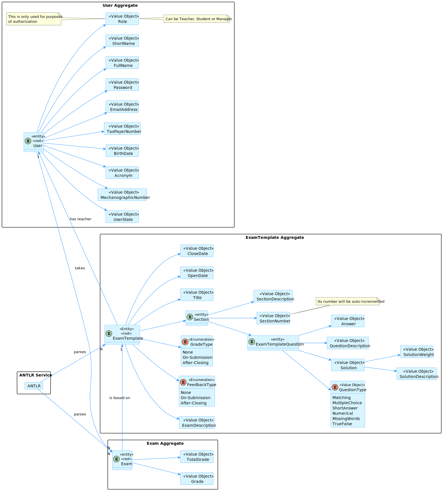
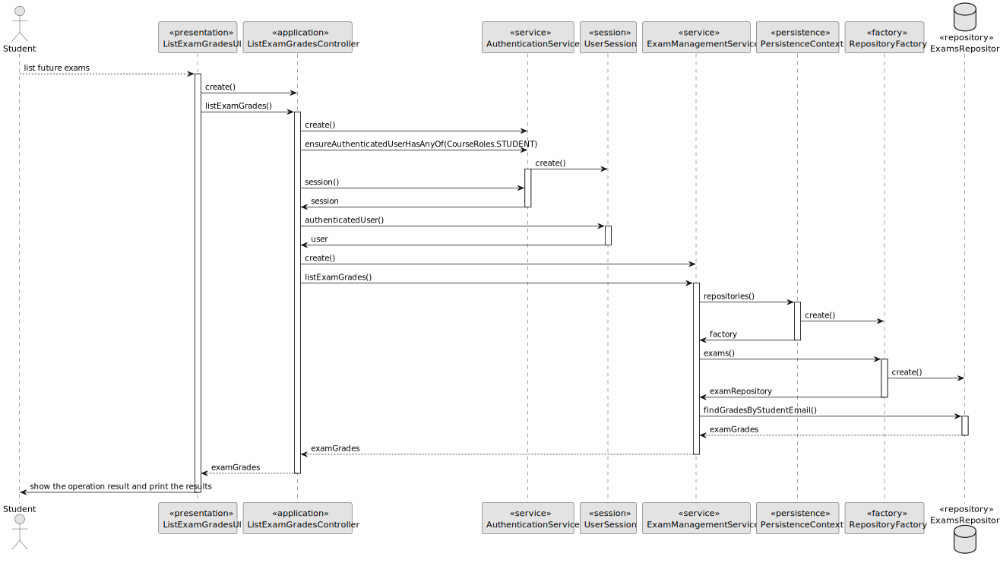
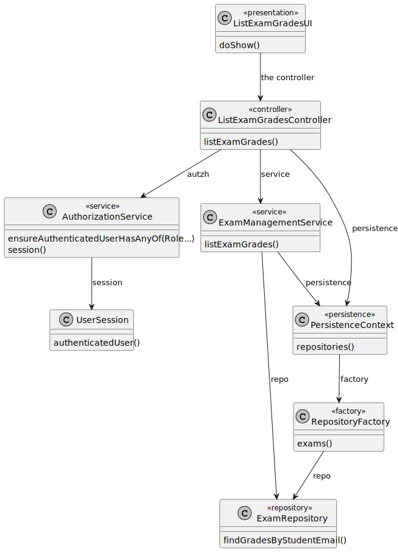
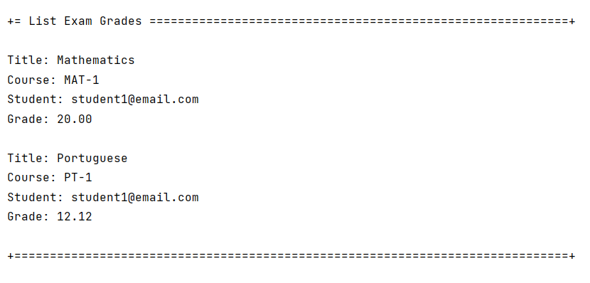
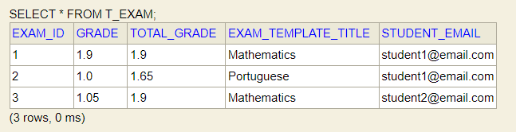

# US 2005

## 1. Context

This is the first time this task is being developed, since it was assigned in the present sprint (SPRINT C).

This [User Story](../../Glossary.md)  relates [Students](../../Glossary.md), [Exams](../../Glossary.md) and [Grades](../../Glossary.md).

Students will take an exam that will be graded and will have access to their grades.

## 2. Requirements

**US 2005** - As Student, I want to view a list of my grades.

- The Student can only view his/her own grades.
- The Student can only view the grades of the exams he/she took. 
- The Student's grade is N/A if they were in the course but did not take the exam.
- The Student's total grade is the sum of the grades of all the questions of the exams he/she took.

Regarding these requirements we understand that this User Story relates to [US2004](../US_2004/readme.md).

### 2.1 Client Specifications

## 3. Analysis

### 3.1 Domain Model



### 3.2 Implementation Analysis

After analyzing the requirements and the dependencies of this User Story, we concluded that the following classes should be used:

- **ListExamGradesUI**: The user interface of this functionality.
- **ListExamGradesController**: The controller of this functionality.
- **ExamManagementService**: The service of this functionality.
- **ExamRepository**: The repository of this functionality.

## 4. Domain

### 4.1 Sequence Diagram



### 4.2 Class Diagram



### 4.3 Applied Patterns

Some main design patterns were applied in this functionality, namely:
- **Single Responsibility Principle (SRP)**: A class should have only one reason to change and only one responsibility.
    - For example, in this User Story, the class `ListExamGradesUI` is responsible for the user interaction.

## 5. Implementation

**ListExamGradesUI**

```java
package exams;

import eapli.framework.presentation.console.AbstractUI;
import org.authz.application.AuthzRegistry;
import org.domain.model.exam.Exam;
import org.exam.application.ListExamGradesController;

public class ListExamGradesUI extends AbstractUI {

    private final ListExamGradesController ctrl = new ListExamGradesController(AuthzRegistry.authorizationService());

    @Override
    protected boolean doShow() {
        try {

            Iterable<Exam> exams = ctrl.listExamGrades();

            if (exams.iterator().hasNext()) {
                for (Exam exam : exams) {
                    System.out.printf("Title: %s\nCourse: %s\nStudent: %s\nGrade: %.2f\n\n", exam.title(), exam.course(), exam.student(), exam.schoolGrade());
                }
            } else {
                System.out.println("The student did not take any exams yet");
            }

        } catch (IllegalArgumentException iae) {
            System.out.println(iae.getMessage());
        }

        return true;

    }

    @Override
    public String headline() {
        return "List Exam Grades";
    }
}
```

**ListExamGradesController**

```java
package org.exam.application;

import org.authz.application.AuthorizationService;
import org.domain.model.exam.Exam;
import org.persistence.PersistenceContext;
import org.user.management.CourseRoles;
import org.usermanagement.domain.model.User;
import org.usermanagement.domain.model.UserSession;

public class ListExamGradesController {

    private final ExamService service;

    private final AuthorizationService authz;

    public ListExamGradesController(
            final AuthorizationService authzServicep
    ) {
        this.authz = authzServicep;
        this.service = new ExamService(
                PersistenceContext.repositories().exams(),
                PersistenceContext.repositories().examTemplates(),
                PersistenceContext.repositories().courses()
        );
    }

    public Iterable<Exam> listExamGrades() {

        authz.ensureAuthenticatedUserHasAnyOf(CourseRoles.STUDENT);

        UserSession session = authz.session().orElse(null);

        assert session != null;
        User student = session.authenticatedUser();

        return service.listExamGrades(student);

    }

}
```

## 6. Integration/Demonstration

