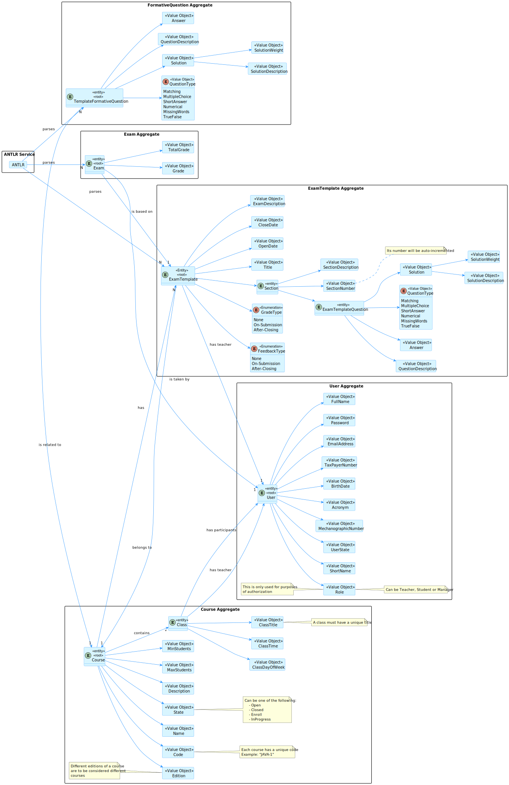
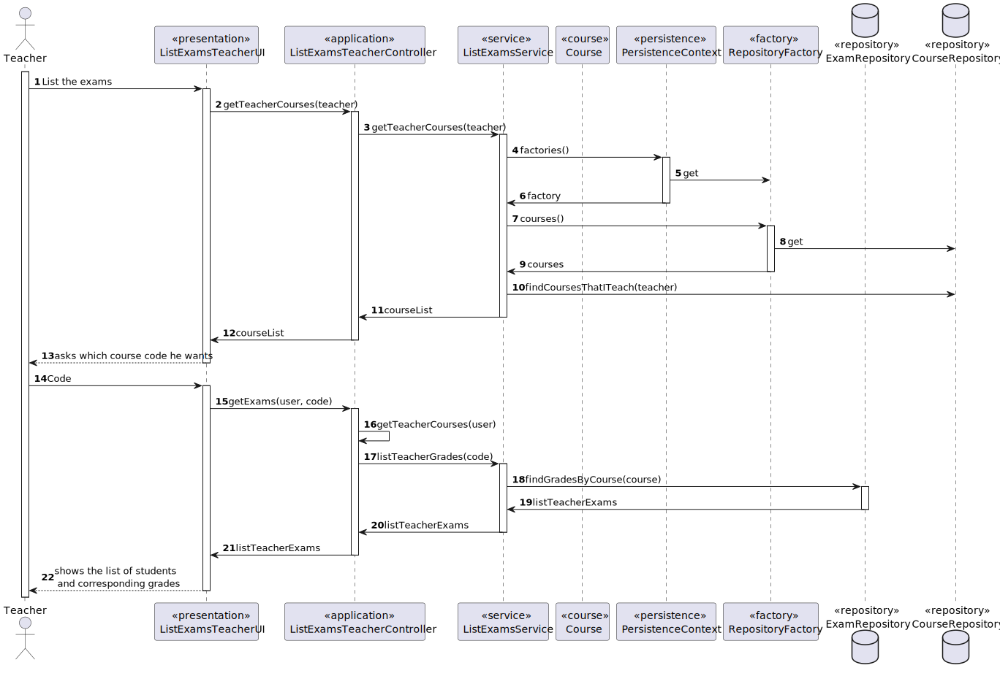
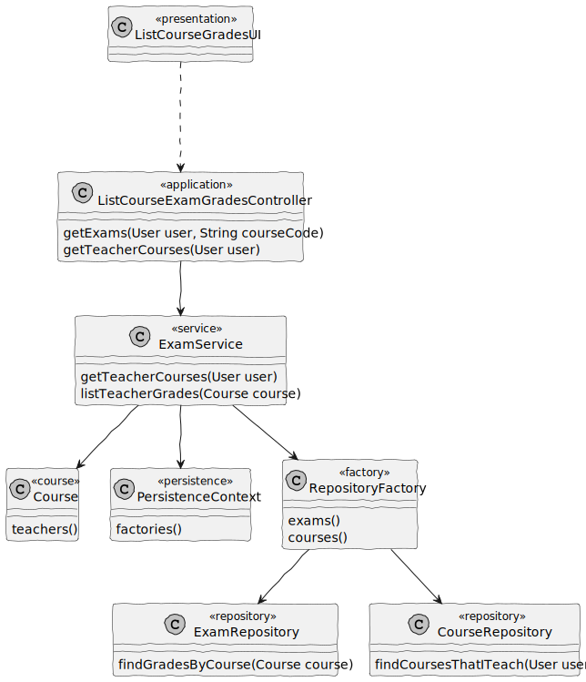
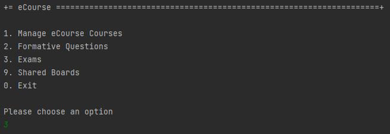
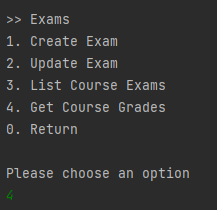
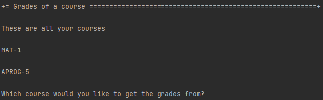
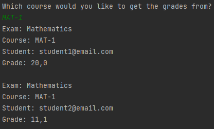

# US G002

## 1. Context

It is required for a teacher to be able to see the grades of the students of one of his/her courses

## 2. Requirements

**US 2006** : As Teacher, I want to view a list of the grades of exams of my courses

*2006.1* : The system displays to a teacher of a course all the exams of the course

## 3. Analysis

### 3.1 Domain Model

### 3.2 Implementation Analysis

- **ListCourseGradesUI**: The interface
- **ListCourseExamGradesController**: The controller
- **ExamService**: The service
- **ExamRepository**: The repository to find the exams

## 4. Design

*In this sections, the team should present the solution design that was adopted to solve the requirement. This should include, at least, a diagram of the realization of the functionality (e.g., sequence diagram), a class diagram (presenting the classes that support the functionality), the identification and rational behind the applied design patterns and the specification of the main tests used to validade the functionality.*

### 4.1. Realization

### 4.2. Class Diagram

### 4.3. Applied Patterns

- **Single Responsibility Principle (SRP)**: A class should have only one reason to change and only one responsibility.
    - For example the class `ListCourseGradesUI` is responsible for the user interaction.

### 4.4. Tests

**Test 1:** *Verifies the exams are saved and each teacher may find the corresponding exams*

@Test
void listTeacherGradesTest() throws IOException {

        final User student2 = buildStudent2();

        Course c1 = template.course();

        c1.addStudent(buildStudent2());

        when(templateRepo.findByTitle(title)).thenReturn(Optional.of(template));

        Exam e1 = service.evaluateExamFromFile(FILE_EXAM_RESOLUTION_1,
                student, title);

        Exam e2 = service.evaluateExamFromFile(FILE_EXAM_RESOLUTION_2,
                student2, title);

        List<Exam> exams = new ArrayList<>();

        exams.add(e1);
        exams.add(e2);

        when(service.listTeacherGrades(c1)).thenReturn(exams);

        service.listTeacherGrades(c1);

        verify(repo, times(2)).save(any());
        verify(repo, times(1)).findGradesByCourse(c1);
    }

## 5. Implementation

**ListCourseGradesUI**

    package exams;

    import eapli.framework.io.util.Console;
    import eapli.framework.presentation.console.AbstractUI;
    import org.authz.application.AuthzRegistry;
    import org.domain.model.Course;
    import org.domain.model.exam.Exam;
    import org.exam.application.ListCourseExamGradesController;
    import org.persistence.PersistenceContext;

    import java.util.List;

    public class ListCourseGradesUI extends AbstractUI {

    private final ListCourseExamGradesController ctrl = new ListCourseExamGradesController(PersistenceContext.repositories().courses(),
            PersistenceContext.repositories().exams(),
            PersistenceContext.repositories().examTemplates());
    @Override
    protected boolean doShow() {

        try {
            List<Course> courses = (List<Course>) ctrl.getTeacherCourses(AuthzRegistry.authorizationService().session().get().authenticatedUser());

            System.out.println("These are all your courses\n");
            for (Course course : courses) {
                System.out.println(course.identity().value() + "\n");
            }

            String courseCode = Console.readLine("Which course would you like to get the grades from?");

            List<Exam> courseExams = (List<Exam>) ctrl.getExams(AuthzRegistry.authorizationService().session().get().authenticatedUser(),
                    courseCode);

            for (Exam exam : courseExams) {
                System.out.println(exam.toString());
            }
        }catch (IllegalArgumentException e){
            System.out.println(e.getMessage());
        }
        return true;
    }

    @Override
    public String headline() {
        return "Grades of a course";
    }
    }

**ListCourseExamGradesController**

    package org.exam.application;
    
    
    import eapli.framework.application.UseCaseController;
    import eapli.framework.validations.Preconditions;
    import org.domain.model.Course;
    import org.domain.model.CourseCode;
    import org.domain.model.exam.Exam;
    import org.domain.repositories.CourseRepository;
    import org.user.management.CourseRoles;
    import org.usermanagement.domain.model.User;
    import repositories.ExamRepository;
    import repositories.ExamTemplateRepository;
    
    import java.util.*;
    
    /**
    * The type List course exam grades controller.
      */
      @UseCaseController
      public class ListCourseExamGradesController {
    
      private final CourseRepository courseRepo;
    
      private final ExamRepository examRepo;
    
      private final ExamTemplateRepository examTemplateRepo;
    
      private final ExamService service;
    
      /**
      * Instantiates a new List course exam grades controller.
      *
      * @param courseRepo       the course repo
      * @param examRepo         the exam repo
      * @param examTemplateRepo the exam template repo
        */
        public ListCourseExamGradesController(final CourseRepository courseRepo,
        final ExamRepository examRepo,
        final ExamTemplateRepository examTemplateRepo){
        this.courseRepo = courseRepo;
        this.examRepo = examRepo;
        this.examTemplateRepo = examTemplateRepo;
        service = new ExamService(examRepo, examTemplateRepo, courseRepo);
        }
    
      /**
      * Get teacher courses iterable.
      *
      * @param teacher the teacher
      * @return the iterable
        */
        public Iterable<Course> getTeacherCourses(User teacher){
        Preconditions.ensure(teacher.role().equals(CourseRoles.TEACHER.toString()), "The logged in user must be a teacher");
        return service.getTeacherCourses(teacher);
        }
    
      /**
      * Get exams iterable.
      *
      * @param teacher    the teacher
      * @param courseCode the course code
        * @return the iterable
          */
          public Iterable<Exam> getExams(User teacher,
          String courseCode){
    
          Set<Course> listCourses = new HashSet<>((Collection<? extends Course>) getTeacherCourses(teacher));
    
          Course course = courseRepo.findByCode(CourseCode.of(courseCode)).get();
    
          Preconditions.ensure(listCourses.contains(course), "The course was not on the shown list");
    
          return service.listTeacherGrades(course);
          }
    }

## 6. Integration/Demonstration

