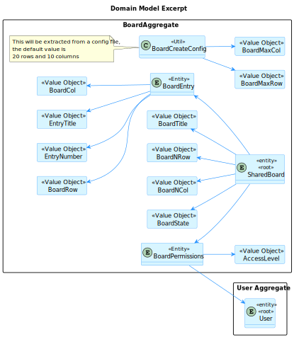
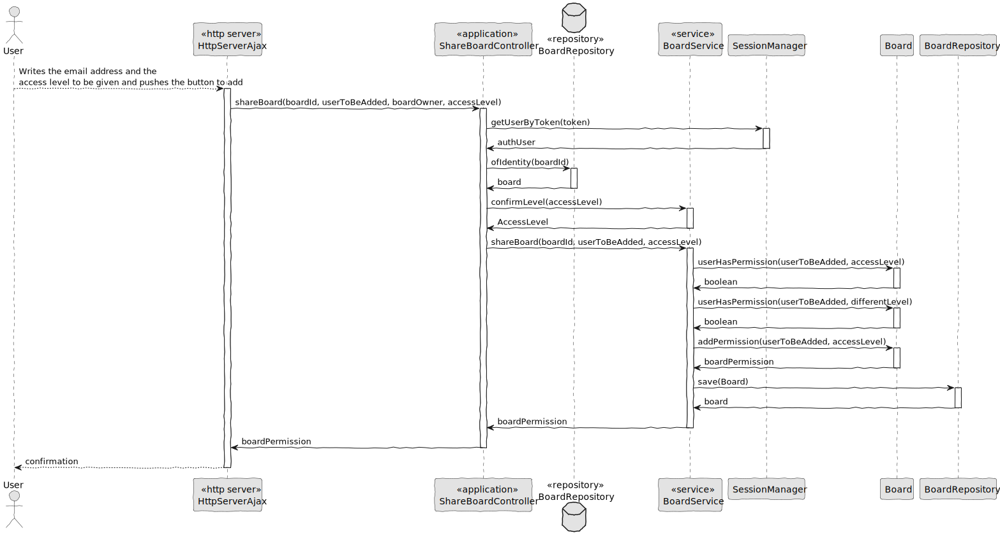
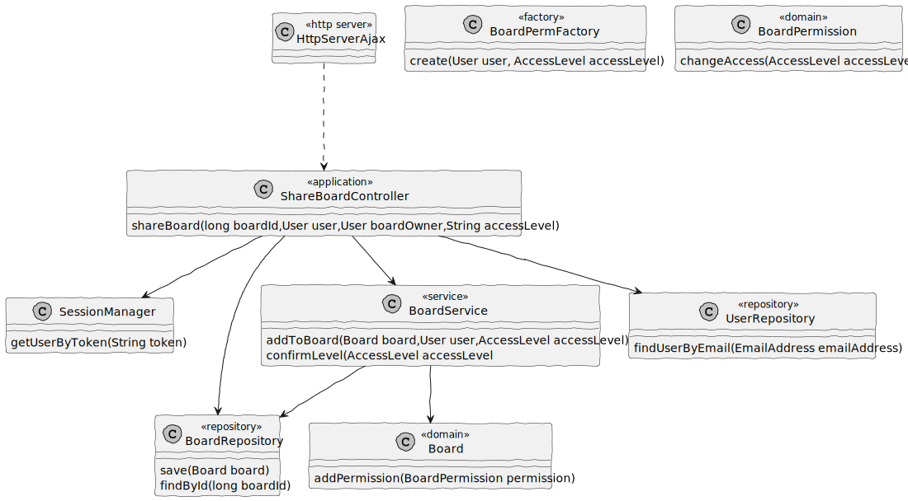
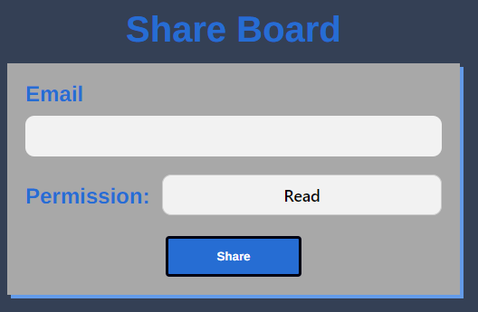

# US G002

## 1. Context

It is intended for all users to be able to share one of its own boards

## 2. Requirements

**US 3004** : As User, I want to share a board

*3004.1* : A user shares a board it owns with other users

*3004.2* : This functional part of the system has very specific technical requirements, particularly some concerns
about synchronization problems. In fact, several clients will try to concurrently update
boards. As such, the solution design and implementation must be based on threads,
condition variables and mutexes. Specific requirements will be provided in SCOMP.

## 3. Analysis

## 4. Design

*In this sections, the team should present the solution design that was adopted to solve the requirement. This should include, at least, a diagram of the realization of the functionality (e.g., sequence diagram), a class diagram (presenting the classes that support the functionality), the identification and rational behind the applied design patterns and the specification of the main tests used to validade the functionality.*

### 4.1. Realization

### 4.2. Class Diagram

### 4.3. Applied Patterns

- **Single Responsibility Principle (SRP)**: A class should have only one reason to change and only one responsibility.
    - For example the class `ShareBoardController` is responsible for the control of the user interaction.

### 4.4. Tests

**Test 1:** *Verifies that there can be these two access level types*

    @Test
    void confirmCorrectLevel() {
    assertEquals(AccessLevelType.WRITE, boardService.confirmLevel("Write"));

        assertEquals(AccessLevelType.READ, boardService.confirmLevel("Read"));
    }

**Test 2:** *Verifies there can be thrown exceptions in different examples**

    @Test
    void confirmWrongLevel(){
        assertThrows(IllegalArgumentException.class, ()-> boardService.confirmLevel("Readable"));
        assertThrows(IllegalArgumentException.class, ()-> boardService.confirmLevel("Wrong"));
        assertThrows(IllegalArgumentException.class, ()-> boardService.confirmLevel("Sentence"));
        assertThrows(IllegalArgumentException.class, ()-> boardService.confirmLevel("Blabla1213"));
    }

**Test 3:** *Verifies the board can be shared by the owner*

    @Test
    void shareABoard(){
        List<BoardEntry> allBoardEntrys = new ArrayList<>();
        User boardOwner = managerUser();
        User teacher = teacherUser();

        BoardEntryFactory factoryBE = new BoardEntryFactory();
        BoardEntry entry = factoryBE.create("1",
                "1", "1", "Entry 1",
                "3", "3");
        allBoardEntrys.add(entry);

        BoardFactory factory = new BoardFactory();
        Board board = factory.create(boardTitle, boardNRow, boardNCol, allBoardEntrys, boardOwner);

        BoardPermissionFactory factoryBPF = new BoardPermissionFactory();
        BoardPermission boardPermission = factoryBPF.create(boardOwner, AccessLevelType.WRITE);

        board.addPermission(boardPermission);

        boardService.createBoard(
                boardTitle, boardNRow, boardNCol,
                allBoardEntrys, boardOwner);

        boardService.addToBoard(board, teacher, AccessLevelType.READ);

        List<Board> boards = new ArrayList<>();
        boards.add(board);

        when(boardRepositoryMock.getBoardsByUser(teacher)).thenReturn(boards);

        assertTrue(board.userHasAnyPermission(teacher));
    }

**Test 4** *Verifies the board can't be  shared with the same permissions again*

    @Test
    void shareABoardAgain(){
        List<BoardEntry> allBoardEntrys = new ArrayList<>();
        User boardOwner = managerUser();
        User teacher = teacherUser();

        BoardEntryFactory factoryBE = new BoardEntryFactory();
        BoardEntry entry = factoryBE.create("1",
                "1", "1", "Entry 1",
                "3", "3");
        allBoardEntrys.add(entry);

        BoardFactory factory = new BoardFactory();
        Board board = factory.create(boardTitle, boardNRow, boardNCol, allBoardEntrys, boardOwner);

        BoardPermissionFactory factoryBPF = new BoardPermissionFactory();
        BoardPermission boardPermission = factoryBPF.create(boardOwner, AccessLevelType.WRITE);

        board.addPermission(boardPermission);

        boardService.createBoard(
                boardTitle, boardNRow, boardNCol,
                allBoardEntrys, boardOwner);

        boardService.addToBoard(board, teacher, AccessLevelType.READ);

        assertThrows(IllegalArgumentException.class,
                () -> boardService.addToBoard(board, teacher, AccessLevelType.READ));
    }

## 5. Implementation

**ShareBoardController**

        package org.boards.controller;
        
        import eapli.framework.application.UseCaseController;
        import eapli.framework.general.domain.model.EmailAddress;
        import eapli.framework.validations.Preconditions;
        import org.boards.service.BoardService;
        import org.domain.model.AccessLevel;
        import org.domain.model.Board;
        import org.domain.model.BoardPermission;
        import org.domain.repositories.BoardRepository;
        import org.usermanagement.domain.model.User;
        import org.usermanagement.domain.repositories.UserRepository;
        
        /**
        * The type Share board controller.
          */
          @UseCaseController
          public class ShareBoardController {
        
          private final UserRepository userRepo;
          private final BoardRepository boardRepo;
        
          private final BoardService service;
        
          /**
            * Instantiates a new Share board controller.
            *
            * @param userRepo  the user repo
            * @param boardRepo the board repo
              */
              public ShareBoardController(UserRepository userRepo,
              BoardRepository boardRepo){
              this.userRepo = userRepo;
              this.boardRepo = boardRepo;
              service = new BoardService(boardRepo);
              }
        
          /**
            * Share board and give board permission.
            *
            * @param boardId     the board id
            * @param user        the user
            * @param boardOwner  the board owner
            * @param accessLevel the access level
            * @return the board permission
              */
              public BoardPermission shareBoard(final long boardId,
              final User user,
              final User boardOwner,
              final String accessLevel){
              Board board = boardRepo.ofIdentity(boardId).orElse(null);
        
              Preconditions.nonNull(board, "The board is not on the system");
        
              Preconditions.ensure(board.boardOwner().emailAddress().toString().equals(boardOwner.emailAddress().toString()),
              "The user is not the owner of this board");
        
              AccessLevel access = service.confirmLevel(accessLevel);
        
              return service.addToBoard(board, user, access);
              }
              }

**BoardService**

        package org.boards.service;
        
        import eapli.framework.validations.Preconditions;
        import org.domain.model.*;
        import org.domain.repositories.BoardRepository;
        import org.springframework.beans.factory.annotation.Autowired;
        import org.springframework.stereotype.Service;
        import org.usermanagement.domain.model.User;
        
        import java.util.List;
        
        /**
        * The type Board service.
          */
          @Service
          public class BoardService {
          /**
            * UserRepository.
              */
              private final BoardRepository boardRepository;
        
        
            /**
             * Instantiates a new Board service.
             *
             * @param boardRepo the board repo
             */
            @Autowired
            public BoardService(final BoardRepository boardRepo) {
                boardRepository = boardRepo;
            }
        
            /**
             * Create board.
             *
             * @param boardTitlep    the board titlep
             * @param boardNRowp     the board n rowp
             * @param boardNColp     the board n colp
             * @param allBoardEntrys the all board entrys
             * @param boardOwner     the board owner
             * @return Board board
             */
            public Board createBoard(final String boardTitlep,
                                    final String boardNRowp,
                                    final String boardNColp,
                                    final List<BoardEntry> allBoardEntrys,
                                    final User boardOwner) {
                BoardFactory boardFactory = new BoardFactory();
                BoardPermissionFactory boardPerFactory = new BoardPermissionFactory();
        
                Board newBoard = boardFactory.create(boardTitlep, boardNRowp,
                        boardNColp, allBoardEntrys, boardOwner);
        
                BoardPermission boardPermission = boardPerFactory.create(
                        boardOwner, AccessLevelType.WRITE);
        
                newBoard.addPermission(boardPermission);
        
                return boardRepository.save(newBoard);
            }
        
            /**
             * Add to board to add board permission.
             *
             * @param board       the board
             * @param user        the user
             * @param accessLevel the access level
             * @return the board permission
             */
            public BoardPermission addToBoard(final Board board,
                                    final User user,
                                    final AccessLevel accessLevel){
        
                BoardPermissionFactory boardPermFactory = new BoardPermissionFactory();
        
                Preconditions.ensure(!board.userHasPermission(user, accessLevel), "User already had this permission");
        
                AccessLevel differentLevel= null;
        
                if(accessLevel.equals(AccessLevelType.READ)){
                    differentLevel = AccessLevelType.WRITE;
                }else{
                    differentLevel = AccessLevelType.READ;
                }
        
                if(board.userHasPermission(user, differentLevel)){
        
                    BoardPermission permission = board.userPermission(user);
        
                    permission.changeAccess(accessLevel);
        
                    boardRepository.save(board);
        
                    return permission;
                }else {
                    BoardPermission permission = boardPermFactory.create(user, accessLevel);
        
                    board.addPermission(permission);
        
                    boardRepository.save(board);
        
                    return permission;
                }
            }
        
            /**
             * Confirm level access level.
             *
             * @param accessLevel the access level
             * @return the access level
             */
            public AccessLevel confirmLevel(final String accessLevel){
                AccessLevel accessLev = null;
        
                if(accessLevel.equalsIgnoreCase("read")){
                    accessLev = AccessLevelType.READ;
                } else if(accessLevel.equalsIgnoreCase("write")){
                    accessLev = AccessLevelType.WRITE;
                }
        
                Preconditions.nonNull(accessLev, "The access level written must be Write or Read");
        
                return accessLev;
            }
        
        }

## 6. Integration/Demonstration

## 7. Observations

It was developed 2 ways to execute this functionality: server and console. But there are some differences between them both:

- Server : The data that has to be reviewed is actually only the users : the one who is adding and the one who is added. The access level is fixed to a box with the only 2 available options and the user must have access to the board to access the functionality
- Console : The data will be asked (such as the board Id, the user to be added and the access level) and therefore, the need of confirmation on the board ID and the access level is added