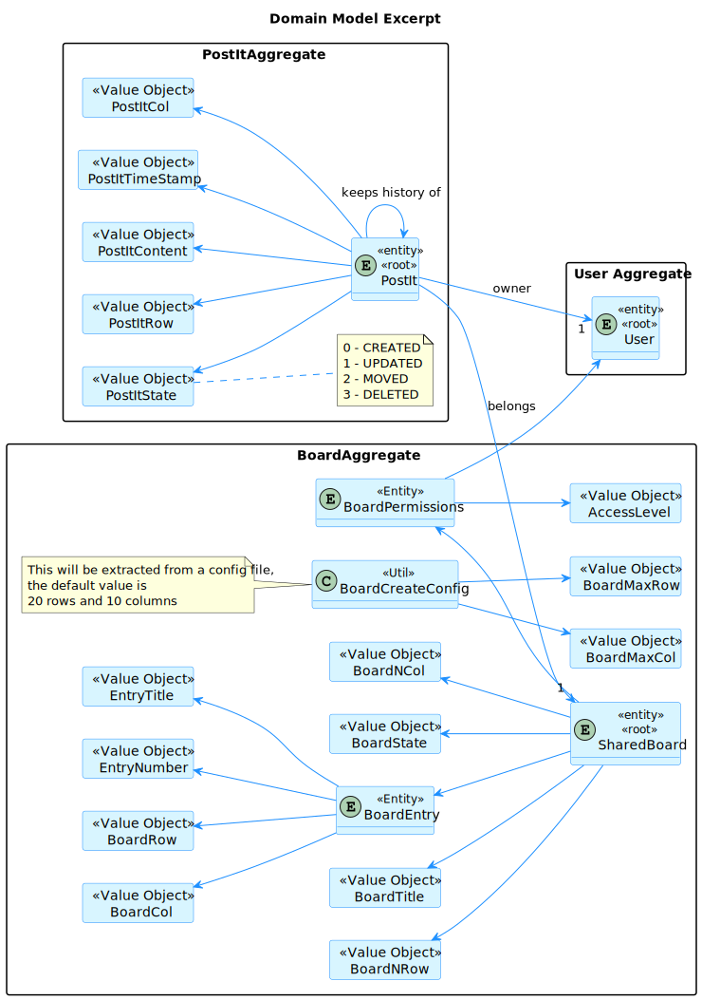
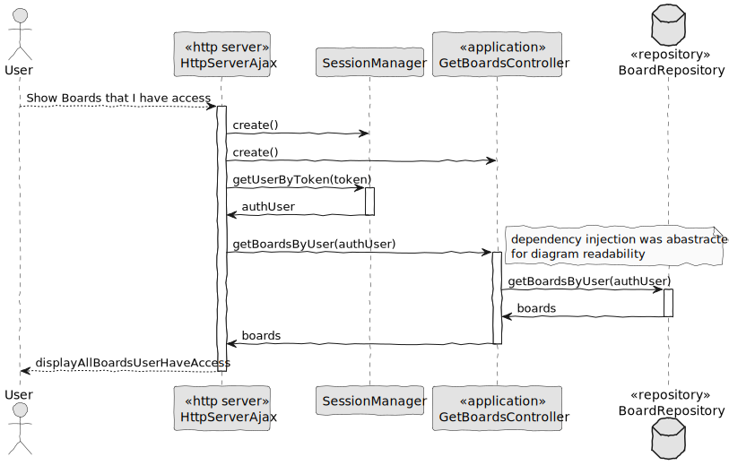
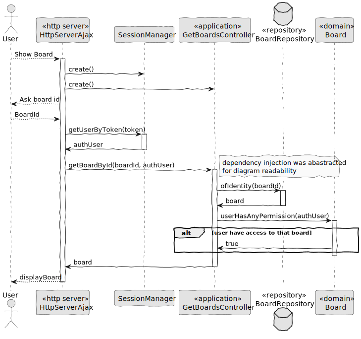
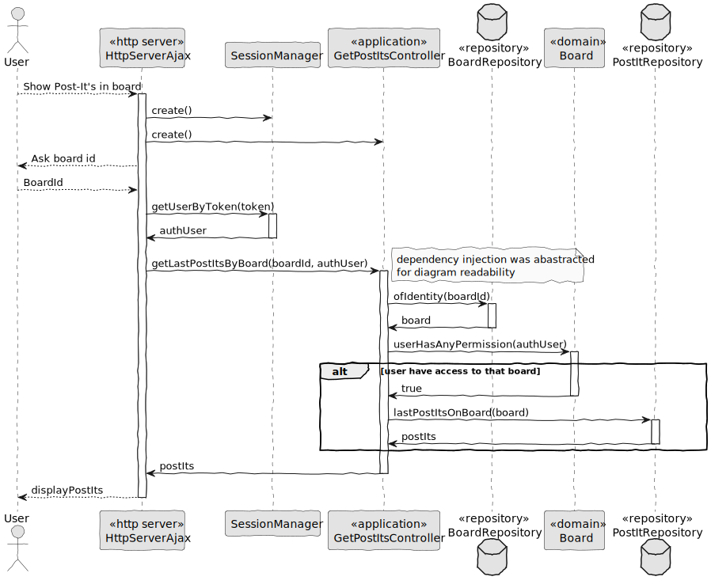
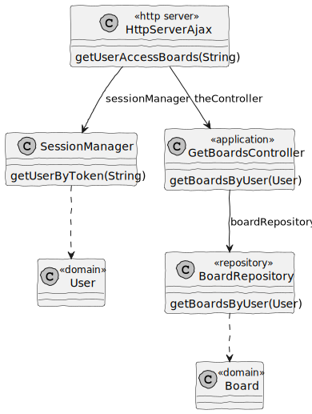
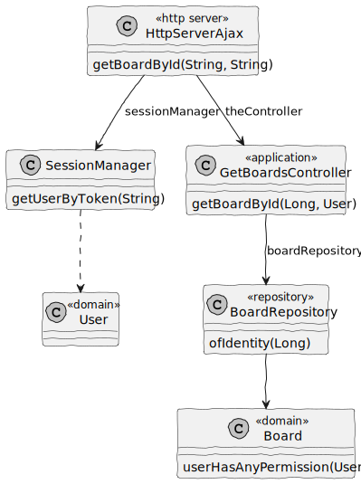
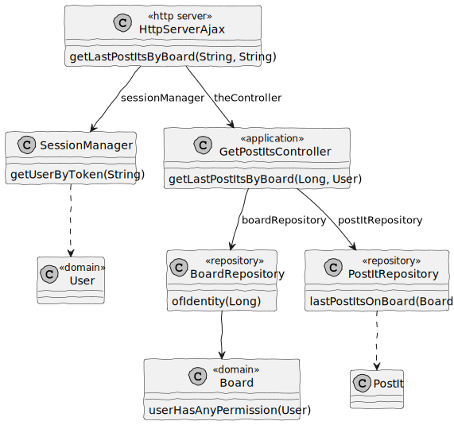
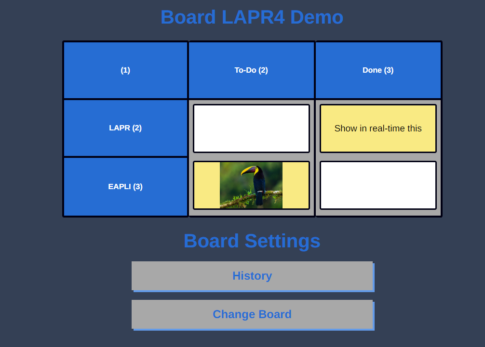

# US 3005

## 1. Context

In Sprint C client wants us to develop a feature for our System. He wants that a User to be able to view, in real-time, the updates in the shared boards.

## 2. Requirements

As User, I want to view, in real-time, the updates in the shared boards.

This functional part of the system has very specific technical requirements, particularly some concerns about synchronization problems. 
In fact, several clients will try to concurrently update boards. 
As such, the solution design and implementation must be based on threads, condition variables and mutexes. Specific requirements will be provided in SCOMP.
The client app should implement an HTTP server to be able to generate the "views" of the boards. This should be done automatically, without the intervention of the users (i.e., without reload of the web page) by using AJAX.

Dependencies:

Should have Board in system:

**US 3002:** As User, I want to create a board.

All possible updates to shared boards:

**US 3006:** As User, I want to create a post-it on a board.

**US 3007:** As User, I want to change a post-it.

**US 3008:** As User, I want to undo the last change in a post-it.


## 3. Analysis

Information in System Specification

    The system should generate "real-time" HTML rendering of the board, presenting all the actual contents of the board, the row and column titles, the board title, the authors (short name and email) of the posts and a timestamp of each post.

Information in Forum

    "Uma célula pode ter mais do que um post it?" 

    Neste momento (no âmbito deste projeto) isso não será necessário. A ser possível (uma célula com mais do que 1 post-it) isso iria dificultar algumas funcionalidades, como a que permite mudar um post-it.


This is an excerpt of our domain Model, it provides the clear idea of how the Post-It should be identified according to the information in System Specification.



## 4. Design

### 4.1. Realization

#### 4.1.1. Sequence Diagram get boards user have access



#### 4.1.2. Sequence Diagram get data by board id



#### 4.1.3. Sequence Diagram get last post-its by position (row/column/board)



### 4.2 Class Diagram

#### 4.2.1 Class Diagram get boards user have access



#### 4.2.2 Class Diagram get data by board id



#### 4.2.3 Class Diagram get last post-its by position (row/column/board)



### 4.3. Applied Patterns

#### 4.3.1. Factory

- Our PersistenceContext will create a RepositoryFactory based on the configuration file then the RepositoryFactory will create the repository that we need in order to persist our domain entity.

#### 4.3.2 Service

- Services are operations or functions that are not naturally in line with the responsibility of an entity or value object. They are used to model operations that involve multiple objects or complex behaviour.

#### 4.3.3 Single Responsibility Principle (SRP)

- Ensure that each object has a clear and well-defined responsibility within the domain.

#### 4.3.4 Tell, Don't Ask

- Ensure that objects do not expose their internal state or behaviour to the outside world. On the contrary, objects should receive commands telling them what they should do, rather than being asked for information about their current state.


#### 4.3.5 Request-Response Pattern

- The web browser sends an HTTP request to the server, and the server responds with an appropriate HTTP response.

### 4.4. Tests

**Test 1:** *Get all boards that user have permission successfully*

```Java
@Test
public void testGetBoardsByUser() {
    User authUser = managerUser();
    when(boardRepository.getBoardsByUser(authUser)).thenReturn(new ArrayList<>());

    getBoardsController.getBoardsByUser(authUser);

    verify(boardRepository, times(1)).getBoardsByUser(authUser);
}
```

**Test 2:** *Get board by id successfully*

```Java
@Test
public void getBoardById() {
    User authUser = managerUser();
    Board board = board();

    board.addPermission(createBoardPermission(authUser));
    when(boardRepository.ofIdentity(1L)).thenReturn(Optional.ofNullable(board));

    getBoardsController.getBoardById(1L, authUser);

    verify(boardRepository, times(1)).ofIdentity(1L);
}
```

**Test 3:** *Get all post-it's by the given board. Only max timestamp in every Row and column combination successfully*

```Java
@Test
public void getLastPostItsByBoard() {
    User authUser = managerUser();
    Board board = board();

    board.addPermission(createBoardPermission(authUser));
    when(boardRepository.ofIdentity(1L)).thenReturn(Optional.ofNullable(board));
    when(postItRepository.lastPostItsOnBoard(board)).thenReturn(new ArrayList<>());

    getPostItsController.getLastPostItsByBoard(1L, authUser);

    verify(boardRepository, times(1)).ofIdentity(1L);
    verify(postItRepository, times(1)).lastPostItsOnBoard(board);
}
```

## 5. Implementation

**HttpServerAjax**

```Java
package org.shared.board.server;

import com.google.gson.Gson;
import com.google.gson.GsonBuilder;
import eapli.framework.domain.repositories.IntegrityViolationException;
import org.apache.commons.httpclient.auth.InvalidCredentialsException;
import org.boards.controller.CreateBoardController;
import org.boards.controller.GetBoardsController;
import org.domain.model.Board;
import org.domain.model.BoardEntry;
import org.domain.model.postit.PostIt;
import org.persistence.PersistenceContext;
import org.postit.controller.*;
import org.shared.board.server.gson_adapter.HibernateProxyTypeAdapter;
import org.shared.board.server.gson_adapter.LocalDateAdapter;
import org.shared.board.server.request_bodys.BoardBody;
import org.shared.board.server.request_bodys.LoginBody;
import org.shared.board.server.request_bodys.PostItBody;
import org.shared.board.server.request_bodys.PostItPositionBody;
import org.shared.board.server.session.SessionManager;
import org.usermanagement.domain.model.User;

import java.time.LocalDate;
import java.util.*;

/**
 * The type Http server ajax.
 */
public class HttpServerAjax {
    /**
     * The Session manager.
     */
    SessionManager sessionManager;

    /**
     * The Json.
     */
    Gson json;

    /**
     * The constant MIN_ROWS_COLUMNS.
     */
    private static final String MIN_ROWS_COLS = "1";

    /**
     * The Lock objects.
     */
    Map<String, Object> lockObjects = new HashMap<>();


    /**
     * Instantiates a new Http server ajax.
     */
    public HttpServerAjax() {
        this.sessionManager = SessionManager.getInstance();

        GsonBuilder gsonBuilder = new GsonBuilder();
        gsonBuilder.registerTypeAdapter(LocalDate.class, new LocalDateAdapter());
        gsonBuilder.registerTypeAdapterFactory(HibernateProxyTypeAdapter.FACTORY);

        this.json = gsonBuilder.create();
    }

    /**
     * Gets authenticated user.
     * @param token the token
     * @return the authenticated user
     * @throws IllegalArgumentException the illegal argument exception
     * @throws NullPointerException     the null pointer exception
     */
    public String getAuthenticatedUser(String token)
            throws IllegalArgumentException, NullPointerException {
        String textHtml = String.valueOf(sessionManager.getUserByToken(token).identity());

        return textHtml;
    }

    /**
     * Create board.
     * @param requestBody the request body
     * @param token       the token
     * @return the string
     * @throws IntegrityViolationException the integrity violation exception
     * @throws NumberFormatException       the number format exception
     */
    public String createBoard(BoardBody requestBody, String token)
            throws IntegrityViolationException, NumberFormatException {
        CreateBoardController theController = new CreateBoardController();
        List<BoardEntry> allBoardEntrys = new ArrayList<>();
        List<String> boardEntrys = requestBody.boardEntrys();
        User authUser = sessionManager.getUserByToken(token);
        int boardNColumn = Integer.parseInt(requestBody.boardNColumn());
        int boardNRow = Integer.parseInt(requestBody.boardNRow());

        for(int i = 1; i <= boardNColumn; i++) {
            BoardEntry boardEntry = theController.createBoardEntry(
                    String.valueOf(i),
                    MIN_ROWS_COLS,
                    String.valueOf(i),
                    boardEntrys.get(i - 1),
                    requestBody.boardNRow(),
                    requestBody.boardNColumn(),
                    authUser
            );

            allBoardEntrys.add(boardEntry);
        }

        int j = boardNColumn;
        for(int i = 2; i <= boardNRow; i++){
            BoardEntry boardEntry = theController.createBoardEntry(
                    String.valueOf(i),
                    String.valueOf(i),
                    MIN_ROWS_COLS,
                    boardEntrys.get(j),
                    requestBody.boardNRow(),
                    requestBody.boardNColumn(),
                    authUser
            );

            j++;
            allBoardEntrys.add(boardEntry);
        }

        Board board = theController.createBoard(
                requestBody.boardTitle(),
                requestBody.boardNRow(),
                requestBody.boardNColumn(),
                allBoardEntrys,
                authUser);

        return json.toJson(board);
    }

    /**
     * Login user and add session.
     * @param body the body
     * @return the string
     * @throws InvalidCredentialsException the invalid credentials exception
     */
    public String login(LoginBody body)
            throws InvalidCredentialsException {
        UUID token = sessionManager.login(body.email(), body.password());

        return token.toString();
    }

    /**
     * Create post it to board.
     * @param requestBody the request body
     * @param token       the token
     * @return the string
     */
    public String createPostIt(PostItBody requestBody, String token){
        CreatePostItController theController = new CreatePostItController();
        User authUser = sessionManager.getUserByToken(token);

        String lockKey = generateLockKey(requestBody);
        Object lock = getOrCreateLockObject(lockKey);
        PostIt postIt;

        synchronized (lock){
            postIt = theController.createPostIt(
                    requestBody.content(),
                    requestBody.row(),
                    requestBody.column(),
                    requestBody.boardId(),
                    authUser);
        }

        return json.toJson(postIt);
    }

    /**
     * Get user access boards.
     * @param token the token
     * @return the string
     */
    public String getUserAccessBoards(String token){
        User authUser = sessionManager.getUserByToken(token);

        GetBoardsController theController = new GetBoardsController(
                PersistenceContext.repositories().boards());

        Iterable<Board> boards = theController.getBoardsByUser(authUser);

        return json.toJson(boards);
    }

    /**
     * Update content of post-it.
     * @param requestBody the request body
     * @param token       the token
     * @return the string
     */
    public String updatePostItContent(PostItBody requestBody, String token){
        UpdatePostItController theController = new UpdatePostItController();
        User authUser = sessionManager.getUserByToken(token);

        String lockKey = generateLockKey(requestBody);
        Object lock = getOrCreateLockObject(lockKey);
        PostIt postIt;

        synchronized (lock){
            postIt = theController.updatePostItContent(
                    requestBody.content(),
                    requestBody.row(),
                    requestBody.column(),
                    requestBody.boardId(),
                    authUser);
        }

        return json.toJson(postIt);
    }

    /**
     * Delete post-it.
     * @param requestBody the request body
     * @param token       the token
     * @return the string
     */
    public String deletePostIt(PostItBody requestBody, String token){
        DeletePostItController theController = new DeletePostItController();
        User authUser = sessionManager.getUserByToken(token);

        String lockKey = generateLockKey(requestBody);
        Object lock = getOrCreateLockObject(lockKey);
        PostIt postIt;

        synchronized (lock){
            postIt = theController.deletePostIt(
                    requestBody.row(),
                    requestBody.column(),
                    requestBody.boardId(),
                    authUser);
        }

        return json.toJson(postIt);
    }

    /**
     * Undo post-it.
     * @param requestBody the request body
     * @param token       the token
     * @return the string
     */
    public String undoPostIt(PostItBody requestBody, String token) {

        UndoPostItController ctrl = new UndoPostItController();
        User authenticated = sessionManager.getUserByToken(token);

        String lockKey = generateLockKey(requestBody);
        Object lock = getOrCreateLockObject(lockKey);

        PostIt postIt;

        synchronized (lock) {
            postIt = ctrl.undoPostIt(
                    requestBody.row(),
                    requestBody.column(),
                    requestBody.boardId(),
                    authenticated
            );
        }

        return json.toJson(postIt);
    }

    /**
     * Update post-it position.
     * @param requestBody the request body
     * @param token       the token
     * @return the string
     */
    public String updatePostItPosition(PostItPositionBody requestBody, String token){
        UpdatePostItController theController = new UpdatePostItController();
        User authUser = sessionManager.getUserByToken(token);
        String lockKey;
        PostIt postIt;

        //lock previous cell
        lockKey = requestBody.previousPostItRow()
                    + requestBody.previousPostItColumn()
                    + requestBody.boardId();
        Object lockPrevious = getOrCreateLockObject(lockKey);

        //lock new cell
        lockKey = requestBody.newPostItRow()
                + requestBody.newPostItColumn()
                + requestBody.boardId();
        Object lockNew = getOrCreateLockObject(lockKey);

        synchronized (lockPrevious){
            synchronized (lockNew){
                postIt = theController.updatePostItPosition(
                        requestBody.previousPostItRow(),
                        requestBody.previousPostItColumn(),
                        requestBody.newPostItRow(),
                        requestBody.newPostItColumn(),
                        requestBody.boardId(),
                        authUser);
            }
        }

        return json.toJson(postIt);
    }

    /**
     * Get board by id.
     * @param boardId the board id
     * @param token   the token
     * @return the string
     */
    public String getBoardById(String boardId, String token){
        GetBoardsController theController = new GetBoardsController(
                PersistenceContext.repositories().boards());
        User authUser = sessionManager.getUserByToken(token);

        Board board = theController.getBoardById(Long.valueOf(boardId), authUser);

        return json.toJson(board);
    }

    /**
     * Get last post its by board.
     * @param boardId the board id
     * @param token   the token
     * @return the string
     */
    public String getLastPostItsByBoard(String boardId, String token){
        GetPostItsController theController = new GetPostItsController(
                PersistenceContext.repositories().postIt(),
                PersistenceContext.repositories().boards());
        User authUser = sessionManager.getUserByToken(token);

        Iterable<PostIt> postIts = theController.getLastPostItsByBoard(
                Long.valueOf(boardId), authUser);

        return json.toJson(postIts);
    }

    /**
     * Generate String based on row column and board id.
     * @param requestBody post-it
     * @return String
     */
    private String generateLockKey(PostItBody requestBody) {
        return requestBody.row() + requestBody.column() + requestBody.boardId();
    }

    /**
     * Get object corresponding to String.
     * Or create a new one if that string doesn't exist.
     * @param lockKey string base on post-it
     * @return Object
     */
    private synchronized Object getOrCreateLockObject(String lockKey) {
        return lockObjects.computeIfAbsent(lockKey, k -> new Object());
    }


}
````

**GetBoardsController**

```Java
package org.boards.controller;

import eapli.framework.validations.Preconditions;
import org.domain.model.Board;
import org.domain.repositories.BoardRepository;
import org.usermanagement.domain.model.User;

import java.util.Optional;

/**
 * The type Get boards controller.
 */
public class GetBoardsController {
    /**
     * Create a board repository.
     */
    private final BoardRepository boardRepository;

    /**
     * Instantiates a new Get boards controller.
     * @param repository the repository
     */
    public GetBoardsController(BoardRepository repository) {
        boardRepository = repository;
    }

    /**
     * Gets boards by user.
     * @param authUser the auth user
     * @return the boards by user
     */
    public Iterable<Board> getBoardsByUser(final User authUser) {
        Preconditions.ensure(authUser != null,
                "You need to authenticate first");

        return boardRepository.getBoardsByUser(authUser);
    }


    /**
     * Gets board by id.
     * @param boardId  the board id
     * @param authUser the auth user
     * @return the board by id
     */
    public Board getBoardById(final Long boardId,
                              final User authUser) {
        Optional<Board> board = boardRepository.ofIdentity(boardId);
        Preconditions.ensure(
                board.get().userHasAnyPermission(authUser),
                "You don't have permission to access that board");

        return board.get();
    }
}
````

**GetPostItsController**

```Java
package org.postit.controller;

import eapli.framework.validations.Preconditions;
import org.domain.model.Board;
import org.domain.model.postit.PostIt;
import org.domain.repositories.BoardRepository;
import org.usermanagement.domain.model.User;
import repositories.PostItRepository;

/**
 * The type Get Post-Its controller.
 */
public class GetPostItsController {
    /**
     * Create a post-it repository.
     */
    private final PostItRepository postItRepository;

    /**
     * Create a board repository.
     */
    private final BoardRepository boardRepository;


    /**
     * Instantiates a new Get post its controller.
     * @param repository       the repository
     * @param boardRepositoryp the board repositoryp
     */
    public GetPostItsController(PostItRepository repository,
                                BoardRepository boardRepositoryp) {
        postItRepository = repository;
        boardRepository = boardRepositoryp;
    }

    /**
     * Gets last post its by board.
     * @param boardId  the board id
     * @param authUser the auth user
     * @return the last post its by board
     */
    public Iterable<PostIt> getLastPostItsByBoard(final Long boardId,
                                                  final User authUser) {
        Board board = boardRepository.ofIdentity(boardId).get();
        Preconditions.ensure(
                board.userHasAnyPermission(authUser),
                "You don't have permission to access that board");

        return postItRepository.lastPostItsOnBoard(board);
    }
}
````


## 6. Integration/Demonstration

**Login into the application**


**Click on Board that you want to view**


**Board will show**


