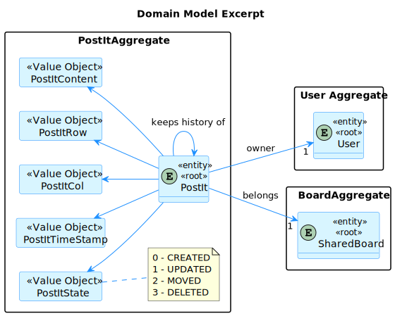
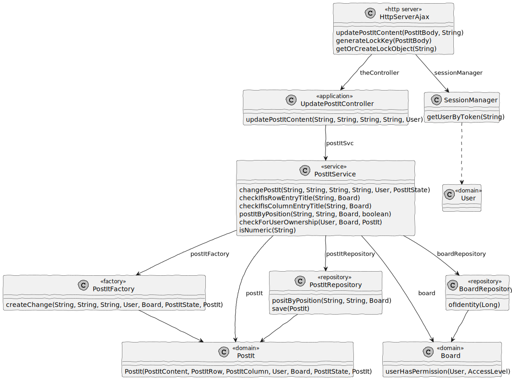
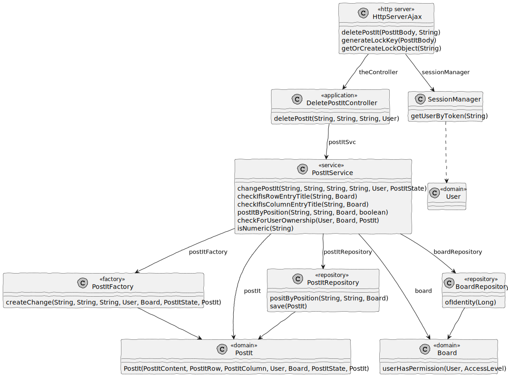
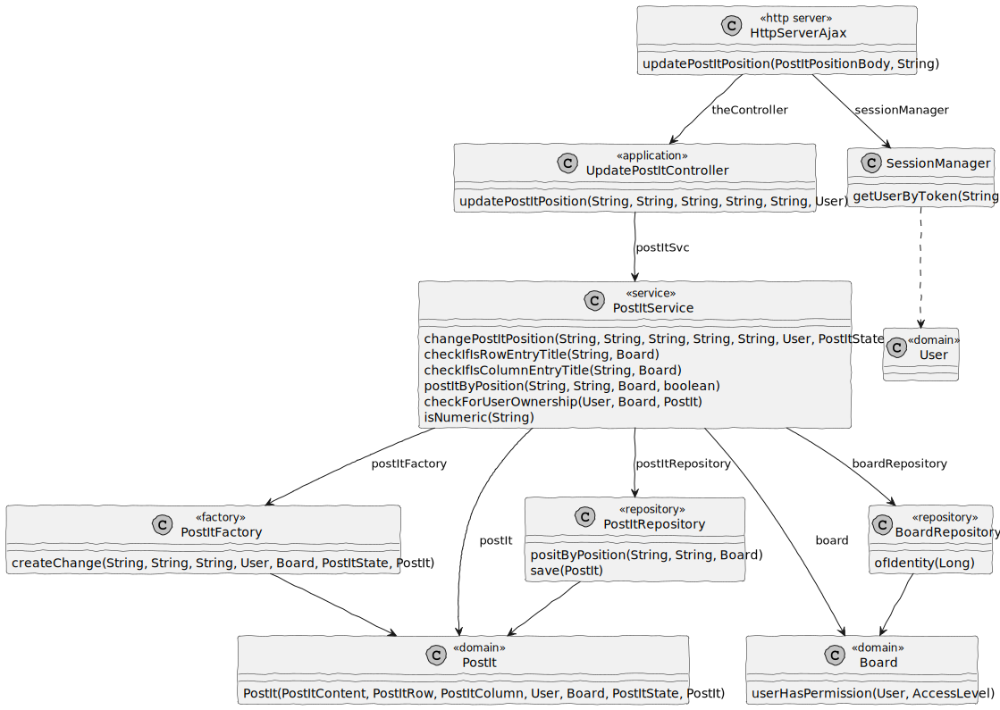
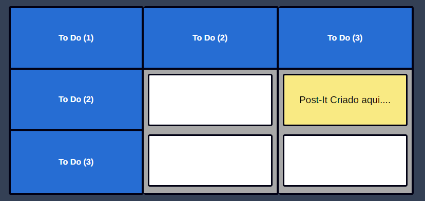
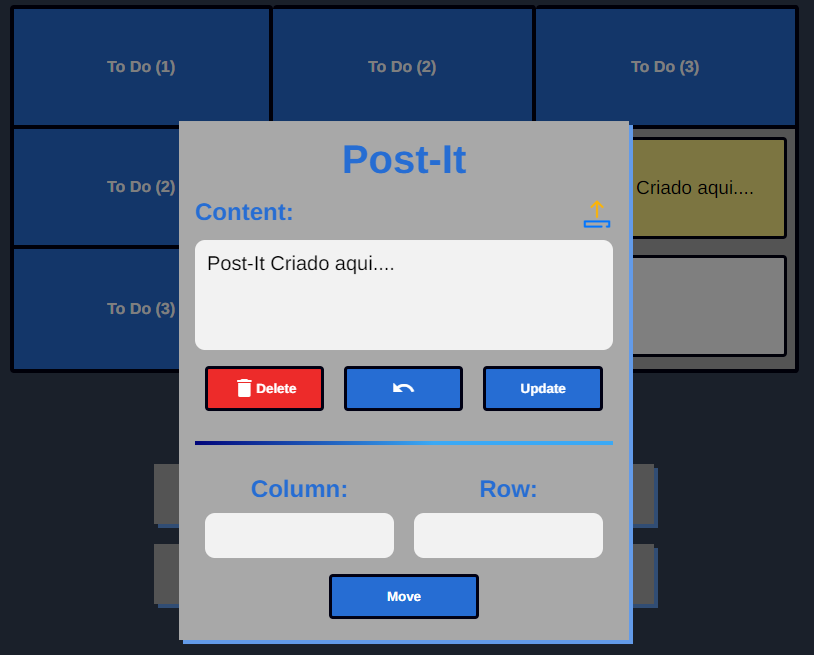

# US 3007

## 1. Context

In Sprint C client wants us to develop a feature for our System. He wants that a User to be able to change a post-it content, move a post-it to another free cell and delete post-it.

## 2. Requirements

As User, I want to change a post-it.

Dependencies:

**US 3002:** As User, I want to create a board.

**US 3006:** As User, I want to create a post-it on a board.


## 3. Analysis

Information in System Specification

    The user who created a post in a cell can change that post. It may change its contents or move the post into a free cell. The user can also undo the last change. The owner of a post can delete it.

Information in Forum

    "Uma célula pode ter mais do que um post it?" 

    Neste momento (no âmbito deste projeto) isso não será necessário. A ser possível (uma célula com mais do que 1 post-it) isso iria dificultar algumas funcionalidades, como a que permite mudar um post-it.

    "As stated in the system specifications document, "Columns and rows may have titles. They may also be identified by an integer number from 1 to the maximum number", we wanted to clarify if it should be possible to have a column with no title and no identifier.Also, can the identifier of a column/row change once it's assigned?"

    In order for user to post content into a cell they must identify the cell. Therefore, I think at least, ir should be possible to identify the cell by the number of its column and the number of its row. If the cells have titles, these titles can be used to identify the cells. However, it should always be possible to identify a cell by the column number and row number.
    Regarding changing the title of the columns and rows after creating the board, there is nothing explicit about that. Therefore, I would accept the solution that does not support that possibility.


This is an excerpt of our domain Model, it provides the clear idea of how the Post-It should be identified according to the information in System Specification.



## 4. Design

### 4.1. Realization

#### 4.1.1. Sequence Diagram change post-it content


#### 4.1.2. Sequence Diagram delete post-it


#### 4.1.3. Sequence Diagram change post-it position


### 4.2 Class Diagram

#### 4.2.1 Class Diagram change post-it content



#### 4.2.2 Class Diagram delete post-it



#### 4.2.3 Class Diagram change post-it position



### 4.3. Applied Patterns

#### 4.3.1. Factory

- Our PersistenceContext will create a RepositoryFactory based on the configuration file then the RepositoryFactory will create the repository that we need in order to persist our domain entity.

#### 4.3.2 Service

- Services are operations or functions that are not naturally in line with the responsibility of an entity or value object. They are used to model operations that involve multiple objects or complex behaviour.

#### 4.3.3 Single Responsibility Principle (SRP)

- Ensure that each object has a clear and well-defined responsibility within the domain.

#### 4.3.4 Tell, Don't Ask

- Ensure that objects do not expose their internal state or behaviour to the outside world. On the contrary, objects should receive commands telling them what they should do, rather than being asked for information about their current state.


#### 4.3.5 Request-Response Pattern

- The web browser sends an HTTP request to the server, and the server responds with an appropriate HTTP response.

### 4.4. Tests

**Test 1:** *Test update post-it content successfully.*

```Java
@Test
void testChangePostItContentSuccessful() {
    User postItOwner = managerUser();
    Board board = createBoard();
    PostItFactory postItFactory = new PostItFactory();

    board.addPermission(createBoardPermission(postItOwner));
    when(boardRepository.ofIdentity(123L)).thenReturn(Optional.of(board));

    PostIt existingPostIt = postItFactory.create(
            POST_IT_CONTENT,
            POST_IT_ROW_COL,
            POST_IT_ROW_COL,
            postItOwner,
            board,
            PostItStateType.CREATED
    );

    when(postItRepository.positByPosition(POST_IT_ROW_COL, POST_IT_ROW_COL, board)).thenReturn(existingPostIt);
    when(postItRepository.save(any(PostIt.class))).thenAnswer(invocation -> invocation.getArgument(0));

    String updatedContent = "Updated Post-it Content";
    PostIt updatedPostIt = postItService.updateContent(updatedContent,
            POST_IT_ROW_COL, POST_IT_ROW_COL, BOARD_ID, postItOwner);

    assertNotNull(updatedPostIt);
    assertEquals(updatedContent, updatedPostIt.content().value());
    assertEquals(PostItRow.of(POST_IT_ROW_COL, board.boardNRow()), updatedPostIt.rowPos());
    assertEquals(PostItColumn.of(POST_IT_ROW_COL, board.boardNCol()), updatedPostIt.columnPos());
    assertEquals(postItOwner, updatedPostIt.owner());
    assertEquals(board, updatedPostIt.board());
    assertEquals(PostItStateType.UPDATED, updatedPostIt.state());
    verify(postItRepository, times(1)).save(any(PostIt.class));
}
```

**Test 2:** *Test move post-it to another cell successfully.*

```Java
@Test
void testChangePostItPositionSuccessful() {
    User postItOwner = managerUser();
    Board board = createBoard();
    PostItFactory postItFactory = new PostItFactory();

    PostIt existingPostIt = postItFactory.create(
            POST_IT_CONTENT,
            POST_IT_ROW_COL,
            POST_IT_ROW_COL,
            postItOwner,
            board,
            PostItStateType.CREATED
    );

    PostIt newPostIt = postItFactory.create(
            POST_IT_CONTENT,
            NEW_ROW_COL,
            NEW_ROW_COL,
            postItOwner,
            board,
            PostItStateType.CREATED
    );

    board.addPermission(createBoardPermission(postItOwner));
    when(boardRepository.ofIdentity(Long.parseLong(BOARD_ID))).thenReturn(Optional.of(board));
    when(postItRepository.positByPosition(POST_IT_ROW_COL, POST_IT_ROW_COL, board)).thenReturn(existingPostIt);
    when(postItRepository.positByPosition(NEW_ROW_COL, NEW_ROW_COL, board)).thenReturn(null);
    when(postItRepository.save(any(PostIt.class))).thenReturn(newPostIt);

    PostIt updatedPostIt = postItService.changePostItPosition(POST_IT_ROW_COL, POST_IT_ROW_COL, NEW_ROW_COL, NEW_ROW_COL, BOARD_ID, postItOwner);

    assertNotNull(updatedPostIt);
    verify(postItRepository, times(2)).save(any(PostIt.class));
}
```

**Test 3:** *Test delete post-it successfully.*

```Java
@Test
void testDeletePostItSuccessful() {
    User postItOwner = managerUser();
    Board board = createBoard();
    PostItFactory postItFactory = new PostItFactory();

    board.addPermission(createBoardPermission(postItOwner));
    when(boardRepository.ofIdentity(123L)).thenReturn(Optional.of(board));

    PostIt existingPostIt = postItFactory.create(
            POST_IT_CONTENT,
            POST_IT_ROW_COL,
            POST_IT_ROW_COL,
            postItOwner,
            board,
            PostItStateType.CREATED
    );

    when(postItRepository.positByPosition(POST_IT_ROW_COL, POST_IT_ROW_COL, board)).thenReturn(existingPostIt);
    when(postItRepository.save(any(PostIt.class))).thenAnswer(invocation -> invocation.getArgument(0));

    String updatedContent = PostItStateType.DELETED.toString();
    PostIt updatedPostIt = postItService.changePostIt(updatedContent,
            POST_IT_ROW_COL, POST_IT_ROW_COL, BOARD_ID, postItOwner, PostItStateType.DELETED);

    assertNotNull(updatedPostIt);
    assertEquals(updatedContent, updatedPostIt.content().value());
    assertEquals(PostItRow.of(POST_IT_ROW_COL, board.boardNRow()), updatedPostIt.rowPos());
    assertEquals(PostItColumn.of(POST_IT_ROW_COL, board.boardNCol()), updatedPostIt.columnPos());
    assertEquals(postItOwner, updatedPostIt.owner());
    assertEquals(board, updatedPostIt.board());
    assertEquals(PostItStateType.DELETED, updatedPostIt.state());
    verify(postItRepository, times(1)).save(any(PostIt.class));
}
```

## 5. Implementation

**HttpServerAjax**

```Java
package org.shared.board.server;

import com.google.gson.Gson;
import com.google.gson.GsonBuilder;
import eapli.framework.domain.repositories.IntegrityViolationException;
import org.apache.commons.httpclient.auth.InvalidCredentialsException;
import org.boards.controller.CreateBoardController;
import org.boards.controller.GetBoardsController;
import org.domain.model.Board;
import org.domain.model.BoardEntry;
import org.domain.model.postit.PostIt;
import org.persistence.PersistenceContext;
import org.postit.controller.CreatePostItController;
import org.postit.controller.DeletePostItController;
import org.postit.controller.UndoPostItController;
import org.postit.controller.UpdatePostItController;
import org.shared.board.server.gson_adapter.HibernateProxyTypeAdapter;
import org.shared.board.server.gson_adapter.LocalDateAdapter;
import org.shared.board.server.request_bodys.BoardBody;
import org.shared.board.server.request_bodys.LoginBody;
import org.shared.board.server.request_bodys.PostItBody;
import org.shared.board.server.request_bodys.PostItPositionBody;
import org.shared.board.server.session.SessionManager;
import org.usermanagement.domain.model.User;

import java.time.LocalDate;
import java.util.*;

/**
 * The type Http server ajax.
 */
public class HttpServerAjax {
    /**
     * The Session manager.
     */
    SessionManager sessionManager;

    /**
     * The Json.
     */
    Gson json;

    /**
     * The constant MIN_ROWS_COLUMNS.
     */
    private static final String MIN_ROWS_COLS = "1";

    /**
     * The Lock objects.
     */
    Map<String, Object> lockObjects = new HashMap<>();


    /**
     * Instantiates a new Http server ajax.
     */
    public HttpServerAjax() {
        this.sessionManager = SessionManager.getInstance();

        GsonBuilder gsonBuilder = new GsonBuilder();
        gsonBuilder.registerTypeAdapter(LocalDate.class, new LocalDateAdapter());
        gsonBuilder.registerTypeAdapterFactory(HibernateProxyTypeAdapter.FACTORY);

        this.json = gsonBuilder.create();
    }

    /**
     * Gets authenticated user.
     *
     * @param token the token
     * @return the authenticated user
     * @throws IllegalArgumentException the illegal argument exception
     * @throws NullPointerException     the null pointer exception
     */
    public String getAuthenticatedUser(String token)
            throws IllegalArgumentException, NullPointerException {
        String textHtml = String.valueOf(sessionManager.getUserByToken(token).identity());

        return textHtml;
    }

    /**
     * Create board string.
     *
     * @param requestBody the request body
     * @param token       the token
     * @return the string
     * @throws IntegrityViolationException the integrity violation exception
     * @throws NumberFormatException       the number format exception
     */
    public String createBoard(BoardBody requestBody, String token)
            throws IntegrityViolationException, NumberFormatException {
        CreateBoardController theController = new CreateBoardController();
        List<BoardEntry> allBoardEntrys = new ArrayList<>();
        List<String> boardEntrys = requestBody.boardEntrys();
        User authUser = sessionManager.getUserByToken(token);
        int boardNColumn = Integer.parseInt(requestBody.boardNColumn());
        int boardNRow = Integer.parseInt(requestBody.boardNRow());

        for(int i = 1; i <= boardNColumn; i++) {
            BoardEntry boardEntry = theController.createBoardEntry(
                    String.valueOf(i),
                    MIN_ROWS_COLS,
                    String.valueOf(i),
                    boardEntrys.get(i - 1),
                    requestBody.boardNRow(),
                    requestBody.boardNColumn(),
                    authUser
            );

            allBoardEntrys.add(boardEntry);
        }

        int j = boardNColumn;
        for(int i = 2; i <= boardNRow; i++){
            BoardEntry boardEntry = theController.createBoardEntry(
                    String.valueOf(i),
                    String.valueOf(i),
                    MIN_ROWS_COLS,
                    boardEntrys.get(j),
                    requestBody.boardNRow(),
                    requestBody.boardNColumn(),
                    authUser
            );

            j++;
            allBoardEntrys.add(boardEntry);
        }

        Board board = theController.createBoard(
                requestBody.boardTitle(),
                requestBody.boardNRow(),
                requestBody.boardNColumn(),
                allBoardEntrys,
                authUser);

        return json.toJson(board);
    }

    /**
     * Login user and add session.
     *
     * @param body the body
     * @return the string
     * @throws InvalidCredentialsException the invalid credentials exception
     */
    public String login(LoginBody body)
            throws InvalidCredentialsException {
        UUID token = sessionManager.login(body.email(), body.password());

        return token.toString();
    }

    /**
     * Create post it to board.
     *
     * @param requestBody the request body
     * @param token       the token
     * @return the string
     */
    public String createPostIt(PostItBody requestBody, String token){
        CreatePostItController theController = new CreatePostItController();
        User authUser = sessionManager.getUserByToken(token);

        String lockKey = generateLockKey(requestBody);
        Object lock = getOrCreateLockObject(lockKey);
        PostIt postIt;

        synchronized (lock){
            postIt = theController.createPostIt(
                    requestBody.content(),
                    requestBody.row(),
                    requestBody.column(),
                    requestBody.boardId(),
                    authUser);
        }

        return json.toJson(postIt);
    }

    /**
     * Get user access boards string.
     *
     * @param token the token
     * @return the string
     */
    public String getUserAccessBoards(String token){
        User authUser = sessionManager.getUserByToken(token);

        GetBoardsController theController = new GetBoardsController(
                PersistenceContext.repositories().boards());

        Iterable<Board> boards = theController.getBoardsByUser(authUser);

        return json.toJson(boards);
    }

    /**
     * Update content of post-it.
     *
     * @param requestBody the request body
     * @param token       the token
     * @return the string
     */
    public String updatePostItContent(PostItBody requestBody, String token){
        UpdatePostItController theController = new UpdatePostItController();
        User authUser = sessionManager.getUserByToken(token);

        String lockKey = generateLockKey(requestBody);
        Object lock = getOrCreateLockObject(lockKey);
        PostIt postIt;

        synchronized (lock){
            postIt = theController.updatePostItContent(
                    requestBody.content(),
                    requestBody.row(),
                    requestBody.column(),
                    requestBody.boardId(),
                    authUser);
        }

        return json.toJson(postIt);
    }

    /**
     * Delete post-it string.
     *
     * @param requestBody the request body
     * @param token       the token
     * @return the string
     */
    public String deletePostIt(PostItBody requestBody, String token){
        DeletePostItController theController = new DeletePostItController();
        User authUser = sessionManager.getUserByToken(token);

        String lockKey = generateLockKey(requestBody);
        Object lock = getOrCreateLockObject(lockKey);
        PostIt postIt;

        synchronized (lock){
            postIt = theController.deletePostIt(
                    requestBody.row(),
                    requestBody.column(),
                    requestBody.boardId(),
                    authUser);
        }

        return json.toJson(postIt);
    }

    /**
     * Undo post-it string.
     *
     * @param requestBody the request body
     * @param token       the token
     * @return the string
     */
    public String undoPostIt(PostItBody requestBody, String token) {

        UndoPostItController ctrl = new UndoPostItController();
        User authenticated = sessionManager.getUserByToken(token);

        String lockKey = generateLockKey(requestBody);
        Object lock = getOrCreateLockObject(lockKey);

        PostIt postIt;

        synchronized (lock) {
            postIt = ctrl.undoPostIt(
                    requestBody.row(),
                    requestBody.column(),
                    requestBody.boardId(),
                    authenticated
            );
        }

        return json.toJson(postIt);
    }

    /**
     * Update post-it position.
     * @param requestBody the request body
     * @param token       the token
     * @return the string
     */
    public String updatePostItPosition(PostItPositionBody requestBody, String token){
        UpdatePostItController theController = new UpdatePostItController();
        User authUser = sessionManager.getUserByToken(token);
        String lockKey;
        PostIt postIt;

        //lock previous cell
        lockKey = requestBody.previousPostItRow()
                    + requestBody.previousPostItColumn()
                    + requestBody.boardId();
        Object lockPrevious = getOrCreateLockObject(lockKey);

        //lock new cell
        lockKey = requestBody.newPostItRow()
                + requestBody.newPostItColumn()
                + requestBody.boardId();
        Object lockNew = getOrCreateLockObject(lockKey);

        synchronized (lockPrevious){
            synchronized (lockNew){
                postIt = theController.updatePostItPosition(
                        requestBody.previousPostItRow(),
                        requestBody.previousPostItColumn(),
                        requestBody.newPostItRow(),
                        requestBody.newPostItColumn(),
                        requestBody.boardId(),
                        authUser);
            }
        }

        return json.toJson(postIt);
    }

    /**
     * Generate String based on row column and board id.
     * @param requestBody post-it
     * @return String
     */
    private String generateLockKey(PostItBody requestBody) {
        return requestBody.row() + requestBody.column() + requestBody.boardId();
    }

    /**
     * Get object corresponding to String.
     * Or create a new one if that string doesn't exist.
     * @param lockKey string base on post-it
     * @return Object
     */
    private synchronized Object getOrCreateLockObject(String lockKey) {
        return lockObjects.computeIfAbsent(lockKey, k -> new Object());
    }


}
````

**UpdatePostItController**

```Java
package org.postit.controller;

import eapli.framework.validations.Preconditions;
import org.authz.application.AuthorizationService;
import org.authz.application.AuthzRegistry;
import org.domain.model.postit.PostIt;
import org.domain.model.postit.PostItStateType;
import org.persistence.PersistenceContext;
import org.postit.service.PostItService;
import org.user.management.CourseRoles;
import org.usermanagement.domain.model.User;

/**
 * The type Update post it controller.
 */
public class UpdatePostItController {
    /**
     * Authorization service instance.
     */
    private final AuthorizationService authz;

    /**
     * Create a postIt service with repository injection.
     */
    private final PostItService postItSvc = new PostItService(
            PersistenceContext.repositories().postIt(),
            PersistenceContext.repositories().boards());

    /**
     * Instantiates UpdatePostItController.
     */
    public UpdatePostItController() {
        authz = AuthzRegistry.authorizationService();
    }

    /**
     * Update post-it content.
     * @param postItContentp the post-it contentp
     * @param postItRowp     the post-it rowp
     * @param postItColumnp  the post-it columnp
     * @param boardIdp       the board idp
     * @return the post-it
     */
    public PostIt updatePostItContent(final String postItContentp,
                                      final String postItRowp,
                                      final String postItColumnp,
                                      final String boardIdp) {
        authz.ensureAuthenticatedUserHasAnyOf(CourseRoles.allRoles());

        return postItSvc.changePostIt(postItContentp, postItRowp, postItColumnp,
                boardIdp, authz.session().get().authenticatedUser(),
                PostItStateType.UPDATED);
    }

    /**
     * Update post-it content.
     * @param postItContentp the post-it contentp
     * @param postItRowp     the post-it rowp
     * @param postItColumnp  the post-it columnp
     * @param boardIdp       the board idp
     * @param authUser       the auth user
     * @return the postit
     */
    public PostIt updatePostItContent(final String postItContentp,
                                      final String postItRowp,
                                      final String postItColumnp,
                                      final String boardIdp,
                                      final User authUser) {
        Preconditions.ensure(authUser != null,
                "You need to authenticate first");

        return postItSvc.changePostIt(postItContentp, postItRowp, postItColumnp,
                boardIdp, authUser, PostItStateType.UPDATED);
    }

    /**
     * Update post-it position.
     * @param previousPostItRowp    the previous post-it rowp
     * @param previousPostItColumnp the previous post-it columnp
     * @param newPostItRowp         the new post-it rowp
     * @param newPostItColumnp      the new post-it columnp
     * @param boardIdp              the board idp
     * @return the post it
     */
    public PostIt updatePostItPosition(final String previousPostItRowp,
                                       final String previousPostItColumnp,
                                       final String newPostItRowp,
                                       final String newPostItColumnp,
                                       final String boardIdp) {
        authz.ensureAuthenticatedUserHasAnyOf(CourseRoles.allRoles());

        return postItSvc.changePostItPosition(
                previousPostItRowp, previousPostItColumnp,
                newPostItRowp, newPostItColumnp,
                boardIdp, authz.session().get().authenticatedUser());
    }

    /**
     * Update post-it position.
     * @param previousPostItRowp    the previous post-it rowp
     * @param previousPostItColumnp the previous post-it columnp
     * @param newPostItRowp         the new post-it rowp
     * @param newPostItColumnp      the new post-it columnp
     * @param boardIdp              the board idp
     * @param authUser              the auth user
     * @return the post it
     */
    public PostIt updatePostItPosition(final String previousPostItRowp,
                                       final String previousPostItColumnp,
                                       final String newPostItRowp,
                                       final String newPostItColumnp,
                                       final String boardIdp,
                                       final User authUser) {
        Preconditions.ensure(authUser != null,
                "You need to authenticate first");

        return postItSvc.changePostItPosition(
                previousPostItRowp, previousPostItColumnp,
                newPostItRowp, newPostItColumnp,
                boardIdp, authUser);
    }
}
````

**DeletePostItController**

```Java
package org.postit.controller;

import eapli.framework.validations.Preconditions;
import org.authz.application.AuthorizationService;
import org.authz.application.AuthzRegistry;
import org.domain.model.postit.PostIt;
import org.domain.model.postit.PostItStateType;
import org.persistence.PersistenceContext;
import org.postit.service.PostItService;
import org.user.management.CourseRoles;
import org.usermanagement.domain.model.User;

/**
 * The type Delete post it controller.
 */
public class DeletePostItController {
    /**
     * Authorization service instance.
     */
    private final AuthorizationService authz;

    /**
     * Create a postIt service with repository injection.
     */
    private final PostItService postItSvc = new PostItService(
            PersistenceContext.repositories().postIt(),
            PersistenceContext.repositories().boards());

    /**
     * Instantiates DeletePostItController.
     */
    public DeletePostItController() {
        authz = AuthzRegistry.authorizationService();
    }

    /**
     * Delete post-it.
     * @param postItRowp    the post-it rowp
     * @param postItColumnp the post-it columnp
     * @param boardIdp      the board idp
     * @return the post-it
     */
    public PostIt deletePostIt(final String postItRowp,
                               final String postItColumnp,
                               final String boardIdp) {
        authz.ensureAuthenticatedUserHasAnyOf(CourseRoles.allRoles());

        return postItSvc.changePostIt(PostItStateType.DELETED.toString(),
                postItRowp, postItColumnp,
                boardIdp, authz.session().get().authenticatedUser(),
                PostItStateType.DELETED);
    }

    /**
     * Delete post-it.
     * @param postItRowp    the post-it rowp
     * @param postItColumnp the post-it columnp
     * @param boardIdp      the board idp
     * @param authUser      the auth user
     * @return the post-it
     */
    public PostIt deletePostIt(final String postItRowp,
                               final String postItColumnp,
                               final String boardIdp,
                               final User authUser) {
        Preconditions.ensure(authUser != null,
                "You need to authenticate first");

        return postItSvc.changePostIt(PostItStateType.DELETED.toString(),
                postItRowp, postItColumnp,
                boardIdp, authUser, PostItStateType.DELETED);
    }
}
````

**PostItService**

```Java
package org.postit.service;

import eapli.framework.validations.Preconditions;
import exceptions.NoPreviousElementException;
import org.domain.model.AccessLevelType;
import org.domain.model.Board;
import org.domain.model.postit.*;
import org.domain.repositories.BoardRepository;
import org.springframework.beans.factory.annotation.Autowired;
import org.springframework.stereotype.Service;
import org.usermanagement.domain.model.User;
import repositories.PostItRepository;

import java.util.NoSuchElementException;
import java.util.regex.Pattern;

/**
 * The type Post-it service.
 */
@Service
public class PostItService {
    /**
     * PostItRepository.
     */
    private final PostItRepository postItRepository;

    /**
     * BoardRepository.
     */
    private final BoardRepository boardRepository;

    /**
     * Check if is a number pattern
     */
    private Pattern pattern = Pattern.compile("-?\\d+(\\.\\d+)?");

    /**
     * Instantiates a new Post-it service.
     * @param postItRepo the post-it repo
     * @param boardRepo  the board repo
     */
    @Autowired
    public PostItService(final PostItRepository postItRepo,
                         final BoardRepository boardRepo) {
        postItRepository = postItRepo;
        boardRepository = boardRepo;
    }

    /**
     * Create post-it.
     * @param postItContentp the post-it contentp
     * @param postItRowp     the post-it rowp
     * @param postItColumnp  the post-it columnp
     * @param postItOwner    the post-it owner
     * @param boardIdp       the board idp
     * @return the post-it
     * @throws NoSuchElementException the no such element exception
     */
    public PostIt createPostIt(final String postItContentp,
                               String postItRowp,
                               String postItColumnp,
                               final User postItOwner,
                               final String boardIdp)
            throws NoSuchElementException {
        Long boardId = Long.parseLong(boardIdp);
        Board board = boardRepository.ofIdentity(boardId).get();

        postItRowp = checkIfIsRowEntryTitle(postItRowp, board);
        postItColumnp = checkIfIsColumnEntryTitle(postItColumnp, board);

        Preconditions.ensure(
                postItByPosition(
                        postItRowp,
                        postItColumnp,
                        board,
                        false
                ) == null, "Already exist a Post-It in that cell!");

        Preconditions.ensure(
                board.userHasPermission(postItOwner,
                        AccessLevelType.WRITE), "You don't have "
                        + AccessLevelType.WRITE + " permission"
        );

        PostItFactory postItFactory = new PostItFactory();

        PostIt postIt = postItFactory.create(
                postItContentp,
                postItRowp,
                postItColumnp,
                postItOwner,
                board,
                PostItStateType.CREATED);

        return postItRepository.save(postIt);
    }

    /**
     * Update post-it content.
     * @param postItContentp the post-it contentp
     * @param postItRowp     the post-it rowp
     * @param postItColumnp  the post-it columnp
     * @param boardIdp       the board idp
     * @param authUser       the user updating
     * @param postItStatep   the post-it state
     * @return the post-it
     * @throws NoSuchElementException the no such element exception
     */
    public PostIt changePostIt(final String postItContentp,
                                String postItRowp,
                                String postItColumnp,
                                final String boardIdp,
                                final User authUser,
                                final PostItState postItStatep)
            throws NoSuchElementException {
        Long boardId = Long.parseLong(boardIdp);
        Board board = boardRepository.ofIdentity(boardId).get();

        postItRowp = checkIfIsRowEntryTitle(postItRowp, board);
        postItColumnp = checkIfIsColumnEntryTitle(postItColumnp, board);

        PostIt lastPostIt = postItByPosition(
                postItRowp,
                postItColumnp,
                board,
                false);

        Preconditions.ensure(
                lastPostIt != null,
                "There is no post-it in this cell!");

        checkForUserOwnership(authUser, board, lastPostIt);

        PostItFactory postItFactory = new PostItFactory();

        PostIt postItUpdated = postItFactory.createChange(
                postItContentp,
                postItRowp,
                postItColumnp,
                authUser,
                board,
                postItStatep,
                lastPostIt);

        return postItRepository.save(postItUpdated);
    }

    /**
     * Check if already exist a Post-it in that position.
     * @param postItRowp postItRowp
     * @param postItColumnp postItColumnp
     * @param boardp boardp
     * @return PostIt
     */
    private PostIt postItByPosition(final String postItRowp,
                                    final String postItColumnp,
                                    final Board boardp,
                                    final boolean isUndo){
        PostIt postIt = postItRepository.positByPosition(postItRowp,
                    postItColumnp, boardp);

        if(postIt != null
                && ((postIt.state().equals(PostItStateType.DELETED)
                || postIt.state().equals(PostItStateType.MOVED))
                && !isUndo)){
            return null;
        }

        return postIt;
    }

    /**
     * Undo post it.
     *
     * @param postItRowp    the post it rowp
     * @param postItColumnp the post it columnp
     * @param boardIdp      the board idp
     * @param authUser      the auth user
     * @return the post it
     */
    public PostIt undoPostIt(String postItRowp,
                             String postItColumnp,
                             final Long boardIdp,
                             final User authUser) {
        Board board = boardRepository.ofIdentity(boardIdp)
                .get();


        postItRowp = checkIfIsRowEntryTitle(postItRowp, board);
        postItColumnp = checkIfIsColumnEntryTitle(postItColumnp, board);

        PostIt lastPostIt = postItByPosition(postItRowp, postItColumnp,
                board, true);

        PostIt previousPostIt = lastPostIt.rollBackPostIt();

        checkForUserOwnership(authUser, board, lastPostIt);

        if(previousPostIt == null)
            throw new NoPreviousElementException(
                    "This post-it has no history");

        PostItState previousState = previousPostIt.state();

        PostItState newState = PostItStateType.UPDATED;

        if(previousState.equals(PostItStateType.DELETED)) {
            newState = PostItStateType.DELETED; // if the previous state was deleted
            // it must be deleted again
        }

        PostItFactory postItFactory = new PostItFactory();

        PostIt newPostIt = postItFactory.createChange(
                previousPostIt.content(),
                previousPostIt.rowPos(),
                previousPostIt.columnPos(),
                previousPostIt.owner(),
                previousPostIt.board(),
                newState,
                lastPostIt);

        if(previousState.equals(PostItStateType.MOVED)) {
            savePreviousPostItMoved(lastPostIt,
                    previousPostIt,
                    postItFactory,
                    newPostIt);
        }

        return this.postItRepository.save(newPostIt);
    }

    /**
     * If the undo-ing is a move,
     * the last post it must be
     * saved again with the moved state.
     *
     * @param lastPostIt
     * @param previousPostIt
     * @param postItFactory
     * @param newPostIt
     */
    private void savePreviousPostItMoved(PostIt lastPostIt,
                                         PostIt previousPostIt,
                                         PostItFactory postItFactory,
                                         PostIt newPostIt) {

            Preconditions.ensure(
                    postItByPosition(
                            String.valueOf(newPostIt.rowPos().value()),
                            String.valueOf(newPostIt.columnPos().value()),
                            newPostIt.board(),
                            false
                    ) == null,
                    "Unable to undo post-it since "
                            + "there is already another "
                            + "post-it in that cell."
            );

            PostIt movedPostIt = postItFactory.createChange(
                    lastPostIt.content(),
                    lastPostIt.rowPos(),
                    lastPostIt.columnPos(),
                    lastPostIt.owner(),
                    lastPostIt.board(),
                    PostItStateType.MOVED,
                    previousPostIt
            );

            this.postItRepository.save(movedPostIt);
    }

    private void checkForUserOwnership(User authUser, Board board, PostIt lastPostIt) {
        Preconditions.ensure(
                lastPostIt.owner().sameAs(authUser),
                "Only the owner of this post-it can change it!"
        );

        Preconditions.ensure(
                board.userHasPermission(authUser,
                        AccessLevelType.WRITE), "You don't have "
                        + AccessLevelType.WRITE + " permission"
        );
    }

    /**
     * Check if user write EntryTitle of board
     * @param postItRowp postItRowp
     * @param board board
     * @return String
     */
    private String checkIfIsRowEntryTitle(String postItRowp, Board board){
        if(!isNumeric(postItRowp)){
            String postItRow = board.findRowByEntryTitle(postItRowp);

            if(postItRow == null){
                throw new IllegalArgumentException("This board row doesn't exist");
            }

            return postItRow;
        }

        return postItRowp;
    }

    /**
     * Check if user write EntryTitle of board
     * @param postItColumnp postItColumnp
     * @param board board
     * @return String
     */
    private String checkIfIsColumnEntryTitle(String postItColumnp, Board board){
        if(!isNumeric(postItColumnp)){
            String postItColumn = board.findColumnByEntryTitle(postItColumnp);

            if(postItColumn == null){
                throw new IllegalArgumentException("This board column doesn't exist");
            }

            return postItColumn;
        }

        return postItColumnp;
    }

    /**
     * Is numeric.
     *
     * @param strNum the str num
     * @return the boolean
     */
    public boolean isNumeric(String strNum) {
        if (strNum == null) {
            return false;
        }

        return pattern.matcher(strNum).matches();
    }

    public PostIt changePostItPosition(String previousPostItRowp,
                                       String previousPostItColumnp,
                                       String newPostItRowp,
                                       String newPostItColumnp,
                                       final String boardIdp,
                                       final User authUser) {
        Long boardId = Long.parseLong(boardIdp);
        Board board = boardRepository.ofIdentity(boardId).get();

        previousPostItRowp = checkIfIsRowEntryTitle(previousPostItRowp, board);
        previousPostItColumnp = checkIfIsColumnEntryTitle(previousPostItColumnp, board);

        PostIt lastPostIt = postItByPosition(
                previousPostItRowp,
                previousPostItColumnp,
                board,
                false);

        Preconditions.ensure(
                lastPostIt != null,
                "There is no post-it in this cell!");

        checkForUserOwnership(authUser, board, lastPostIt);

        newPostItRowp = checkIfIsRowEntryTitle(newPostItRowp, board);
        newPostItColumnp = checkIfIsColumnEntryTitle(newPostItColumnp, board);

        PostIt newPostItPosition = postItByPosition(
                newPostItRowp,
                newPostItColumnp,
                board,
                false);

        Preconditions.ensure(
                newPostItPosition == null,
                "Already exist a Post-It in that cell!");

        PostItFactory postItFactory = new PostItFactory();

        PostIt lastPostItMoved = postItFactory.createChange(
                lastPostIt.content().value(),
                previousPostItRowp,
                previousPostItColumnp,
                authUser,
                board,
                PostItStateType.MOVED,
                null);

        PostIt lastPostItSaved = postItRepository.save(lastPostItMoved);

        PostIt updatedPostIt = postItFactory.createChange(
                lastPostIt.content().value(),
                newPostItRowp,
                newPostItColumnp,
                authUser,
                board,
                PostItStateType.UPDATED,
                lastPostItSaved);

        return postItRepository.save(updatedPostIt);
    }
}
````

## 6. Integration/Demonstration

**Login into the application**


**Click on Board that you want to update a Post-It**


**Click on Post-it that you want to update**




**Change Post-it content and click on update**

**Write column and row click on move**

**If user want to delete just need to click on button Delete**




## 7. Observations

It was developed 2 ways to execute this functionality: http and console. But there are some differences between them both:

   - HTTP
        - Update post-it: Only the content of the post-it is requested, which can be text or an image via upload. The cell where the post-it is created is detected by the click. The board is recognized by the link that the user is accessing.
        - Move post-it: Only the new column position and new row position will be asked. Previous column and row will be recognized by the click on cell.
        - Delete post-it: Just need to click on button delete. Cell will be recognized by the click.

   - Console
        - Update post-it: The data will be asked (row position, column position, board id, post-it content) by console line.
        - Move post-it: The data will be asked (previous row position, previous column position, new row position, new column position, board id) by console line.
        - Delete post-it: The data will be asked (row position, column position, board id) by console line.