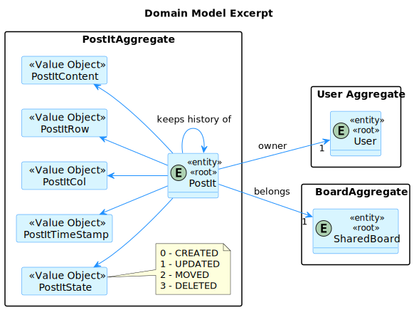
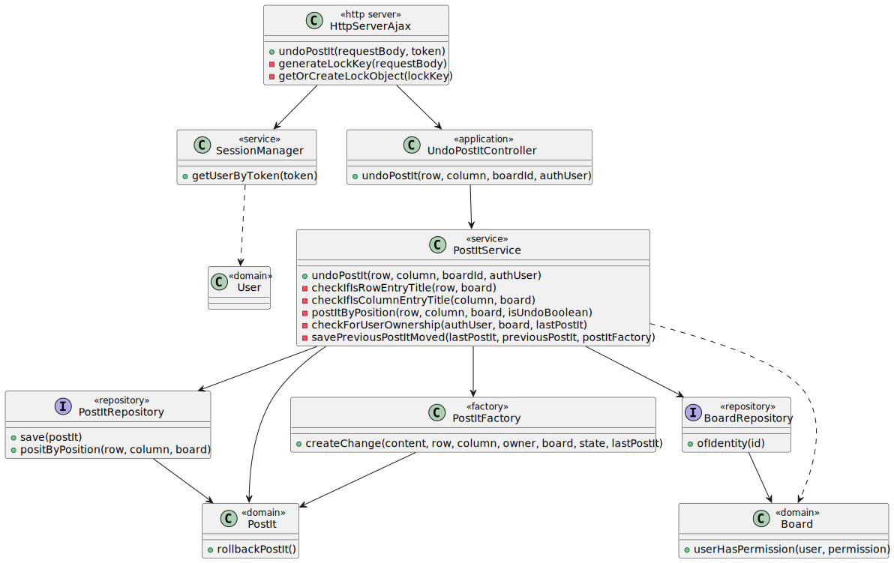
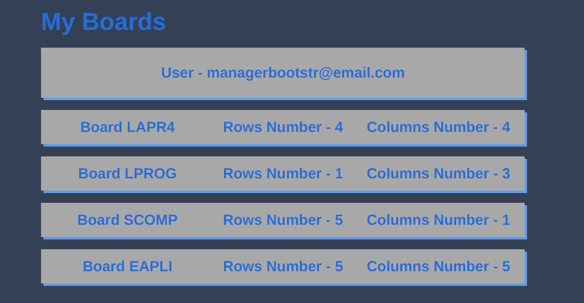
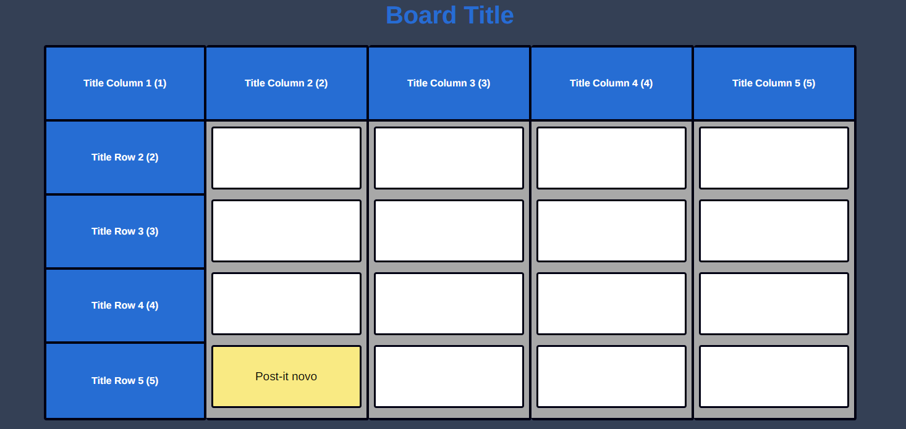
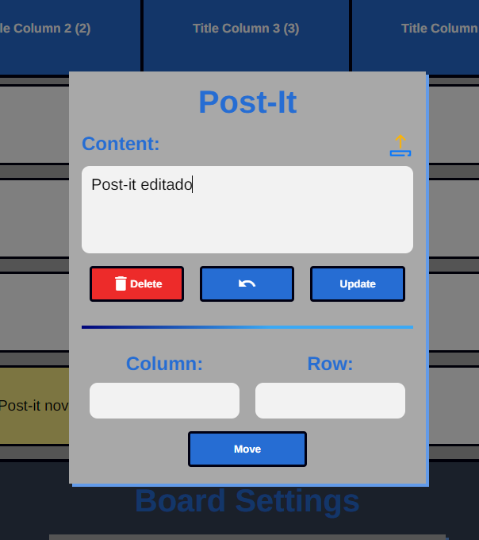
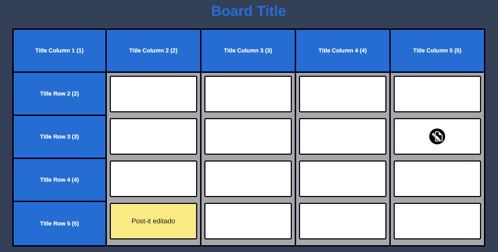
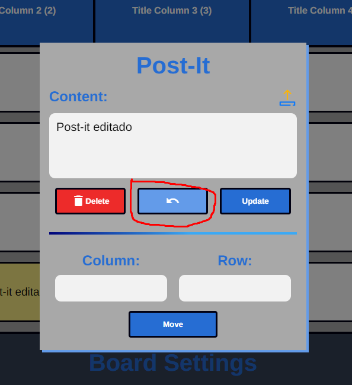
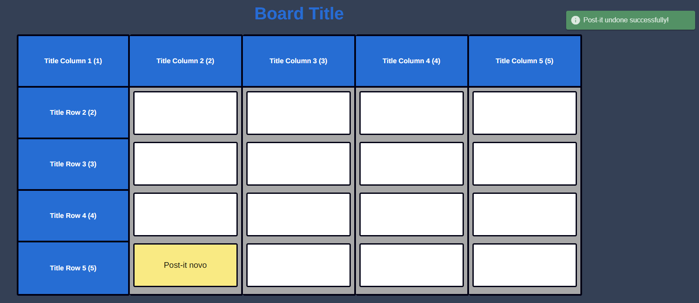

# US 3008 - As a User, I want to undo the last change in a post-it

## 1. Context

> In this user story, we will have to undo a post-it which ultimately means that we need to have a history of the changes, so the post-it will hold its past state (a newly created post-it will have that at null).

> There is another case we have to think separately, undoing a deleted post-it, so we will treat this user story as if it was two different user stories.

> For undoing a post-it, it will search its previous reference and insert it in the database as a new one.

> For undoing a deleted post-it, we will click undo post-it in an empty board entry, and if it has a previous reference, the old post-it will pop up in that position.

### 1.1 User story abstraction

> For context, since these incoming user stories are more complex,
> repository getting from config files and dependency injections will be abstracted,
> for the sake of simplicity of the user stories and understanding what is going on behind the scenes
> without absurd amounts of boilerplate code represented in the diagrams.

## 2. Requirements

> In order for the post-it to be undone, we need to have **post-its** in a **board** and a **history** of the changes.

So, the predefined dependencies are:

- US 3005 (we need to view the board in order to undo a post-it)
- US 3006 (we need to have post-its in the board in order to undo one)
- US 3007 (we need to have a history of the changes in order to undo a post-it)

> Related to authorization, the only rule we have is that the user must be logged in and have access to the board, which is previously verified in the dependencies.
Any type of user can undo a post-it, so no need for server-side authorization, just the login.

## 3. Analysis


- As we can see, this 3 aggregates are essential to the execution of the user story, as a post-it **belongs to** a board **of a** user.


## 4. Design

### 4.1. Realization


- As we can see in the sequence diagram, the undo post-it operation depends on the state of the post-it and previous, so there is a lot of "alts" (alternatives) in the diagram.
- We always create new instances instead of updating the old ones, so as not to corrupt the history of the post-it.

### 4.2. Class Diagram


- Since the undo post-it is an operation, we as a team opted that this operation must belong to the Post It service, the service that will manage Post It operations.
- The HttpServerAjax is an abstraction, in reality we have an end-point that whenever an http request is received, the server creates a new thread and executes the operation.

### 4.3. Applied Patterns

#### 4.3.1. Factory
- To create new post-its we use a factory, since the post-it structure is solid, as it doesn't have any optional fields, we can use a factory to create new post-its.

#### 4.3.2. Singleton
- Our session manager is a singleton that stores the session in a map, so our client can do the authentication through a token.

#### 4.3.3. Repository
- We need to use the board and post-it repositories to get the post-its and boards from the database.
- We also save the newly updated (undone) post-its in the repositories, which abstract the database access, and makes the performing of the user story easier.

#### 4.3.4. MVC (Model-View-Controller)
- We use the MVC pattern, the view is the HTML page, the controllers/services are responsible for guiding the user story, and the model/repositories are responsible for the data access(storing).
- This is compatible with the HC/LC pattern, since there is a high cohesion (each class is entitled to their own responsibilities) and low coupling(the dependencies are low, since it follows a UI -> controller -> service -> repository flow)

### 4.3.5. Request-Response pattern
- The client is given access to the server, and the server is responsible for responding to the client's requests, so that the client knows if it went successfull or not.
- This is also useful, since it is easy to pass on information, through the request and response bodies, which normally have a pattern to be read by the client and server (in this case, JSON, could be XML, etc).


### 4.4. Tests

#### 4.4.1 Service Tests (integration)

```java

package org.postit.service;

import eapli.framework.infrastructure.authz.domain.model.PlainTextEncoder;
import exceptions.NoPreviousElementException;
import org.domain.model.*;
import org.domain.model.postit.*;
import org.domain.repositories.BoardRepository;
import org.junit.jupiter.api.BeforeEach;
import org.junit.jupiter.api.Test;
import org.mockito.Mock;
import org.mockito.MockitoAnnotations;
import org.user.management.CourseRoles;
import org.usermanagement.domain.model.ECoursePasswordPolicy;
import org.usermanagement.domain.model.User;
import org.usermanagement.domain.model.UserBuilder;
import repositories.PostItRepository;

import java.util.ArrayList;
import java.util.NoSuchElementException;
import java.util.Optional;

import static org.junit.jupiter.api.Assertions.*;
import static org.mockito.ArgumentMatchers.any;
import static org.mockito.Mockito.*;

class PostItServiceTest {
    ECoursePasswordPolicy passwordPolicy = new ECoursePasswordPolicy();
    private PostItService postItService;
    @Mock
    private PostItRepository postItRepository;

    @Mock
    private BoardRepository boardRepository;

    private final String BOARD_TITLE = "Test Board";
    private final String BOARD_N_ROW = "3";
    private final String BOARD_N_COL = "4";

    private static final String STRING_SHORTNAME = "shortName";
    private static final String STRING_FULLNAME = "fullName";
    private static final String STRING_PASSWORD = "Correct5";
    private static final String STRING_EMAIL = "email@email.com";

    private static final String POST_IT_CONTENT = "Test Post-it";
    private static final String POST_IT_ROW_COL = "2";
    private static final String BOARD_ID = "123";

    @BeforeEach
    void setUp() {
        MockitoAnnotations.openMocks(this);
        postItService = new PostItService(postItRepository, boardRepository);
    }


    @Test
    void ensurePersonWithoutPermsCannotUndoPostIt(){
        User user = managerUser();
        Board board = createBoard();
        PostItFactory postItFactory = new PostItFactory();

        when(boardRepository.ofIdentity(123L)).thenReturn(Optional.of(board));

        PostIt existingPostIt = postItFactory.create(
                POST_IT_CONTENT,
                POST_IT_ROW_COL,
                POST_IT_ROW_COL,
                user,
                board,
                PostItStateType.CREATED
        );

        when(postItRepository.positByPosition(POST_IT_ROW_COL, POST_IT_ROW_COL, board)).thenReturn(existingPostIt);

        Throwable t = assertThrows(IllegalArgumentException.class, () ->
                postItService.undoPostIt(POST_IT_ROW_COL, POST_IT_ROW_COL, Long.parseLong(BOARD_ID), user));


        verify(postItRepository, never()).save(any(PostIt.class));
    }

    @Test
    void ensurePersonThatDidntCreatePostItCantUndoIt(){
        User user = managerUser();
        User user2 = anotherManagerUser();

        Board board = createBoard();

        PostItFactory postItFactory = new PostItFactory();

        when(boardRepository.ofIdentity(123L)).thenReturn(Optional.of(board));

        PostIt existingPostIt = postItFactory.create(
                POST_IT_CONTENT,
                POST_IT_ROW_COL,
                POST_IT_ROW_COL,
                user2,
                board,
                PostItStateType.CREATED
        );

        when(postItRepository.positByPosition(POST_IT_ROW_COL, POST_IT_ROW_COL, board)).thenReturn(existingPostIt);

        Throwable t = assertThrows(IllegalArgumentException.class, () ->
                postItService.undoPostIt(POST_IT_ROW_COL, POST_IT_ROW_COL, Long.parseLong(BOARD_ID), user));

        verify(postItRepository, never()).save(any(PostIt.class));
    }

    @Test
    void ensureCantUndoNewlyCreatedPostIt(){
        User user = managerUser();
        Board board = createBoard();
        PostItFactory postItFactory = new PostItFactory();

        board.addPermission(createBoardPermission(user));

        when(boardRepository.ofIdentity(123L)).thenReturn(Optional.of(board));

        PostIt existingPostIt = postItFactory.create(
                POST_IT_CONTENT,
                POST_IT_ROW_COL,
                POST_IT_ROW_COL,
                user,
                board,
                PostItStateType.CREATED
        );

        when(postItRepository.positByPosition(POST_IT_ROW_COL, POST_IT_ROW_COL, board)).thenReturn(existingPostIt);

        Throwable t = assertThrows(NoPreviousElementException.class, () ->
                postItService.undoPostIt(POST_IT_ROW_COL, POST_IT_ROW_COL, Long.parseLong(BOARD_ID), user));

        verify(postItRepository, never()).save(any(PostIt.class));
    }

    @Test
    void ensureCanUndoDeletedPostIt(){
        User user = managerUser();
        Board board = createBoard();

        board.addPermission(createBoardPermission(user));

        PostItFactory postItFactory = new PostItFactory();

        when(boardRepository.ofIdentity(123L)).thenReturn(Optional.of(board));

        PostIt previous = postItFactory.create(
                POST_IT_CONTENT,
                POST_IT_ROW_COL,
                POST_IT_ROW_COL,
                user,
                board,
                PostItStateType.CREATED
        );

        PostIt deleted = postItFactory.createChange(
                POST_IT_CONTENT,
                POST_IT_ROW_COL,
                POST_IT_ROW_COL,
                user,
                board,
                PostItStateType.DELETED,
                previous
        );

        when(postItRepository.positByPosition(POST_IT_ROW_COL, POST_IT_ROW_COL, board)).thenReturn(deleted);

        postItService.undoPostIt(POST_IT_ROW_COL, POST_IT_ROW_COL, Long.parseLong(BOARD_ID), user);

        verify(postItRepository, times(1)).save(any()); // save the newly reverted post it
    }

    @Test
    void ensureCanUndoChangedContentPostIt(){
        User user = managerUser();
        Board board = createBoard();

        board.addPermission(createBoardPermission(user));

        PostItFactory postItFactory = new PostItFactory();

        when(boardRepository.ofIdentity(123L)).thenReturn(Optional.of(board));

        PostIt previous = postItFactory.create(
                POST_IT_CONTENT,
                POST_IT_ROW_COL,
                POST_IT_ROW_COL,
                user,
                board,
                PostItStateType.CREATED
        );

        PostIt changed = postItFactory.createChange(
                "CHANGED CONTENT",
                POST_IT_ROW_COL,
                POST_IT_ROW_COL,
                user,
                board,
                PostItStateType.UPDATED,
                previous
        );

        when(postItRepository.positByPosition(POST_IT_ROW_COL, POST_IT_ROW_COL, board)).thenReturn(changed);

        postItService.undoPostIt(POST_IT_ROW_COL, POST_IT_ROW_COL, Long.parseLong(BOARD_ID), user);

        verify(postItRepository, times(1)).save(any()); // save the newly reverted post it
    }

    @Test
    void ensureCanUndoBackToDeleted(){
        User user = managerUser();
        Board board = createBoard();

        board.addPermission(createBoardPermission(user));

        PostItFactory postItFactory = new PostItFactory();

        when(boardRepository.ofIdentity(123L)).thenReturn(Optional.of(board));

        PostIt previous = postItFactory.create(
                POST_IT_CONTENT,
                POST_IT_ROW_COL,
                POST_IT_ROW_COL,
                user,
                board,
                PostItStateType.CREATED
        );

        PostIt deleted = postItFactory.createChange(
                "DELETED",
                POST_IT_ROW_COL,
                POST_IT_ROW_COL,
                user,
                board,
                PostItStateType.DELETED,
                previous
        );

        PostIt updated = postItFactory.createChange(
                POST_IT_CONTENT,
                POST_IT_ROW_COL,
                POST_IT_ROW_COL,
                user,
                board,
                PostItStateType.UPDATED,
                deleted
        );

        when(postItRepository.positByPosition(POST_IT_ROW_COL, POST_IT_ROW_COL, board)).thenReturn(updated);

        postItService.undoPostIt(POST_IT_ROW_COL, POST_IT_ROW_COL, Long.parseLong(BOARD_ID), user);

        verify(postItRepository, times(1)).save(any()); // save the newly reverted post it
    }

    @Test
    void ensureCantUndoMoveWhenNewPostItInOldPosition(){
        User user = managerUser();
        Board board = createBoard();

        board.addPermission(createBoardPermission(user));

        PostItFactory postItFactory = new PostItFactory();

        when(boardRepository.ofIdentity(123L)).thenReturn(Optional.of(board));

        PostIt moved = postItFactory.createChange(
                POST_IT_CONTENT,
                POST_IT_ROW_COL,
                POST_IT_ROW_COL,
                user,
                board,
                PostItStateType.MOVED,
                null
        );

        PostIt updated = postItFactory.createChange(
                POST_IT_CONTENT,
                POST_IT_ROW_COL,
                "3" ,
                user,
                board,
                PostItStateType.UPDATED,
                moved
        );

        PostIt newPostIt = postItFactory.create(
                POST_IT_CONTENT,
                POST_IT_ROW_COL,
                POST_IT_ROW_COL,
                user,
                board,
                PostItStateType.CREATED
        );

        when(postItRepository.positByPosition(POST_IT_ROW_COL, POST_IT_ROW_COL, board)).thenReturn(newPostIt);
        when(postItRepository.positByPosition(POST_IT_ROW_COL, "3", board)).thenReturn(updated);

        Throwable t = assertThrows(IllegalArgumentException.class, () ->
                postItService.undoPostIt(POST_IT_ROW_COL, "3", Long.parseLong(BOARD_ID), user));

        verify(postItRepository, never()).save(any(PostIt.class));
    }

    @Test
    void ensureCanUndoMovedPostItWithPreviousEntryFree(){
        User user = managerUser();
        Board board = createBoard();

        board.addPermission(createBoardPermission(user));

        PostItFactory postItFactory = new PostItFactory();

        when(boardRepository.ofIdentity(123L)).thenReturn(Optional.of(board));

        PostIt moved = postItFactory.createChange(
                POST_IT_CONTENT,
                POST_IT_ROW_COL,
                POST_IT_ROW_COL,
                user,
                board,
                PostItStateType.MOVED,
                null
        );

        PostIt updated = postItFactory.createChange(
                POST_IT_CONTENT,
                POST_IT_ROW_COL,
                "3" ,
                user,
                board,
                PostItStateType.UPDATED,
                moved
        );

        when(postItRepository.positByPosition(POST_IT_ROW_COL, "3", board)).thenReturn(updated);

        postItService.undoPostIt(POST_IT_ROW_COL, "3", Long.parseLong(BOARD_ID), user);

        verify(postItRepository, times(2)).save(any()); // create 2 post-its,
        // one that means the moved becomes updated and the updated becomes moved
        // because of this, it will save two times
    }
}
```

- Other user story tests were hidden and can be found in the project's repository.
- Also data construction for tests is hidden, so we can better capture the purpose of the tests, mostly each one corresponding to a different case.
- For example, we must test undoes for deleting a post-it, moving a post-it and changing the content separately.

## 5. Implementation

### 5.1. Javascript sending http request

```javascript
function undoPostIt(){
    event.preventDefault();

    const request = new XMLHttpRequest();


    request.onload = function() {
        if (request.status === 200) {
            const data = JSON.parse(request.responseText);

            console.log(data);


            writeContentInCell(colPos, rowPos, "");

            if(data.postItState.postItState !== "DELETED"){
                writeContentInCell(data.postItColumn.value,
                    data.postItRow.value,
                    data.postItContent.value);
            }


            notification("Post-it undone successfully!", request.status);
        } else {
            notification(request.responseText, request.status);
        }

        disableOverlay();
    }

    request.open("PUT", "/undo_post_it", true);

    const token = getTokenCookie();

    if(token){
        request.setRequestHeader("Authorization", token);
    }

    const data = {
        postItRow: rowPos,
        postItColumn: colPos,
        boardId: getBoardUserIsIn()
    };

    request.send(JSON.stringify(data));
}
```
- Simple http request done with AJAX, could be easily abstracted using the fetch API.
- We extract the row and column of the post-it we want to undo, and the board id from the link.

### 5.2. Java controller handling the request in a multi-threaded server

```java
package org.postit.controller;

import eapli.framework.validations.Preconditions;
import org.authz.application.AuthorizationService;
import org.authz.application.AuthzRegistry;
import org.domain.model.postit.PostIt;
import org.persistence.PersistenceContext;
import org.postit.service.PostItService;
import org.springframework.stereotype.Controller;
import org.user.management.CourseRoles;
import org.usermanagement.domain.model.User;

@Controller
public class UndoPostItController {

    private final PostItService service = new PostItService(
            PersistenceContext.repositories().postIt(),
            PersistenceContext.repositories().boards()
    );

    private final AuthorizationService authz = AuthzRegistry.authorizationService();

    // web endpoint
    public PostIt undoPostIt(String row,
                             String column,
                             String boardId,
                             User authenticated){
        Preconditions.ensure(authenticated != null,
                "User must be authenticated");


        return this.service.undoPostIt(row, column, Long.parseLong(boardId), authenticated);
    }
    // bootstrap endpoint
    public PostIt undoPostIt(String row,
                             String column,
                             String boardId){

        authz.ensureAuthenticatedUserHasAnyOf(CourseRoles.allRoles());


        return this.service.undoPostIt(row,
                column,
                Long.parseLong(boardId),
                authz.session()
                        .get()
                        .authenticatedUser());
    }
}
```

- Works only as a coordinator to the user story, it is the service's responsibility to handle the business logic.

### 5.3. Service with the business logic

```java
package org.postit.service;

import eapli.framework.validations.Preconditions;
import exceptions.NoPreviousElementException;
import org.domain.model.AccessLevelType;
import org.domain.model.Board;
import org.domain.model.postit.*;
import org.domain.repositories.BoardRepository;
import org.springframework.beans.factory.annotation.Autowired;
import org.springframework.stereotype.Service;
import org.usermanagement.domain.model.User;
import repositories.PostItRepository;

import java.util.NoSuchElementException;
import java.util.regex.Pattern;

/**
 * The type Post-it service.
 */
@Service
public class PostItService {
    /**
     * PostItRepository.
     */
    private final PostItRepository postItRepository;

    /**
     * BoardRepository.
     */
    private final BoardRepository boardRepository;

    /**
     * Check if is a number pattern
     */
    private Pattern pattern = Pattern.compile("-?\\d+(\\.\\d+)?");

    /**
     * Instantiates a new Post-it service.
     * @param postItRepo the post-it repo
     * @param boardRepo  the board repo
     */
    @Autowired
    public PostItService(final PostItRepository postItRepo,
                         final BoardRepository boardRepo) {
        postItRepository = postItRepo;
        boardRepository = boardRepo;
    }

    /**
     * Undo post it.
     *
     * @param postItRowp    the post it rowp
     * @param postItColumnp the post it columnp
     * @param boardIdp      the board idp
     * @param authUser      the auth user
     * @return the post it
     */
    public PostIt undoPostIt(String postItRowp,
                             String postItColumnp,
                             final Long boardIdp,
                             final User authUser) {
        Board board = boardRepository.ofIdentity(boardIdp)
                .get();

        postItRowp = checkIfIsRowEntryTitle(postItRowp, board);
        postItColumnp = checkIfIsColumnEntryTitle(postItColumnp, board);

        PostIt lastPostIt = postItByPosition(postItRowp, postItColumnp,
                board, true);

        Preconditions.ensure(!(lastPostIt == null ||
                        lastPostIt.state().equals(PostItStateType.MOVED)),
                "There is no post-it in this cell!");

        PostIt previousPostIt = lastPostIt.rollBackPostIt();

        checkForUserOwnership(authUser, board, lastPostIt);

        if(previousPostIt == null)
            throw new NoPreviousElementException(
                    "This post-it has no history");

        PostItState previousState = previousPostIt.state();

        PostItState newState = PostItStateType.UPDATED;

        if(previousState.equals(PostItStateType.DELETED)) {
            newState = PostItStateType.DELETED; // if the previous state was deleted
            // it must be deleted again
        }

        PostItFactory postItFactory = new PostItFactory();


        if(previousState.equals(PostItStateType.MOVED)) {
            lastPostIt = savePreviousPostItMoved(lastPostIt,
                    previousPostIt,
                    postItFactory);
        }

        PostIt newPostIt = postItFactory.createChange(
                previousPostIt.content(),
                previousPostIt.rowPos(),
                previousPostIt.columnPos(),
                previousPostIt.owner(),
                previousPostIt.board(),
                newState,
                lastPostIt);

        return this.postItRepository.save(newPostIt);
    }

    /**
     * Check if already exist a Post-it in that position.
     * @param postItRowp postItRowp
     * @param postItColumnp postItColumnp
     * @param boardp boardp
     * @return PostIt
     */
    private PostIt postItByPosition(final String postItRowp,
                                    final String postItColumnp,
                                    final Board boardp,
                                    final boolean isUndo){
        PostIt postIt = postItRepository.positByPosition(postItRowp,
                    postItColumnp, boardp);

        if(postIt != null
                && ((postIt.state().equals(PostItStateType.DELETED)
                || postIt.state().equals(PostItStateType.MOVED))
                && !isUndo)){
            return null;
        }

        return postIt;
    }

    /**
     * If the undo-ing is a move,
     * the last post it must be
     * saved again with the moved state.
     *
     * @param lastPostIt
     * @param previousPostIt
     * @param postItFactory
     */
    private PostIt savePreviousPostItMoved(PostIt lastPostIt,
                                         PostIt previousPostIt,
                                         PostItFactory postItFactory) {

            Preconditions.ensure(
                    postItByPosition(
                            String.valueOf(previousPostIt.rowPos().value()),
                            String.valueOf(previousPostIt.columnPos().value()),
                            previousPostIt.board(),
                            false
                    ) == null,
                    "Unable to undo post-it since "
                            + "there is already another "
                            + "post-it in that cell."
            );

            PostIt movedPostIt = postItFactory.createChange(
                    lastPostIt.content(),
                    lastPostIt.rowPos(),
                    lastPostIt.columnPos(),
                    lastPostIt.owner(),
                    lastPostIt.board(),
                    PostItStateType.MOVED,
                    null
            );

            return this.postItRepository.save(movedPostIt);
    }

    private void checkForUserOwnership(User authUser, Board board, PostIt lastPostIt) {
        Preconditions.ensure(
                lastPostIt.owner().sameAs(authUser),
                "Only the owner of this post-it can change it!"
        );

        Preconditions.ensure(
                board.userHasPermission(authUser,
                        AccessLevelType.WRITE), "You don't have "
                        + AccessLevelType.WRITE + " permission"
        );
    }

    /**
     * Check if user write EntryTitle of board
     * @param postItRowp postItRowp
     * @param board board
     * @return String
     */
    private String checkIfIsRowEntryTitle(String postItRowp, Board board){
        if(!isNumeric(postItRowp)){
            String postItRow = board.findRowByEntryTitle(postItRowp);

            if(postItRow == null){
                throw new IllegalArgumentException("This board row doesn't exist");
            }

            return postItRow;
        }

        return postItRowp;
    }

    /**
     * Check if user write EntryTitle of board
     * @param postItColumnp postItColumnp
     * @param board board
     * @return String
     */
    private String checkIfIsColumnEntryTitle(String postItColumnp, Board board){
        if(!isNumeric(postItColumnp)){
            String postItColumn = board.findColumnByEntryTitle(postItColumnp);

            if(postItColumn == null){
                throw new IllegalArgumentException("This board column doesn't exist");
            }

            return postItColumn;
        }

        return postItColumnp;
    }

    /**
     * Is numeric.
     *
     * @param strNum the str num
     * @return the boolean
     */
    public boolean isNumeric(String strNum) {
        if (strNum == null) {
            return false;
        }

        return pattern.matcher(strNum).matches();
    }
}
```
- Handles the business logic of the undo post-it use case, since it is a very complicated use case we extracted many parts of the logic into functions.
- The undo depends on the previous and current state of the post-it, so for different cases we have different logic.

## 6. Integration/Demonstration

### 6.1. Login into the app


### 6.2. Choose a board



### 6.3. Choose a post-it to edit



### 6.4. Edit the post-it

- Could be a deletion, a move or a change of content



### 6.5. Verify it was edited



### 6.6. Undo the post-it



### 6.7. Verify it was undone

- As we can see the previous post-it content was recovered



## 7. Observations

It was developed 2 ways to execute this functionality: http and console. But there are some differences between them both:

- HTTP
    - Undo post-it: Only needed to click the undo button on a certain cell of a board.

- Console
    - Undo post-it: Needed to write the row, column and boardId of the post-it to undo it.