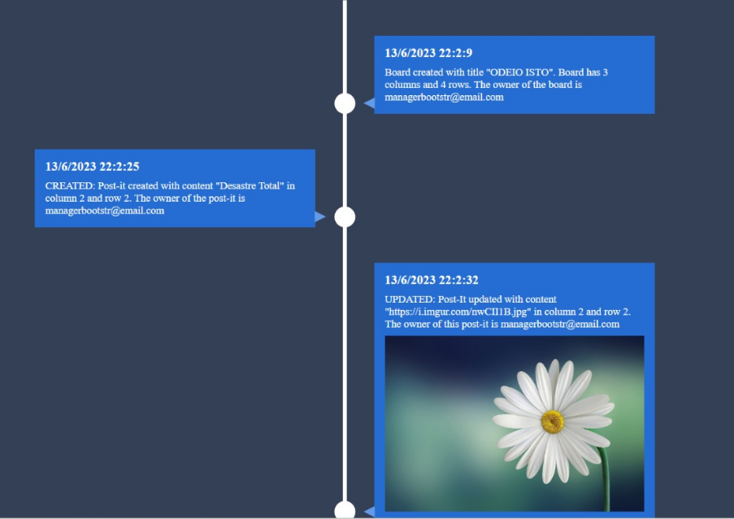

# US 3009

## 1. Context

This is the first time this task is being developed, since it was assigned in the present sprint (SPRINT C).

This [User Story](../../Glossary.md)  relates [Users](../../Glossary.md) and [Boards](../../Glossary.md).

Users will be able to view the history of the boards. The history of the board shows the date and time the **board was created**, a post-it **was created**, **updated**, **moved**, and/or **deleted**.

## 2. Requirements

**US 3009** - As User, I want to view the history of updates on a board.

- The User can only view the history of updates on a board if he/she is the owner of the board or if he/she is a member of the board (has read permissions)
- The User can only view the history of updates on a board if the board exists.

Regarding these requirements we understand that this User Story relates to [US3004](../US_3004/readme.md).

### 2.1 Client Specifications

## 3. Analysis

### 3.1 Domain Model


### 3.2 Implementation Analysis

ViewBoardHistoryController - The controller of this functionality.

## 4. Domain

### 4.1 Sequence Diagram


### 4.2 Class Diagram


### 4.3 Applied Patterns

Some main design patterns were applied in this functionality, namely:
- **Single Responsibility Principle (SRP)**: A class should have only one reason to change and only one responsibility.

## 5. Implementation

**ViewBoardHistoryController**

````java
package org.postit.controller;

import eapli.framework.validations.Preconditions;
import org.domain.model.Board;
import org.domain.model.postit.PostIt;
import org.domain.repositories.BoardRepository;
import org.usermanagement.domain.model.User;
import repositories.PostItRepository;

public class ViewBoardHistoryController {

    /**
     * The Board repository.
     */
    private final BoardRepository boardRepository;

    /**
     * The Post it repository.
     */
    private final PostItRepository postItRepository;

    /**
     * Instantiates a new View board history controller.
     * @param boardRepository the board repository
     * @param postItRepository the post it repository
     */
    public ViewBoardHistoryController(BoardRepository boardRepository,
                                      PostItRepository postItRepository) {
        this.boardRepository = boardRepository;
        this.postItRepository = postItRepository;
    }

    /**
     * View board history.
     * @param boardId the board id
     * @param authUser the auth user
     * @return Iterable<PostIt> - post-its history
     */
    public Iterable<PostIt> viewBoardHistory(Long boardId,
                                            User authUser) {

        Board board = boardRepository.ofIdentity(boardId).get();

        Preconditions.ensure(board.userHasAnyPermission(authUser),
                "User does not have permission to view this board");

        return postItRepository.getPostItsHistory(board);
    }
}
````

**HttpServerAjax**
````java
    public String viewBoardHistory(Long boardId, String token) {
        ViewBoardHistoryController ctrl = new ViewBoardHistoryController(
                PersistenceContext.repositories().boards(),
                PersistenceContext.repositories().postIt());

        User authUser = sessionManager.getUserByToken(token);

        Iterable<PostIt> history = ctrl.viewBoardHistory(boardId, authUser);

        return json.toJson(history);
    }
````

**index.js**

````javascript
function getHistoryOfBoard(functionCallBack){
    const request = new XMLHttpRequest();

    request.onload = function() {
        if(request.status === 200){
            const history = JSON.parse(request.responseText);

            functionCallBack(history);
        } else {
            window.location.href = window.location.origin + '/myboards';
        }
    };

    request.open("GET", "/get_history/" + getBoardUserIsIn(), true);
    request.timeout = 5000;

    const token = getTokenCookie();

    if(token){
        request.setRequestHeader("Authorization", token);
    }

    request.send();
}
````

````javascript
function historyLoadOnPage(board){

    setPostItHistory();

    const timeline = document.querySelector('.timeline ul');
    const {dayOfMonth, month, year, hourOfDay, minute, second} = board.createdOn;

    const timelineItems = {
        timestamp: dayOfMonth + '/' + (month + 1) + '/' + year + ' ' + hourOfDay + ':' + minute + ':' + second,
        content: 'Board created with title "' + board.boardTitle.value
            + '". Board has ' + board.boardNCol.value + ' columns and '
            + board.boardNRow.value + ' rows. The owner of the board is ' + board.boardOwner.email.email
    };

    const li = document.createElement('li');
    const div = document.createElement('div');
    const time = document.createElement('time');
    const content = document.createTextNode(timelineItems.content);

    time.textContent = timelineItems.timestamp;

    div.appendChild(time);
    div.appendChild(content);
    li.appendChild(div);
    timeline.appendChild(li);

}
````

````javascript
function setPostItHistory(){
    const request = new XMLHttpRequest();

    request.onload = function() {
        if(request.status === 200){
            const postIts = JSON.parse(request.responseText);

            console.log(postIts)

            for (let i = 0; i < postIts.length; i++) {
                const timeline = document.querySelector('.timeline ul');
                const {dayOfMonth, month, year, hourOfDay, minute, second} = postIts[i].postItTimeStamp;

                const timelineItems = {
                    timestamp: dayOfMonth + '/' + (month + 1) + '/' + year + ' ' + hourOfDay + ':' + minute + ':' + second,
                    content: ''
                };

                console.log(postIts[i])

                const img = document.createElement('img');
                img.src = postIts[i].postItContent.value;
                img.classList.add('img-history');

                if (postIts[i].postItState.postItState === "CREATED") {
                    timelineItems.content = 'CREATED: Post-it created with content "' + postIts[i].postItContent.value
                        + '" in column ' + postIts[i].postItColumn.value + ' and row '
                        + postIts[i].postItRow.value + '. The owner of the post-it is ' + postIts[i].postItOwner.email.email;

                } else if (postIts[i].postItState.postItState === "DELETED") {
                    timelineItems.content = 'DELETED: Post-It deleted from column ' + postIts[i].postItColumn.value + ' and row '
                        + postIts[i].postItRow.value + '. The owner of this post-it is ' + postIts[i].postItOwner.email.email;

                } else if (postIts[i].postItState.postItState === "UPDATED") {
                    timelineItems.content = 'UPDATED: Post-It updated with content "' + postIts[i].postItContent.value
                        + '" in column ' + postIts[i].postItColumn.value + ' and row '
                        + postIts[i].postItRow.value + '. The owner of this post-it is ' + postIts[i].postItOwner.email.email;

                } else if (postIts[i].postItState.postItState === "MOVED") {
                    timelineItems.content = 'MOVED: Post-It moved from column ' + postIts[i].postItColumn.value + ' and row '
                        + postIts[i].postItRow.value + ' to column ' + postIts[i + 1].postItColumn.value + ' and row '
                        + postIts[i + 1].postItRow.value + '. The owner of this post-it is ' + postIts[i].postItOwner.email.email;
                    i++;
                }

                const li = document.createElement('li');
                const div = document.createElement('div');
                const time = document.createElement('time');
                const content = document.createTextNode(timelineItems.content);


                time.textContent = timelineItems.timestamp;

                div.appendChild(time);
                div.appendChild(content);

                if (validation.isLink(postIts[i].postItContent.value)) {
                    div.appendChild(img);
                }

                li.appendChild(div);
                timeline.appendChild(li);
            }
        } else {
                window.location.href = window.location.origin + '/myboards';
            }
    };

    request.open("GET", "/board_history?id=" + getBoardUserIsIn(), true);
    request.timeout = 5000;

    const token = getTokenCookie();

    if(token){
        request.setRequestHeader("Authorization", token);
    }

    request.send();
}
````


## 6. Integration/Demonstration



## 7. Observations

It was developed 2 ways to execute this functionality: http and console.

- In http, there is no input, you need to click the "history" button on the board and you will be automatically redirected.
- In TCP, the necessary input is the boardId displaying the history on the console of such board.