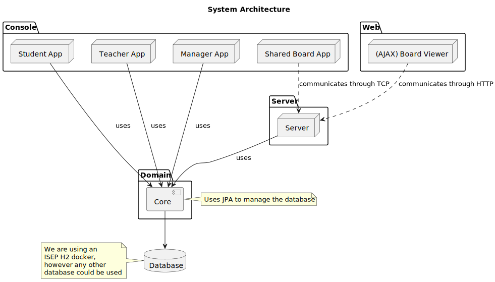
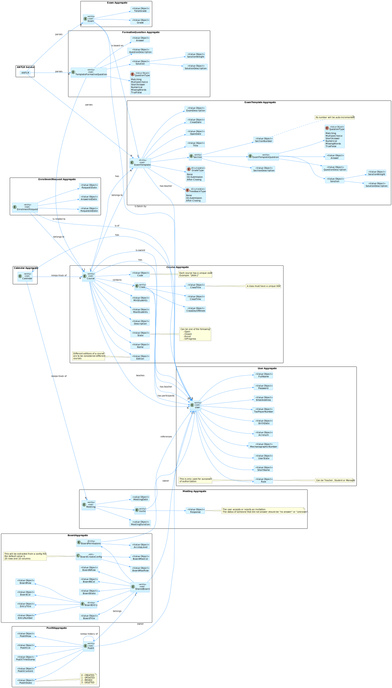

# Project Planning and Technical Documentation

## 1. Group Members

The members of the group:

| Student Nr.	                     | Name	          |
|----------------------------------|----------------|
| **[1201205](1201205/readme.md)** | Samuel Dias    |
| **[1201416](1201416/readme.md)** | Pedro Alves    |
| **[1211136](1211136/readme.md)** | Bruna Costa    |
| **[1211201](1211201/readme.md)** | Henrique Pinto |

## 2. Task Assignment

The assignment of tasks (requirements/user stories/use cases) during the project.

| Student Nr.	                   | Sprint A                                                                                                                    | Sprint B                                                                                                                                                                                                                                                                                                                                           | Sprint C                                                                                                                |
|--------------------------------|-----------------------------------------------------------------------------------------------------------------------------|----------------------------------------------------------------------------------------------------------------------------------------------------------------------------------------------------------------------------------------------------------------------------------------------------------------------------------------------------|-------------------------------------------------------------------------------------------------------------------------|
| [1201205](1201205/readme.md)  | US G001 ; [US G002](SPRINT%20A/US_G002/readme.md) ; US G003 ; US G004 ; US G005 ; [US G006](SPRINT%20A/US_G006/readme.md) ; | [US 1001](SPRINT%20B/US_1001/readme.md); [US 2001](SPRINT%20B/US_2001/readme.md); [US 3001](SPRINT%20B/US_3001/readme.md); [US 3002](SPRINT%20B/US_3002/readme.md); [US 3003](SPRINT%20B/US_3003/readme.md);  [US 5001](SPRINT%20B/US_5001/US5001_Group8.pptx); [US 2007](SPRINT%20B/US_2007/readme.md);                                           | [US 3005](SPRINT%20C/US_3005/readme.md); [US 3006](SPRINT%20C/US_3006/readme.md); [US 3007](SPRINT%20B/US_3007/readme.md); [US 5002](../SPRINT%20C/US_5002/US5002_Group8.pptx) |         |
| [1201416](1201416/readme.md)   | US G001 ; [US G002](SPRINT%20A/US_G002/readme.md) ; US G003 ; US G004 ; US G005 ; [US G006](SPRINT%20A/US_G006/readme.md)   | [US 1002](SPRINT%20B/US_1002/readme.md); [US 1003](SPRINT%20B/US_1003/readme.md) ; [US 1004](SPRINT%20B/US_1004/readme.md); [US 1005](SPRINT%20B/US_1005/readme.md);  [US 5001](SPRINT%20B/US_5001/US5001_Group8.pptx);                                                                                                                            | [US 2006](SPRINT%20C/US_2006/readme.md); [US 3004](SPRINT%20C/US_3004/readme.md); [US 5002](../SPRINT%20C/US_5002/US5002_Group8.pptx)                                        |
| [1211136](1211136/readme.md)   | US G001 ; [US G002](SPRINT%20A/US_G002/readme.md) ; US G003 ; US G004 ; US G005 ; [US G006](SPRINT%20A/US_G006/readme.md)   | [US 1010](SPRINT%20B/US_1010/readme.md); [US 2001](SPRINT%20B/US_2001/readme.md); [US 2002](SPRINT%20B/US_2002/readme.md); [US 2003](SPRINT%20B/US_2003/readme.md); [US 3001](SPRINT%20B/US_3001/readme.md); [US 3003](SPRINT%20B/US_3003/readme.md); [US 5001](SPRINT%20B/US_5001/US5001_Group8.pptx);                                            |  [US 2005](SPRINT%20C/US_2005/readme.md); [US 3009](SPRINT%20C/US_3009/readme.md); [US 5002](../SPRINT%20C/US_5002/US5002_Group8.pptx)                                       |
| [1211201](1211201/readme.md)   | US G001 ; [US G002](SPRINT%20A/US_G002/readme.md) ; US G003 ; US G004 ; US G005 ; [US G006](SPRINT%20A/US_G006/readme.md)   | [US 1006](SPRINT%20B/US_1006/readme.md); [US 1008](SPRINT%20B/US_1008/readme.md); [US 1009](SPRINT%20B/US_1009/readme.md);  [US 2001](SPRINT%20B/US_2001/readme.md); [US 3001](SPRINT%20B/US_3001/readme.md); [US 3003](SPRINT%20B/US_3003/readme.md); [US 5001](SPRINT%20B/US_5001/US5001_Group8.pptx); [US 2007](SPRINT%20B/US_2007/readme.md);  | [US 2004](SPRINT%20C/US_2004/readme.md); [US 3008](SPRINT%20C/US_3008/readme.md); [US 5002](../SPRINT%20C/US_5002/US5002_Group8.pptx)                                         |

## 3. System Architecture

## 4. Domain Model

